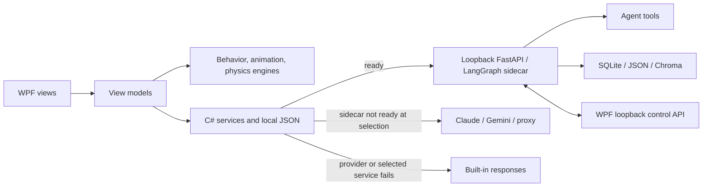

# Aemeath Desktop Pet

English | [中文](README_CN.md)

Aemeath is a Windows-first desktop companion built with .NET 8 and WPF. It combines an animated always-on-top pet, lightweight stats and routines, AI chat, speech, optional screen awareness, and integrations with companion productivity apps. The core application runs without Python or an API key: when AI is unavailable, chat and idle reactions fall back to built-in offline responses.

For agent tools, persistent agent threads, semantic memory, RAG, and backend speech/vision routes, Aemeath can launch an optional loopback FastAPI/LangGraph sidecar. During startup/service selection, a sidecar that is not ready leaves the WPF app on the selected direct provider (Claude, Gemini, or a Claude-compatible proxy), with offline responses as the final fallback. Once `BackendAgentService` has been selected, however, a failed backend request falls directly to offline output rather than retrying a direct provider.

> Development status: active prototype. The repository contains working features, partial integrations, and design-stage code. See [Current Limitations](#current-limitations) before relying on privacy, memory deletion, MCP, or release packaging.

## Table of Contents

- [Project Status](#project-status)
- [Quick Start](#quick-start)
- [Using Aemeath](#using-aemeath)
- [Features](#features)
- [Memory System](#memory-system)
- [Architecture](#architecture)
- [Python AI Backend](#python-ai-backend)
- [MCP Integration](#mcp-integration)
- [Settings](#settings)
- [Data Storage and Privacy](#data-storage-and-privacy)
- [Project Layout](#project-layout)
- [Testing](#testing)
- [Current Limitations](#current-limitations)
- [Design Documents](#design-documents)

## Project Status

| Status | Meaning in this repository | Examples |
|---|---|---|
| Implemented | Connected to the running WPF or sidecar application | Pet window, chat history, stats, direct AI providers, five TTS providers, periodic screen awareness, tray icon |
| Partial | A usable path exists, but the full design is not connected | Multi-tier memory, companion-app integrations, RAG APIs, black-cat companion |
| External dependency | Requires a key, local service, model, database, or separate app | Cloud AI/TTS/STT, Ollama, GPT-SoVITS, activity monitor, Pomodoro bridge |
| Asset placeholder | The behavior exists but reuses generic art | Several of the 26 pet states; the cat window currently renders a Unicode cat |
| Planned or dormant | Classes, settings, or design exist without a runtime path | MCP startup, paper-plane rendering, window-edge pose transitions, fullscreen auto-hide |

## Quick Start

### Prerequisites

- Windows 10 or 11
- [.NET 8 SDK](https://dotnet.microsoft.com/download/dotnet/8.0)
- Python 3.11 or newer **only if you use the optional sidecar**
- Optional provider keys or local services for AI, TTS, STT, and vision

### Run the WPF application

```powershell
git clone https://github.com/RickyT715/Aemeath_Desktop_Pet.git
cd Aemeath_Desktop_Pet
.\run.bat
```

The equivalent development command is:

```powershell
dotnet run --project src/AemeathDesktopPet
```

The first run creates `%LOCALAPPDATA%\AemeathDesktopPet\config.json`. Open **Settings > AI** to configure a direct chat provider, or leave it unconfigured to use offline responses.

### Set up the optional Python sidecar

From the repository root:

```powershell
cd python-backend
py -3.11 -m venv .venv
.\.venv\Scripts\Activate.ps1
python -m pip install -e ".[dev]"
python -m aemeath_agent.main
```

The current manifests omit the imported `langgraph-checkpoint-sqlite` package. As a result, the command above installs the declared environment but does not guarantee that the LangGraph agent initializes; FastAPI can continue in degraded mode and `/health` can still report healthy. Until the manifest is corrected, install that missing dependency separately when developing the agent and verify an agent route, not only `/health`.

For a provider-backed agent, set sidecar environment variables before starting it. For example:

```powershell
$env:AEMEATH_AI_PROVIDER = "gemini"
$env:AEMEATH_GOOGLE_API_KEY = "your-key"
python -m aemeath_agent.main
```

Claude uses `AEMEATH_ANTHROPIC_API_KEY`. The sidecar listens on `127.0.0.1:18900` by default. For app-managed developer mode, install the package as above, select **Settings > Backend > Developer**, point Python path at `.venv\Scripts\python.exe`, and restart Aemeath after changing backend startup settings. The Backend port field is currently ineffective for app-managed startup: WPF sets `AEMEATH_PORT`, but the Python CLI binds argparse's default `18900` and WPF does not pass `--port`.

The normal .NET publish output does not include a built sidecar. See [`python-backend/scripts/build_exe.py`](python-backend/scripts/build_exe.py) for the separate backend packaging entry point.

## Using Aemeath

- **Click** Aemeath to trigger a reaction and improve her mood.
- **Hover for two seconds** to trigger a happy reaction.
- **Drag** to reposition the pet; the position is restored on the next run.
- **Double-click** to open chat.
- **Right-click** for chat, music, paper-plane, cat, stats, click-through, settings, hide, and quit actions.
- Use the **system tray icon** to show Aemeath, open chat/settings, toggle click-through, or quit.
- In chat, **Enter** sends and **Shift+Enter** inserts a new line.
- When voice input is enabled, hold the configured global hotkey (default `Ctrl+F2`) to record and release it to transcribe and send.

Click-through mode makes the pet ignore mouse input. Use the tray menu to turn it off again.

## Features

### Companion behavior and visuals

- A 26-state weighted finite-state model reacts to mood, energy, time, dragging, chat, music, and companion events.
- WPF GIF playback supports mirroring and falls back to `normal.gif` when a state has no dedicated animation.
- Basic flight, gravity, landing, particle, and intermittent glitch effects are active.
- Mood, Energy, and Affection plus lifetime interaction counters persist locally.
- The optional black-cat window follows and reacts to selected Aemeath events, but currently uses placeholder glyph art.
- Music playback selects files from a user-configured folder and drives singing behavior.

### Chat and integrations

- Direct chat providers: Anthropic Claude, Google Gemini, and a Claude-compatible proxy.
- Optional LangGraph backend agent with streaming responses, persistent thread state, and tools.
- Offline responses keep basic chat, greetings, and event reactions available without network access.
- Chat history is persisted locally and the latest messages are supplied as conversational context.
- Optional Pomodoro/to-do named-pipe events and read-only activity-monitor SQLite summaries can influence speech and observations.
- Companion launch paths and Windows startup can be configured from the app.

### Speech and vision

- TTS providers: **Edge TTS**, **GPT-SoVITS**, **ElevenLabs**, **Fish Audio**, and **OpenAI TTS**.
- Push-to-talk STT supports separate, direct C# OpenAI Whisper and Gemini paths. The WPF-to-sidecar STT path is currently nonfunctional: `BackendSttService` sends multipart `file`/`language` fields, while `/stt/transcribe` expects JSON with `audio_base64`, `provider`, and `language`; the route also passes `anthropic_api_key` to Whisper and defines no `openai_api_key`.
- Chat can optionally attach a current screenshot.
- Periodic screen awareness is opt-in and supports Gemini, Claude, Ollama, and local-plus-cloud hybrid vision.
- Periodic capture includes protected-window/fullscreen checks, an app/title blacklist, optional privacy downscaling, change detection, a budget guard, and response PII scanning.

Cloud services require their own keys and send relevant text, audio, or images to the selected provider. GPT-SoVITS and Ollama can remain local; hybrid vision sends a locally produced description to a cloud model. Edge TTS is network-backed even though it does not require an API key.

## Memory System

The current tree contains a four-layer memory design, but the layers do not yet form one fully connected memory product.

| Layer | Current implementation | Persistence and availability |
|---|---|---|
| Working memory | Recent chat messages and backend thread state | WPF `messages.json`; backend `agent_state.db` when used |
| Core memory | C# profile models plus a Python MemGPT-inspired USER block | `core_memory.json` and `memory_blocks.json` |
| Episodic memory | Conversation extraction, observation distillation, and semantic retrieval | Python JSON store plus Chroma collection `aemeath_memories` |
| Procedural memory | Local routines, preferences, and scheduled-event models | `procedural_memory.json` |

Implemented paths include persisted chat history, a stable backend thread ID, Python `save_memory`, `update_user_block`, and `retrieve_memory` tools, background conversation extraction, and 30-minute observation distillation when the sidecar is ready. Screen, activity, camera-summary, and Pomodoro observations are buffered locally before distillation.

Important boundaries:

- The Python agent injects the USER block snapshot read when the agent is constructed and can call its memory tools. `update_user_block` persists a replacement for the next agent construction/restart; it does not refresh the active compiled prompt. Direct C# Claude/Gemini/proxy chat does **not** inject the assembled `MemoryContext`.
- The C# `core_memory.json` and `procedural_memory.json` stores load locally, but conversation extraction does not currently update them automatically and there is no memory-management UI.
- Without the Python sidecar, recent chat history still works, but semantic extraction/retrieval and observation distillation do not.
- `GET /memory/retrieve` currently searches only the memory Chroma collection. `/memory/core/update` appends to the Python mirror and does not apply event updates to the C# canonical file. `/memory/forget` does not apply `time_range`, and its Chroma deletion path may not find stored IDs.

See [`docs/memory_system_design.md`](docs/memory_system_design.md) for the detailed design and its implementation notes.

## Architecture



The startup/service-selection preference is **ready backend agent -> selected direct provider -> offline response**. This is not complete per-request failover: after the backend service is selected, its request failures go directly to offline responses. The WPF application owns windows, animation, interaction, local settings/stats/history, TTS, and integrations. The optional sidecar adds agent orchestration and data-heavy AI capabilities. Both loopback APIs bind locally by default, but they are not authenticated.

## Python AI Backend

The optional [`python-backend`](python-backend/) package is a FastAPI application using LangGraph. It exposes health, agent streaming, STT, vision, RAG, configuration, and memory routes. Its 11 registered agent tools are:

| Tool | Purpose |
|---|---|
| `search_web` | Tavily web search |
| `get_weather` | OpenWeatherMap lookup |
| `manage_todo` | Local SQLite to-do operations |
| `read_screen` | Ask the WPF bridge for a screen description |
| `control_music` | Control WPF music playback |
| `get_pet_stats` | Read pet stats from WPF |
| `rag_retrieve` | Search an ingested personal document collection |
| `get_system_info` | Read local system information |
| `save_memory` | Store long-term facts, episodes, or preferences |
| `update_user_block` | Persist the USER-block replacement used on the next agent construction/restart |
| `retrieve_memory` | Search persistent user memories |

`rag_retrieve` is registered but no startup path configures its retriever, so it reports that RAG is not initialized until code explicitly wires an ingested collection. The RAG API and ingestion modules exist separately.

Sidecar configuration comes from `AEMEATH_*` environment variables or `python-backend/.env`; see [`config.py`](python-backend/aemeath_agent/config.py) and [`pyproject.toml`](python-backend/pyproject.toml). The WPF `/config/sync` request currently carries only a status marker and does not synchronize provider settings.

## MCP Integration

The repository includes an MCP client implementation, Aemeath tool definitions, MCP settings, and tests. The settings tab can save external server definitions and an “Expose as server” flag.

These components are **not connected to application startup or the active chat/agent tool graph**. Enabling MCP in Settings does not currently launch configured servers, expose Aemeath, or add their tools to chat. Treat MCP as dormant infrastructure rather than a user-ready feature.

## Settings

The Settings window has eight tabs:

| Tab | Main controls | Runtime notes |
|---|---|---|
| General | Startup, companion apps, Pomodoro prompts, activity monitor, context speech frequency | Some integrations require restart/external apps |
| Appearance | Size, opacity, glitch, black cat/name, ambient paper planes | Plane interval is saved but not applied by the engine |
| Music | Local music folder | Used by singing behavior |
| AI | Claude, Gemini, proxy, credentials, singing-bubble flag | Direct providers recreate on save; singing flag is saved but not consumed |
| Voice | STT/hotkey/screenshot plus all five TTS providers and playback options | Local or cloud dependencies vary by provider |
| Screen | Opt-in capture, privacy checks, vision provider, interval, budget, prompt, blacklist | Periodic pipeline only; see Privacy below |
| Backend | Enable/mode, ports, Python path, tool keys, retry limit, status | Startup changes generally require restart; app-managed port override is currently ineffective; release does not bundle it |
| MCP | Client/server toggles and server definitions | Saved only; not runtime-wired |

The General “close to tray” and behavior-frequency values are also saved but are not currently applied to window closing or the behavior timer.

## Data Storage and Privacy

### Local files

By default, WPF data and the sidecar’s agent files are stored under:

```text
%LOCALAPPDATA%\AemeathDesktopPet\
```

| File | Contents |
|---|---|
| `config.json` | Settings, provider endpoints, and API keys |
| `stats.json` | Pet stats and lifetime counters |
| `messages.json` | Up to 200 chat messages |
| `core_memory.json` | C# user-profile/core-memory model |
| `procedural_memory.json` | C# routines and scheduled events |
| `observation_buffer.json` | Pending observations, with local expiration handling |
| `agent_state.db` | LangGraph checkpoints (sidecar default) |
| `memory_store.json` | Python facts, episodes, and preferences |
| `memory_blocks.json` | Python USER block and other prompt blocks |

Python Chroma data defaults to the relative path `data/chromadb` and can be changed with `AEMEATH_CHROMADB_PATH`. The agent to-do tool currently uses relative `data/todos.db`. Relative paths resolve from the sidecar process working directory, so they are not guaranteed to live under `%LOCALAPPDATA%`.

### Privacy and security boundaries

- API keys and local history/memory files are stored in plaintext. Protect the Windows account and data directory; do not commit real keys or `.env` files.
- The FastAPI sidecar and WPF internal bridge use unauthenticated loopback HTTP. They are not intended for remote exposure, but another local process may be able to call them.
- Periodic screen awareness is disabled by default and provides blacklist, protected-window, fullscreen, downscale, and response-scan controls. These reduce risk; they do not guarantee that sensitive content can never leave the device.
- The chat “include screenshot” path is a separate explicit action and bypasses the periodic screen-awareness blacklist, protected-window check, fullscreen skip, and response PII scan. It sends the captured image to the active chat/backend provider.
- Activity and periodic screen observation are opt-in. Conversation history is stored whenever chat is used, and backend conversation extraction runs when the sidecar is ready.
- Cloud Claude, Gemini, OpenAI, ElevenLabs, Fish Audio, Edge TTS, and remote proxy endpoints receive the data required for their feature. Ollama and GPT-SoVITS can operate locally, subject to their own configuration.

## Project Layout

```text
src/AemeathDesktopPet/
  Views/          WPF windows and interaction wiring
  ViewModels/     presentation orchestration
  Models/         configuration, state, stats, and memory contracts
  Services/       AI, speech, persistence, privacy, and integrations
  Engine/         animation, behavior, physics, and visual systems
  Resources/      GIF sprites and tray_icon.ico
  Themes/         WPF resources
python-backend/
  aemeath_agent/  FastAPI, LangGraph, tools, RAG, STT, and vision
  tests/          Python tests
tests/
  AemeathDesktopPet.Tests/  xUnit unit, integration, contract, and E2E tests
  TtsIntegrationTest/       manual provider harness
docs/             focused design and audit documents
```

For exact dependencies, use [`AemeathDesktopPet.csproj`](src/AemeathDesktopPet/AemeathDesktopPet.csproj) and [`pyproject.toml`](python-backend/pyproject.toml) as the source of truth. The tray icon and current runtime GIFs are present under [`Resources`](src/AemeathDesktopPet/Resources/); several modeled states intentionally reuse those sprites.

## Testing

Run .NET validation from the repository root:

```powershell
dotnet build AemeathDesktopPet.sln -c Release
dotnet test tests/AemeathDesktopPet.Tests/
dotnet format --verify-no-changes
```

Run Python validation after installing the optional development dependencies:

```powershell
cd python-backend
pytest -v --cov=aemeath_agent
ruff check .
```

The suites cover models, engines, services, view models, Win32 wrappers, HTTP/provider simulations, memory contracts and flows, and backend routes/tools. Tests that simulate a dependency do not prove that a real cloud account, local model, companion app, or packaged sidecar is correctly configured.

For manual TTS provider checks:

```powershell
dotnet run --project tests/TtsIntegrationTest
```

## Current Limitations

- **Memory is partial:** advanced memory is primarily on the Python-agent path; direct C# chat does not receive `MemoryContext`, C# core memory is not auto-learned, and there is no review/edit/delete UI. Memory endpoint caveats are listed above.
- **MCP is dormant:** client/server classes and saved settings are not initialized by the running app.
- **RAG is partial:** ingestion and API code exist, but the agent’s `rag_retrieve` tool is not configured at startup.
- **Paper planes are not visible:** the simulation and landing events run, but no WPF renderer subscribes to plane updates; throw/release physics for Aemeath is also not wired to mouse interaction.
- **Window-edge poses are dormant:** edge detection code runs, but no subscriber transitions the pet into peek, cling, lie, or taskbar-hide states.
- **Fullscreen handling is limited:** periodic screen capture is skipped and TTS can auto-mute, but the pet does not auto-hide for fullscreen apps.
- **Some art is placeholder:** multiple states reuse existing GIFs, and the black-cat window uses a Unicode glyph rather than the included seal asset.
- **Some settings are saved only or need restart:** close-to-tray, behavior frequency, ambient-plane frequency, and the singing flag are not fully consumed; backend and integration lifecycles are not fully reconfigured on save.
- **Backend packaging is separate:** normal .NET publish/release output does not contain the sidecar executable.
- **Backend setup and configuration have gaps:** the declared install omits `langgraph-checkpoint-sqlite`, degraded `/health` does not prove agent readiness, WPF config sync does not transfer effective settings, and the app-managed port override does not change the CLI bind port.
- **Backend STT is not currently interoperable:** WPF sends multipart audio while the route requires JSON `audio_base64`, and the route uses the Anthropic key for Whisper without an OpenAI key setting. Use the separate direct C# Whisper or Gemini path instead.
- **Loopback services are unauthenticated** and local data/API keys are unencrypted.

## Design Documents

- [`REQUIREMENTS.md`](REQUIREMENTS.md) — product scope and requirement status
- [`docs/architecture.md`](docs/architecture.md) — canonical current runtime architecture
- [`CHECKLIST.md`](CHECKLIST.md) — evidence-based implementation ledger
- [`docs/memory_system_design.md`](docs/memory_system_design.md) — memory architecture and known integration state
- [`aemeath_desktop_pet_design.md`](aemeath_desktop_pet_design.md) — historical design intent, not current implementation status
- [`AGENTS.md`](AGENTS.md) — repository contribution guidance

The following documents propose a future evolution into a trusted, Jarvis-like personal assistant.
They are plans, not claims about the current implementation:

- [`docs/research/jarvis_assistant_landscape.md`](docs/research/jarvis_assistant_landscape.md) — primary-source landscape review, recommendations, and critical reflection
- [`docs/prd/jarvis_assistant_prd.md`](docs/prd/jarvis_assistant_prd.md) — product goals, user journeys, detailed requirements, success metrics, and release gates
- [`docs/adr/ADR-0001-evolutionary-modular-assistant-architecture.md`](docs/adr/ADR-0001-evolutionary-modular-assistant-architecture.md) — rebuild-versus-evolution architecture decision
- [`docs/adr/ADR-0002-test-driven-verification-and-exact-sha-delivery.md`](docs/adr/ADR-0002-test-driven-verification-and-exact-sha-delivery.md) — independent preservation testing, strict TDD, Windows test lanes, and exact-commit CI rules
- [`docs/design/jarvis_assistant_design.md`](docs/design/jarvis_assistant_design.md) — target modules, contracts, data ownership, security, migration, and verification design
- [`docs/ui-spec/jarvis_assistant_ui_spec.md`](docs/ui-spec/jarvis_assistant_ui_spec.md) — pet states, Command Center screens, approvals, privacy, accessibility, and visual rules
- [`docs/plans/20260722-jarvis-assistant-evolution.md`](docs/plans/20260722-jarvis-assistant-evolution.md) — phased implementation, failure-mode, test, rollback, and pilot plan
- [`docs/plans/20260722-jarvis-assistant-tdd-checklist.md`](docs/plans/20260722-jarvis-assistant-tdd-checklist.md) — authoritative test-first execution checklist with per-step push and exact-SHA CI evidence

Older root-level design and asset-generation notes are useful historical context, but source code, manifests, and the documents above should be preferred for current behavior.
