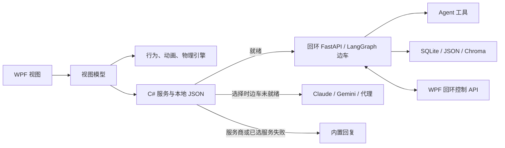

# Aemeath 桌面宠物

[English](README.md) | 中文

Aemeath 是一款以 Windows 为首要平台、基于 .NET 8 和 WPF 的桌面陪伴应用。它将始终置顶的动画角色、轻量属性与日常行为、AI 聊天、语音、可选屏幕感知和效率应用联动整合在一起。核心应用不要求安装 Python 或配置 API 密钥：AI 不可用时，聊天和日常反应会回退到内置离线回复。

若需要 Agent 工具、持久化 Agent 会话、语义记忆、RAG 以及后端语音/视觉路由，Aemeath 可启动一个可选的本机回环 FastAPI/LangGraph 边车。在启动/服务选择阶段，边车尚未就绪时，WPF 应用会继续使用所选的直连服务商（Claude、Gemini 或兼容 Claude 的代理），最终回退到离线回复。但一旦已经选中 `BackendAgentService`，后端请求失败会直接返回离线回复，而不会再尝试直连服务商。

> 开发状态：活跃原型。仓库同时包含已接通的功能、部分接通的集成和仍处于设计阶段的代码。在依赖隐私保护、记忆删除、MCP 或发布打包之前，请先阅读[当前限制](#当前限制)。

## 目录

- [项目状态](#项目状态)
- [快速开始](#快速开始)
- [使用 Aemeath](#使用-aemeath)
- [功能](#功能)
- [记忆系统](#记忆系统)
- [架构](#架构)
- [Python AI 后端](#python-ai-后端)
- [MCP 集成](#mcp-集成)
- [设置](#设置)
- [数据存储与隐私](#数据存储与隐私)
- [项目结构](#项目结构)
- [测试](#测试)
- [当前限制](#当前限制)
- [设计文档](#设计文档)

## 项目状态

| 状态 | 在本仓库中的含义 | 示例 |
|---|---|---|
| 已实现 | 已连接到运行中的 WPF 或边车应用 | 宠物窗口、聊天历史、属性、直连 AI、五种 TTS、周期屏幕感知、托盘图标 |
| 部分实现 | 存在可用路径，但完整设计尚未接通 | 多层记忆、配套应用联动、RAG API、黑猫伙伴 |
| 外部依赖 | 需要密钥、本地服务、模型、数据库或另一个应用 | 云端 AI/TTS/STT、Ollama、GPT-SoVITS、活动监控、番茄钟桥接 |
| 素材占位 | 行为存在，但复用了通用素材 | 26 个宠物状态中的若干状态；猫窗口当前显示 Unicode 猫 |
| 计划中或休眠 | 类、设置或设计已存在，但没有运行时路径 | MCP 启动、纸飞机渲染、窗口边缘姿态、全屏自动隐藏 |

## 快速开始

### 环境要求

- Windows 10 或 11
- [.NET 8 SDK](https://dotnet.microsoft.com/download/dotnet/8.0)
- **仅在使用可选边车时**需要 Python 3.11 或更高版本
- AI、TTS、STT 和视觉功能所需的可选服务商密钥或本地服务

### 运行 WPF 应用

```powershell
git clone https://github.com/RickyT715/Aemeath_Desktop_Pet.git
cd Aemeath_Desktop_Pet
.\run.bat
```

等价的开发命令是：

```powershell
dotnet run --project src/AemeathDesktopPet
```

首次运行会创建 `%LOCALAPPDATA%\AemeathDesktopPet\config.json`。在**设置 > AI** 中配置直连聊天服务商，或保持未配置以使用离线回复。

### 配置可选 Python 边车

从仓库根目录执行：

```powershell
cd python-backend
py -3.11 -m venv .venv
.\.venv\Scripts\Activate.ps1
python -m pip install -e ".[dev]"
python -m aemeath_agent.main
```

当前清单遗漏了代码导入的 `langgraph-checkpoint-sqlite` 包。因此，上述命令只能安装已声明的环境，不能保证 LangGraph Agent 初始化成功；FastAPI 可能继续以降级模式运行，而 `/health` 仍报告健康。在清单修正前，开发 Agent 时需单独安装该依赖，并验证 Agent 路由，而不应只检查 `/health`。

要使用服务商支持的 Agent，请在启动前设置边车环境变量。例如：

```powershell
$env:AEMEATH_AI_PROVIDER = "gemini"
$env:AEMEATH_GOOGLE_API_KEY = "your-key"
python -m aemeath_agent.main
```

Claude 使用 `AEMEATH_ANTHROPIC_API_KEY`。边车默认监听 `127.0.0.1:18900`。若希望由应用托管开发模式，请先按上面方式安装包，在**设置 > Backend > Developer** 中将 Python 路径指向 `.venv\Scripts\python.exe`，修改后重启 Aemeath。当前 Backend 端口字段对应用托管启动无效：WPF 会设置 `AEMEATH_PORT`，但 Python CLI 仍绑定 argparse 的默认值 `18900`，且 WPF 未传入 `--port`。

普通 .NET 发布产物不包含已构建的边车。独立后端打包入口见 [`python-backend/scripts/build_exe.py`](python-backend/scripts/build_exe.py)。

## 使用 Aemeath

- **单击** Aemeath 触发反应并提升心情。
- **悬停两秒**触发开心反应。
- **拖动**宠物改变位置；下次启动会恢复该位置。
- **双击**打开聊天窗口。
- **右键**打开聊天、音乐、纸飞机、猫咪、属性、鼠标穿透、设置、隐藏和退出操作。
- 使用**系统托盘图标**显示 Aemeath、打开聊天/设置、切换鼠标穿透或退出。
- 聊天中按 **Enter** 发送，按 **Shift+Enter** 换行。
- 启用语音输入后，按住已配置的全局快捷键（默认 `Ctrl+F2`）录音，松开后转写并发送。

鼠标穿透模式会让宠物忽略鼠标输入。请通过托盘菜单将其关闭。

## 功能

### 陪伴行为与视觉

- 26 状态加权有限状态模型会对心情、能量、时间、拖动、聊天、音乐和配套事件作出反应。
- WPF GIF 播放支持水平镜像；某状态没有专用动画时回退到 `normal.gif`。
- 基础飞行、重力、落地、粒子和间歇性数字故障效果已接通。
- 心情、能量、好感度及累计互动计数保存在本地。
- 可选黑猫窗口会跟随 Aemeath 并响应部分事件，但目前使用占位字形素材。
- 音乐播放从用户指定目录选择文件，并驱动唱歌行为。

### 聊天与集成

- 直连聊天服务商：Anthropic Claude、Google Gemini，以及兼容 Claude 的代理。
- 可选 LangGraph 后端 Agent，支持流式回复、持久化会话状态和工具。
- 无网络时，内置离线回复仍可用于基础聊天、问候和事件反应。
- 聊天历史保存在本地，最近消息会作为对话上下文传入。
- 可选的番茄钟/待办命名管道事件和只读活动监控 SQLite 摘要可以影响对话和观察。
- 可在应用中配置配套程序路径和随 Windows 启动。

### 语音与视觉

- TTS 服务商：**Edge TTS**、**GPT-SoVITS**、**ElevenLabs**、**Fish Audio** 和 **OpenAI TTS**。
- 按键说话 STT 支持彼此独立的 C# 直连 OpenAI Whisper 和 Gemini 路径。WPF 到边车的 STT 路径目前不可用：`BackendSttService` 发送 multipart `file`/`language` 字段，而 `/stt/transcribe` 要求包含 `audio_base64`、`provider` 和 `language` 的 JSON；该路由还把 `anthropic_api_key` 传给 Whisper，并且没有定义 `openai_api_key`。
- 聊天可选择附加当前屏幕截图。
- 周期屏幕感知为可选功能，支持 Gemini、Claude、Ollama 和“本地 + 云端”混合视觉。
- 周期捕获包含受保护窗口/全屏检查、应用和标题黑名单、可选隐私降采样、画面变化检测、预算保护和回复 PII 扫描。

云端服务需要各自的密钥，并会将功能所需的文本、音频或图像发送给所选服务商。GPT-SoVITS 和 Ollama 可保持本地运行；混合视觉会把本地生成的描述发送给云端模型。Edge TTS 虽不需要 API 密钥，但仍依赖网络服务。

## 记忆系统

当前代码树包含四层记忆设计，但这些层尚未组成一个完全连通的记忆产品。

| 层级 | 当前实现 | 持久化与可用范围 |
|---|---|---|
| 工作记忆 | 最近聊天消息和后端会话状态 | WPF `messages.json`；使用边车时为 `agent_state.db` |
| 核心记忆 | C# 用户资料模型和 Python 的 MemGPT 风格 USER block | `core_memory.json` 和 `memory_blocks.json` |
| 情景记忆 | 对话提取、观察蒸馏和语义检索 | Python JSON 存储及 Chroma 集合 `aemeath_memories` |
| 程序性记忆 | 本地日程、偏好和计划事件模型 | `procedural_memory.json` |

已实现路径包括持久聊天历史、稳定后端 thread ID、Python 的 `save_memory`、`update_user_block` 和 `retrieve_memory` 工具、后台对话提取，以及边车就绪时每 30 分钟执行的观察蒸馏。屏幕、活动、摄像头摘要和番茄钟观察会先在本地缓冲。

重要边界：

- Python Agent 会注入构建 Agent 时读取的 USER block 快照，也可调用记忆工具。`update_user_block` 会保存供下次构建/重启 Agent 使用的替换内容，但不会刷新当前已编译的提示词。C# 直连 Claude/Gemini/代理聊天**不会**注入已组装的 `MemoryContext`。
- C# 的 `core_memory.json` 和 `procedural_memory.json` 会在本地加载，但对话提取目前不会自动更新它们，也没有记忆管理界面。
- 没有 Python 边车时，最近聊天历史仍可用，但语义提取/检索和观察蒸馏不可用。
- `GET /memory/retrieve` 目前只搜索记忆 Chroma 集合。`/memory/core/update` 只追加到 Python 镜像，不会把事件更新写回 C# 权威文件。`/memory/forget` 不处理 `time_range`，其 Chroma 删除路径也可能找不到已存 ID。

详细设计和实现说明见 [`docs/memory_system_design.md`](docs/memory_system_design.md)。

## 架构



启动/服务选择顺序为：**已就绪的后端 Agent -> 所选直连服务商 -> 离线回复**。这不是完整的逐请求故障转移：后端服务一旦被选中，其请求失败会直接进入离线回复。WPF 应用负责窗口、动画、交互、本地设置/属性/历史、TTS 和集成；可选边车负责 Agent 编排和数据密集型 AI 能力。两个回环 API 默认只绑定本机，但均未配置身份认证。

## Python AI 后端

可选的 [`python-backend`](python-backend/) 包是一个使用 LangGraph 的 FastAPI 应用，提供健康检查、Agent 流式响应、STT、视觉、RAG、配置和记忆路由。它注册了 11 个 Agent 工具：

| 工具 | 用途 |
|---|---|
| `search_web` | Tavily 网页搜索 |
| `get_weather` | OpenWeatherMap 天气查询 |
| `manage_todo` | 本地 SQLite 待办操作 |
| `read_screen` | 向 WPF 桥接请求屏幕描述 |
| `control_music` | 控制 WPF 音乐播放 |
| `get_pet_stats` | 从 WPF 读取宠物属性 |
| `rag_retrieve` | 搜索已导入的个人文档集合 |
| `get_system_info` | 读取本机系统信息 |
| `save_memory` | 保存长期事实、情景或偏好 |
| `update_user_block` | 保存供下次构建/重启 Agent 使用的 USER block 替换内容 |
| `retrieve_memory` | 搜索持久化用户记忆 |

`rag_retrieve` 已注册，但启动流程没有配置它的 retriever；在代码显式连接已导入集合前，它会报告 RAG 未初始化。RAG API 和导入模块独立存在。

边车配置来自 `AEMEATH_*` 环境变量或 `python-backend/.env`；源信息见 [`config.py`](python-backend/aemeath_agent/config.py) 和 [`pyproject.toml`](python-backend/pyproject.toml)。WPF 的 `/config/sync` 请求目前只携带状态标记，不会同步服务商配置。

## MCP 集成

仓库包含 MCP 客户端实现、Aemeath 工具定义、MCP 设置和测试。设置页可保存外部服务器定义以及“Expose as server”标记。

这些组件**尚未连接到应用启动或当前聊天/Agent 工具图**。在设置中启用 MCP 目前不会启动已配置服务器、暴露 Aemeath 或把外部工具加入聊天。应将 MCP 视为休眠基础设施，而不是用户可用功能。

## 设置

设置窗口包含八个标签页：

| 标签页 | 主要控制项 | 运行时说明 |
|---|---|---|
| General | 开机启动、配套应用、番茄钟提示、活动监控、场景说话频率 | 部分集成需要重启/外部应用 |
| Appearance | 尺寸、透明度、故障效果、黑猫/名称、环境纸飞机 | 纸飞机间隔会保存，但引擎未使用 |
| Music | 本地音乐目录 | 用于唱歌行为 |
| AI | Claude、Gemini、代理、密钥、唱歌气泡标记 | 保存后重建直连服务；唱歌标记已保存但未消费 |
| Voice | STT/快捷键/截图，以及全部五种 TTS 和播放选项 | 依服务商需要本地或云端依赖 |
| Screen | 可选捕获、隐私检查、视觉服务商、间隔、预算、提示词、黑名单 | 只作用于周期管线；见下方隐私说明 |
| Backend | 启用/模式、端口、Python 路径、工具密钥、重试上限、状态 | 启动设置通常需重启；应用托管端口覆盖目前无效；发布不捆绑边车 |
| MCP | 客户端/服务端开关及服务器定义 | 仅保存，未接入运行时 |

General 中的“关闭到托盘”和行为频率也会保存，但目前不会应用到窗口关闭流程或行为计时器。

## 数据存储与隐私

### 本地文件

WPF 数据和边车 Agent 文件默认位于：

```text
%LOCALAPPDATA%\AemeathDesktopPet\
```

| 文件 | 内容 |
|---|---|
| `config.json` | 设置、服务端点和 API 密钥 |
| `stats.json` | 宠物属性和累计计数 |
| `messages.json` | 最多 200 条聊天消息 |
| `core_memory.json` | C# 用户资料/核心记忆模型 |
| `procedural_memory.json` | C# 日程和计划事件 |
| `observation_buffer.json` | 待处理观察，包含本地过期处理 |
| `agent_state.db` | LangGraph 检查点（边车默认值） |
| `memory_store.json` | Python 事实、情景和偏好 |
| `memory_blocks.json` | Python USER block 和其他提示块 |

Python Chroma 数据默认写入相对路径 `data/chromadb`，可通过 `AEMEATH_CHROMADB_PATH` 修改。Agent 待办工具目前使用相对路径 `data/todos.db`。相对路径以边车进程工作目录为基准，因此不保证位于 `%LOCALAPPDATA%`。

### 隐私与安全边界

- API 密钥以及本地聊天/记忆文件均以明文保存。请保护 Windows 账户和数据目录，不要提交真实密钥或 `.env` 文件。
- FastAPI 边车与 WPF 内部桥接使用未认证的回环 HTTP。它们不应暴露到远程，但其他本地进程可能可以调用。
- 周期屏幕感知默认关闭，并提供黑名单、受保护窗口、全屏、降采样和回复扫描控制。这些措施可降低风险，但不能保证敏感内容绝不会离开设备。
- 聊天中的“附加截图”是独立的显式操作，会绕过周期屏幕感知的黑名单、受保护窗口检查、全屏跳过和回复 PII 扫描，并把截图发送给当前聊天/后端服务商。
- 活动观察和周期屏幕观察为可选项。使用聊天时会保存对话历史；边车就绪时会执行后端对话记忆提取。
- 云端 Claude、Gemini、OpenAI、ElevenLabs、Fish Audio、Edge TTS 及远程代理端点会接收其功能所需的数据。Ollama 与 GPT-SoVITS 可在本地运行，具体取决于配置。

## 项目结构

```text
src/AemeathDesktopPet/
  Views/          WPF 窗口和交互接线
  ViewModels/     展示层编排
  Models/         配置、状态、属性和记忆契约
  Services/       AI、语音、持久化、隐私和集成
  Engine/         动画、行为、物理和视觉系统
  Resources/      GIF 精灵与 tray_icon.ico
  Themes/         WPF 资源
python-backend/
  aemeath_agent/  FastAPI、LangGraph、工具、RAG、STT 和视觉
  tests/          Python 测试
tests/
  AemeathDesktopPet.Tests/  xUnit 单元、集成、契约和 E2E 测试
  TtsIntegrationTest/       手动服务商测试工具
docs/             专项设计和审计文档
```

准确依赖请以 [`AemeathDesktopPet.csproj`](src/AemeathDesktopPet/AemeathDesktopPet.csproj) 和 [`pyproject.toml`](python-backend/pyproject.toml) 为准。托盘图标和当前运行时 GIF 已位于 [`Resources`](src/AemeathDesktopPet/Resources/)；若干建模状态会有意复用这些素材。

## 测试

从仓库根目录运行 .NET 验证：

```powershell
dotnet build AemeathDesktopPet.sln -c Release
dotnet test tests/AemeathDesktopPet.Tests/
dotnet format --verify-no-changes
```

安装可选开发依赖后运行 Python 验证：

```powershell
cd python-backend
pytest -v --cov=aemeath_agent
ruff check .
```

测试覆盖模型、引擎、服务、视图模型、Win32 封装、HTTP/服务商模拟、记忆契约与流程以及后端路由/工具。模拟依赖的测试不能证明真实云端账户、本地模型、配套应用或打包边车已正确配置。

手动检查 TTS 服务商：

```powershell
dotnet run --project tests/TtsIntegrationTest
```

## 当前限制

- **记忆系统部分实现：**高级记忆主要位于 Python Agent 路径；C# 直连聊天不会接收 `MemoryContext`，C# 核心记忆不会自动学习，也没有查看/编辑/删除界面。接口限制见上文。
- **MCP 处于休眠状态：**客户端/服务端类及保存的设置未由运行中的应用初始化。
- **RAG 部分实现：**导入和 API 代码已存在，但 Agent 的 `rag_retrieve` 工具启动时未配置。
- **纸飞机不可见：**模拟和落地事件会运行，但没有 WPF 渲染器订阅飞机更新；Aemeath 自身的投掷/释放物理也未接到鼠标交互。
- **窗口边缘姿态休眠：**边缘检测代码会运行，但没有订阅者把宠物切换到探头、攀附、躺卧或隐藏任务栏状态。
- **全屏处理有限：**周期屏幕捕获会跳过，TTS 可自动静音，但宠物不会因全屏应用自动隐藏。
- **部分素材为占位：**多个状态复用现有 GIF，黑猫窗口显示 Unicode 字形，未使用仓库中的海豹素材。
- **部分设置仅保存或需要重启：**关闭到托盘、行为频率、环境纸飞机间隔和唱歌标记未被完整消费；保存后不会完整重建后端和集成生命周期。
- **后端独立打包：**普通 .NET 发布/发行产物不包含边车可执行文件。
- **后端安装与配置存在缺口：**已声明安装遗漏 `langgraph-checkpoint-sqlite`，降级状态下的 `/health` 不能证明 Agent 就绪，WPF 配置同步不传输有效设置，应用托管端口覆盖也不会改变 CLI 的绑定端口。
- **后端 STT 当前不可互操作：**WPF 发送 multipart 音频，而路由要求 JSON `audio_base64`；路由还把 Anthropic 密钥用于 Whisper，且没有 OpenAI 密钥设置。请改用独立的 C# 直连 Whisper 或 Gemini 路径。
- **回环服务未认证，**本地数据和 API 密钥也未加密。

## 设计文档

- [`REQUIREMENTS.md`](REQUIREMENTS.md) — 产品范围与需求状态
- [`docs/architecture.md`](docs/architecture.md) — 当前运行时架构的权威说明
- [`CHECKLIST.md`](CHECKLIST.md) — 基于证据的实现台账
- [`docs/memory_system_design.md`](docs/memory_system_design.md) — 记忆架构与已知集成状态
- [`aemeath_desktop_pet_design.md`](aemeath_desktop_pet_design.md) — 历史设计意图，不代表当前实现状态
- [`AGENTS.md`](AGENTS.md) — 仓库贡献指南

根目录中的旧版设计与素材生成说明仍可作为历史背景，但应优先以源代码、清单文件和上述文档判断当前行为。
