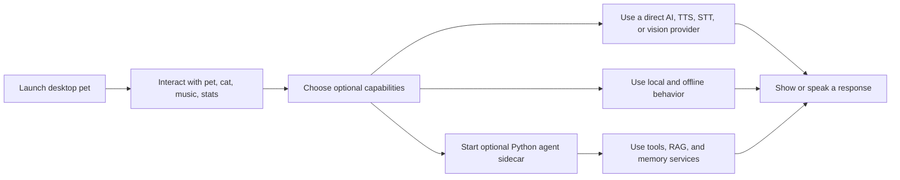
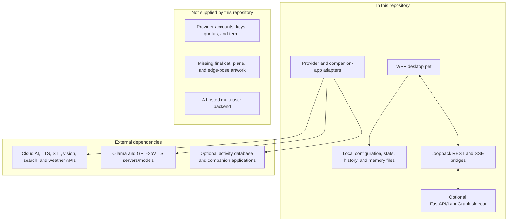

# Aemeath Desktop Pet — Product Requirements and Status

**Document role:** Canonical product requirement and current-status source

**Verified against:** working tree on 2026-07-22

**Target platform:** Windows 10/11 x64

**Primary application:** .NET 8 WPF

**Optional AI sidecar:** Python 3.11+ FastAPI/LangGraph

This document defines the intended product and records how much of each requirement is present in the current working tree. Detailed design documents explain implementation choices, but they must not override the requirement status recorded here. Package versions and dependency membership are authoritative only in the project manifests: `src/AemeathDesktopPet/AemeathDesktopPet.csproj`, `tests/AemeathDesktopPet.Tests/AemeathDesktopPet.Tests.csproj`, and `python-backend/pyproject.toml`. `python-backend/requirements.txt` mirrors the runtime install set used by CI and must be kept consistent with `pyproject.toml`.

## 1. Status Model

| Status | Meaning |
|--------|---------|
| **Implemented** | The behavior is present and connected to the normal application flow; verification may still require a manual or automated check. |
| **Partial** | A meaningful implementation exists, but a required runtime connection, behavior, or verification is missing. |
| **Planned** | The requirement is accepted but no usable implementation is present. |
| **External dependency** | The adapter and application wiring exist, but successful operation requires an external service, API key, model, database, executable, or compatible environment. |
| **Asset placeholder** | Behavior or state support exists, but final visual/audio assets are missing and a substitute or shared animation is used. |

An implementation is not considered complete merely because an interface, engine, setting, or test double exists. The user-visible execution path must also be connected.

## 2. Product Intent

Aemeath Desktop Pet is a fan-made Windows companion inspired by Aemeath from *Wuthering Waves*. It presents a transparent, always-on-top animated character that reacts to the user, keeps lightweight local state, and can optionally converse, speak, listen, observe the screen, and use agent tools.

The product should remain useful without the optional Python backend or cloud credentials. Advanced AI capabilities may use a locally launched Python sidecar, direct providers, local model servers, or contextual offline responses, depending on configuration and availability.

### Primary user stories

- As a desktop user, I want an animated companion that lives unobtrusively on my Windows desktop so that routine computer use feels more lively.
- As a user who enables AI features, I want conversational, voice, vision, and memory behavior that reflects the pet's personality and current state.
- As a privacy-conscious user, I want screen/activity features to be opt-in and to understand what is stored locally or transmitted externally.
- As a user without cloud credentials, I want the pet, local interactions, and offline conversation to continue working.

### User journey

### Scope boundary

## 3. Product Architecture Requirements

| ID | Requirement | Priority | Status | Acceptance check |
|----|-------------|----------|--------|------------------|
| AR-001 | The WPF application is the desktop host and must remain operable when the Python sidecar is disabled or unavailable. | Must | **Implemented** | AC-AR-001: With Backend disabled and no API key, the pet launches and chat returns a contextual offline response. |
| AR-002 | The optional sidecar exposes FastAPI endpoints on loopback, provides REST plus SSE agent streaming, and is intended to honor the configured backend port. | Should | **Partial** | AC-AR-002: `/health`, `/agent/invoke`, and `/agent/stream` respond at the default port; app-managed non-default ports do not work because the launcher does not pass `--port` and the CLI ignores `AEMEATH_PORT`. Packaged-release startup also remains unproven. |
| AR-003 | WPF exposes a loopback internal API for pet stats, screen capture, music control, and pet state so agent tools can interact with the desktop host. | Should | **Implemented** | AC-AR-003: Calls to the four `/internal/*` routes return the expected data or action while WPF is running. |
| AR-004 | Chat selection supports the sidecar when ready, otherwise a configured direct provider, and contextual offline output when the selected service is unavailable. | Must | **Partial** | AC-AR-004: Startup selection works; a sidecar request failure currently falls directly to offline output rather than retrying through the direct provider. |
| AR-005 | Loopback APIs must bind locally by default and must not be presented as authenticated security boundaries. | Must | **Implemented** | AC-AR-005: Defaults use `localhost`/`127.0.0.1`; documentation warns that neither WPF nor FastAPI loopback routes require an auth token. |

## 4. Functional Requirements

### 4.1 Desktop Pet and Interaction

| ID | Requirement | Priority | Status | Acceptance check |
|----|-------------|----------|--------|------------------|
| FR-PET-001 | Show a transparent, borderless, always-on-top pet window without a taskbar button and provide a system-tray menu. | Must | **Implemented** | AC-PET-001: Launching the app shows the pet, omits a taskbar entry, and exposes Show, Chat, Paper Plane, Settings, and Quit from the tray. |
| FR-PET-002 | Decode and cache GIF frames, preserve source timing, support one-shot/loop playback, and mirror directional flight. | Must | **Implemented** | AC-PET-002: included GIFs load from `Resources/Sprites`, animate, and left flight mirrors the flying animation. |
| FR-PET-003 | Drive pet personality through the 26-value `PetState` finite-state model with weighted idle choices and stats/time context. | Must | **Implemented** | AC-PET-003: state changes select an animation and the idle cycle varies behavior using mood, energy, and time inputs. |
| FR-PET-004 | Support gravity, movement, collision, dragging, and release/throw behavior. | Must | **Partial** | AC-PET-004: gravity, bounds, movement, and drag work; drag release must still calculate/apply throw velocity and enter the `Thrown` path. |
| FR-PET-005 | Provide click, hover, sing, chat, paper-plane, cat, stats, settings, tray, and configurable click-through interactions. | Must | **Implemented** | AC-PET-005: each wired menu/input action invokes its application behavior without an exception. |
| FR-PET-006 | Provide a separately positioned black-cat companion with its 12-state behavior engine and reactions to the pet and user. | Should | **Asset placeholder** | AC-PET-006: the cat window follows and reacts, but completion requires state-specific cat sprites/animations in place of the Unicode cat. |
| FR-PET-007 | Detect nearby windows and screen/taskbar edges, track a perched window, and enter visible edge poses. | Should | **Partial** | AC-PET-007: detection/manager tests pass; completion requires runtime event subscriptions and actual transitions/positioning for peek, perch, taskbar-hide, and cling poses. |
| FR-PET-008 | Simulate thrown and ambient paper planes and render them in the desktop UI. | Should | **Partial** | AC-PET-008: trajectory and landing logic exist; completion requires a renderer/visual instance connected to the plane collection. |
| FR-PET-009 | Provide glitch, particle, speech-bubble, music, and time-aware personality effects. | Should | **Implemented** | AC-PET-009: enabled effects are visible/audible in their wired states and disabled effects remain inactive. |
| FR-PET-010 | Hide or reposition the pet when another application is fullscreen. | Should | **Partial** | AC-PET-010: fullscreen detection exists and TTS can auto-mute, but pet-window auto-hide/reposition is not wired. |
| FR-PET-011 | Persist configuration, position, stats, and bounded chat history across restarts. | Must | **Implemented** | AC-PET-011: saved settings, position, stats, and the capped message history reload from local JSON files. |
| FR-PET-012 | Expose mood, energy, affection, lifetime counters, offline decay, and a stats popup; feed stats into behavior selection. | Should | **Implemented** | AC-PET-012: interactions change clamped stats, the popup reflects them, and behavior receives updated mood/energy. |
| FR-PET-013 | Provide exactly eight settings tabs: General, Appearance, Music, AI, Voice, Screen, Backend, and MCP. | Must | **Implemented** | AC-PET-013: all eight named tabs load, edit their owned settings, and save through `ConfigService`. |
| FR-PET-014 | Integrate optionally with Pomodoro events, an external activity-monitor database, and configured companion launchers. | Could | **External dependency** | AC-PET-014: each integration remains inactive when disabled/missing and consumes events/data only when the dependency is present and configured. |

### 4.2 Chat and Agent Capabilities

| ID | Requirement | Priority | Status | Acceptance check |
|----|-------------|----------|--------|------------------|
| FR-AI-001 | Provide a themed chat window with persisted history and streaming display. | Must | **Implemented** | AC-AI-001: user messages and streamed chunks appear in order and the completed turn persists. |
| FR-AI-002 | Support direct Claude, Gemini, and configurable local-proxy chat providers. | Should | **External dependency** | AC-AI-002: the selected adapter streams a response when its key/proxy is available and falls back safely otherwise. |
| FR-AI-003 | Provide contextual scripted conversation without network access. | Must | **Implemented** | AC-AI-003: no provider credentials or backend are required to receive an in-character response. |
| FR-AI-004 | Inject character identity plus current pet/user context into AI requests. | Must | **Implemented** | AC-AI-004: generated requests contain the character prompt and current stats/time context without exposing unrelated configuration. |
| FR-AI-005 | Start, health-check, stop, and retry the optional Python process in auto, bundled, or development mode while honoring configured ports. | Should | **Partial** | AC-AI-005: lifecycle and health/retry work at the default port; completion requires passing the configured `--port` to the sidecar and distributing a verified bundled build with the WPF release. |
| FR-AI-006 | Register 11 sidecar tools: `search_web`, `get_weather`, `manage_todo`, `read_screen`, `control_music`, `get_pet_stats`, `rag_retrieve`, `get_system_info`, `save_memory`, `update_user_block`, and `retrieve_memory`. | Should | **Partial** | AC-AI-006: all 11 appear in the graph; `rag_retrieve` still needs retriever configuration in normal startup, and several tools require keys or WPF loopback access. |
| FR-AI-007 | Ingest PDF, DOCX, text, and directory content and retrieve it through hybrid semantic/BM25 search with reranking. | Could | **Partial** | AC-AI-007: RAG API ingestion/query works with installed models; completion requires production configuration of the agent's `rag_retrieve` tool and packaged dependencies. |
| FR-AI-008 | Consume external MCP stdio servers and expose pet actions through an MCP server when configured. | Could | **Partial** | AC-AI-008: client/server classes and settings exist; completion requires application-startup lifecycle wiring and an end-to-end tool call from a live MCP peer. |

### 4.3 Voice and Vision

| ID | Requirement | Priority | Status | Acceptance check |
|----|-------------|----------|--------|------------------|
| FR-VOICE-001 | Synthesize and play queued speech with volume, cancellation, and fullscreen auto-mute. | Should | **Implemented** | AC-VOICE-001: an available provider produces playable audio, Stop cancels/clears playback, and fullscreen auto-mute suppresses output. |
| FR-VOICE-002 | Offer five TTS providers: Edge TTS, GPT-SoVITS, ElevenLabs, Fish Audio, and OpenAI TTS. | Should | **External dependency** | AC-VOICE-002: selecting each provider creates its adapter; successful synthesis requires network access/API credentials or a compatible local GPT-SoVITS server. |
| FR-VOICE-003 | Capture voice input by hotkey and transcribe through Whisper or Gemini, directly or through the sidecar. | Should | **Partial** | AC-VOICE-003: direct Whisper/Gemini paths are wired. The backend path is currently nonfunctional because WPF sends multipart `file`/`language` data while FastAPI requires JSON `audio_base64`/`provider`/`language`; the Whisper route also uses `anthropic_api_key` and defines no `openai_api_key` setting. |
| FR-VISION-001 | Periodically capture the screen only after opt-in and produce rate-limited in-character commentary. | Should | **Implemented** | AC-VISION-001: the default is disabled; enabling starts the interval capture/comment flow and shows the configured indicator. |
| FR-VISION-002 | Support four vision modes: Gemini, Claude, Ollama, and local/cloud hybrid (`local_hybrid` in WPF; `hybrid` in Python). | Should | **External dependency** | AC-VISION-002: each mode dispatches to the configured cloud key or local Ollama endpoint and handles dependency failure without crashing the pet. |
| FR-VISION-003 | Apply the wired periodic-screen privacy and cost pipeline before publishing commentary. | Must | **Implemented** | AC-VISION-003: the periodic flow applies protected-window and configured app/title blacklist gates, fullscreen skip, configurable downscale, perceptual-change deduplication, approximate monthly budget tracking/gating, and response PII scanning. |
| FR-VISION-004 | Honor the saved privacy-tier, local-prefilter, taskbar-blur, and address-bar-blur settings. | Should | **Partial** | AC-VISION-004: `PrivacyTier`, `UseLocalPreFilter`, `BlurTaskbar`, and `BlurAddressBar` must change capture/analysis behavior; they are currently stored but not consumed by `ScreenAwarenessService`. |

### 4.4 Memory

| ID | Requirement | Priority | Status | Acceptance check |
|----|-------------|----------|--------|------------------|
| FR-MEM-001 | Maintain local C# core profile, procedural memory, and a short-lived observation buffer in JSON. | Should | **Partial** | AC-MEM-001: files load/save and observation entries expire after 24 hours; core/procedural content still lacks a complete automatic update workflow and user controls. |
| FR-MEM-002 | Collect opted-in screen/activity observations and attempt distillation every 30 minutes through the sidecar. | Should | **Partial** | AC-MEM-002: observations enter the buffer and successful distillation clears processed IDs; behavior without an available extraction model remains non-destructive and retryable. |
| FR-MEM-003 | Submit completed conversation turns to `/memory/extract` and persist extracted facts/preferences/episodes in Python JSON and the `aemeath_memories` Chroma collection. | Should | **Partial** | AC-MEM-003: per-turn submission and storage paths exist; extracted updates do not yet synchronize the C# canonical core JSON. |
| FR-MEM-004 | Inject relevant core, procedural, episodic, and recent observation context into every applicable chat provider. | Must | **Partial** | AC-MEM-004: the memory context builder is implemented, but direct C# chat providers do not call it or use the memory-aware prompt overload. |
| FR-MEM-005 | Let the agent maintain and retrieve a persistent USER BLOCK without restart. | Should | **Partial** | AC-MEM-005: update/retrieve tools persist data; the system prompt must refresh the USER BLOCK after an update rather than retaining its startup snapshot. |
| FR-MEM-006 | Provide user-visible inspect, correct, and forget controls with reliable query and time-range deletion. | Must | **Planned** | AC-MEM-006: the UI exposes memory contents and deletion; deletion removes matching JSON and Chroma records and honors both query and time range. |
| FR-MEM-007 | Learn routines/preferences, consolidate sessions, summarize long histories, and persist procedural results. | Could | **Planned** | AC-MEM-007: repeated evidence updates procedural memory and session summaries without duplicating or silently discarding facts. |

### 4.5 Future Enhancements

| ID | Requirement | Priority | Status | Acceptance check |
|----|-------------|----------|--------|------------------|
| FR-FUT-001 | Mini-games such as rock-paper-scissors, catch-the-star, and a pet-integrated focus mode. | Could | **Planned** | AC-FUT-001: each game has a reachable interaction loop, visible state, and restart/exit behavior. |
| FR-FUT-002 | Final special-purpose animations for sleep, edge poses, chat/speaking, cat interactions, and paper-plane actions. | Could | **Asset placeholder** | AC-FUT-002: every state uses a purpose-built approved asset rather than a shared fallback GIF. |
| FR-FUT-003 | Optional interaction and companion sound effects. | Could | **Planned** | AC-FUT-003: sounds obey volume/mute settings and do not play while disabled. |

## 5. Data, Network, Security, and Privacy

### 5.1 Local storage

WPF creates `%LOCALAPPDATA%\AemeathDesktopPet\`. Current files may include:

| Data | Location | Notes |
|------|----------|-------|
| Application configuration and API keys | `config.json` | Keys, paths, and settings are stored in plaintext. The file is not a credential vault. |
| Pet statistics | `stats.json` | Mood, energy, affection, and counters. |
| Chat history | `messages.json` | Locally persisted bounded conversation history. |
| C# memory | `core_memory.json`, `procedural_memory.json`, `observation_buffer.json` | The observation buffer has a 24-hour TTL; core/procedural automatic synchronization is incomplete. |
| Python agent/checkpoint state | `agent_state.db` by default | Defaults to the WPF data directory on Windows, or `~/.aemeath/` when `LOCALAPPDATA` is unavailable; configurable by Python settings/environment. |
| Python memory store and USER BLOCK | `memory_store.json`, `memory_blocks.json` | Defaults to the WPF data directory on Windows, otherwise `~/.aemeath/`. |
| Chroma RAG and episodic memory | `data/chromadb/` by default | Relative to the sidecar working directory; `AEMEATH_CHROMADB_PATH` can override it. |
| Agent to-do data | `data/todos.db` | Relative to the sidecar working directory and not currently exposed as a WPF setting. |
| External activity data | User-configured SQLite path | Read only when Activity Monitor is enabled; it is outside the application data directory. |

Therefore, the old claim that the application writes only beneath `%LOCALAPPDATA%\AemeathDesktopPet\` is not a valid guarantee when the Python sidecar or external integrations are enabled.

### 5.2 Loopback communication

- The Python sidecar defaults to `127.0.0.1:18900`; WPF calls REST endpoints for health, config, agent invoke/stream, STT, vision, RAG, and memory.
- WPF exposes `http://localhost:18901/` by default for stats, screen, music, and pet-state routes used by sidecar tools.
- These APIs currently have no token, session authentication, or caller authorization. Any local process able to reach the ports may attempt to call them.
- The WPF internal port is configurable. The sidecar CLI accepts manual `--host`/`--port` overrides, but the WPF-managed `Backend.Port` setting is currently ineffective because process startup passes neither CLI option and argparse defaults to 18900. Exposing the sidecar beyond loopback is outside the supported/privacy-reviewed configuration.

### 5.3 External transmission

Depending on the user's explicit configuration, the application or sidecar may transmit:

| Capability | Possible destination | Data that may leave the device |
|------------|----------------------|--------------------------------|
| Chat/agent | Anthropic, Google Gemini, or configured proxy/model provider | User messages, conversation/context, pet stats, tool outputs, and an optional screenshot. |
| TTS | Microsoft Edge service, ElevenLabs, Fish Audio, OpenAI, or local GPT-SoVITS | Text to synthesize and provider/profile parameters; returned audio is played locally. |
| STT | OpenAI Whisper, Google Gemini, or sidecar-selected provider | Recorded audio and language metadata. |
| Vision | Google Gemini, Anthropic Claude, or local Ollama/hybrid pipeline | Screenshot or locally generated screen description, subject to enabled privacy preprocessing. |
| Agent tools | Tavily and OpenWeatherMap | Search query or weather location; other tools call local WPF routes. |
| RAG/memory embeddings | Google embedding service when selected, or a local sentence-transformer | Document chunks, memories, or queries used to create/search embeddings. |

Cloud provider policies, retention, billing, and regional processing are external dependencies and are not controlled by this repository.

### 5.4 Privacy requirements

| ID | Requirement | Status | Acceptance check |
|----|-------------|--------|------------------|
| PR-001 | Screen awareness and activity monitoring are disabled by default and require explicit opt-in. | **Implemented** | Fresh configuration has both toggles off; periodic capture/database reading does not start until enabled. |
| PR-002 | The user is visibly informed while periodic screen awareness is active. | **Implemented** | The screen-watch badge appears when enabled and configured to show. |
| PR-003 | Screenshot processing should avoid durable screenshot files. | **Implemented** | Capture/analysis uses in-memory bytes; no screenshot file write exists in the normal path. Textual observations or memories derived from screenshots may still be persisted. |
| PR-004 | Documentation and settings UI must disclose that secret fields are stored as plaintext local configuration, or the application must use protected credential storage. | **Partial** | This document now discloses plaintext storage; the settings UI has no equivalent warning and no protected credential store is implemented. |
| PR-005 | Users must be able to review and delete learned memory. | **Planned** | See AC-MEM-006. |
| PR-006 | Loopback APIs require authentication or an equivalent local authorization control before being treated as secure against other local processes. | **Planned** | Unauthorized local calls are rejected after the control is implemented. |

## 6. Assets and Visual Completeness

| Asset area | Current state | Status |
|------------|---------------|--------|
| Aemeath sprites | Eight GIFs are present: normal, flying, hand wave, happy jump, laugh, laugh flying, sigh/sign, and listening to music. Multiple FSM states intentionally reuse these files. | **Implemented** for the animation engine; **Asset placeholder** for state-specific poses. |
| Seal sprite | One `seal.gif` is present under `Resources/Sprites/Seal/`. | **Implemented asset**, with limited product integration. |
| Black cat | No cat sprite set; the separate window displays Unicode cat glyphs. | **Asset placeholder** |
| Paper plane | No plane sprite and no WPF plane renderer are connected. | **Partial / Asset placeholder** |
| Icons | `Resources/Icons/tray_icon.ico` exists, is copied to output, is used by the tray, and is configured as the application icon. | **Implemented** |
| Edge/special poses | FSM values exist but use shared Aemeath GIFs and lack complete positioning/transitions. | **Partial / Asset placeholder** |

## 7. Non-Functional Requirements

The following numeric goals are retained as **unverified engineering targets**, not measured characteristics or release guarantees. Record hardware, OS build, release commit, publish mode, sidecar state, provider state, sample duration, and tool version with every result.

| ID | Target | Verification method | Current evidence |
|----|--------|---------------------|------------------|
| NFR-001 | Idle CPU below 0.5% after warm-up | Measure a Release build for at least 10 minutes with Windows Performance Recorder/Analyzer; report normalized CPU and enabled features. | **Unverified target** |
| NFR-002 | Active animation CPU below 2% | Measure representative idle, flight, glitch, cat, and particle scenarios with the same profiler and sampling window. | **Unverified target** |
| NFR-003 | WPF working set below 50 MB in the base offline scenario | Record private working set after launch/warm-up with no sidecar; report sidecar/model memory separately. | **Unverified target** |
| NFR-004 | Interactive startup below 3 seconds | Measure process start to first rendered/interactive pet using an instrumented timestamp over at least 20 cold and warm launches. | **Unverified target** |
| NFR-005 | Drag presentation sustains 60 displayed frames per second on a 60 Hz display | Capture WPF frame timing during a scripted 30-second drag on representative 100%, 150%, and mixed-DPI displays. | **Unverified target** |
| NFR-006 | Installed/published base WPF payload near 30 MB | Sum a clean framework-dependent Release publish directory; report self-contained WPF and packaged Python/model payloads separately. | **Unverified target** |
| NFR-007 | Source GIF timing is preserved (currently 9 FPS standard and 25 FPS listening animation) | Compare decoder metadata/timer behavior with the included source files and check dropped frames under load. | **Implemented, runtime measurement pending** |
| NFR-008 | Offline operation degrades gracefully without keys, network, sidecar, Ollama, GPT-SoVITS, or companion apps. | Run an offline fault matrix and verify the pet remains responsive, errors are contained, and offline chat responds. | **Partial verification** |
| NFR-009 | Avoid visible Z-order flicker in normal desktop use. | Record manual scenarios across virtual desktops, fullscreen transitions, taskbar positions, and mixed-DPI monitors. | **Unverified target** |

No fixed RAM, VRAM, disk, throughput, availability, coverage, or test-count claim should be treated as verified unless accompanied by a dated result and method.

## 8. Runtime and Dependency Requirements

| Area | Requirement |
|------|-------------|
| Base OS | Windows 10/11 x64 capable of running .NET 8 WPF. Exact minimum Windows build remains to be compatibility-tested. |
| Base runtime | .NET 8 Desktop Runtime for framework-dependent builds, or the self-contained WPF release payload. |
| Optional sidecar development | Python 3.11 or newer and dependencies declared in `python-backend/pyproject.toml`; CI currently exercises Python 3.12. |
| Optional local AI | Compatible Ollama and/or GPT-SoVITS servers plus their models/assets. Model-specific RAM/VRAM needs are external and are not guaranteed here. |
| Optional cloud AI | Network connectivity, valid provider credentials, quota, and acceptance of provider terms. |
| C# packages | The application manifest currently declares Hardcodet.NotifyIcon.Wpf, Edge_tts_sharp, NAudio, System.Drawing.Common, and Microsoft.Data.Sqlite; exact versions belong to the `.csproj`. |
| Python packages | FastAPI/Uvicorn, LangChain/LangGraph, provider adapters, ChromaDB, sentence-transformers, BM25/reranking, document loaders, HTTP/SSE, settings, and tooling dependencies are governed by `pyproject.toml`. |

## 9. Verification Requirements

Release evidence must be based on commands and manifests, not hard-coded test counts:

- `dotnet build AemeathDesktopPet.sln -c Release`
- `dotnet test tests/AemeathDesktopPet.Tests/ -c Release`
- `dotnet format --verify-no-changes`
- From `python-backend/`: `pytest -v --cov=aemeath_agent`
- From `python-backend/`: `ruff check .`
- Manual Windows verification for transparent rendering, tray behavior, drag, settings persistence, audio devices, hotkeys, DPI, fullscreen, provider integrations, and loopback security assumptions.

The current CI runs Release build/tests and C# coverage on Windows, and Python tests/coverage on Ubuntu with Python 3.12. It does not enforce coverage thresholds. The format step is currently advisory (`continue-on-error`). The tag release workflow publishes only the self-contained WPF payload; it does not build or bundle the Python sidecar.

## 10. Known Release Gaps

The following gaps block describing the repository as a fully integrated release:

1. Render paper planes and supply final plane artwork.
2. Wire window-edge events and poses into visible runtime behavior.
3. Apply drag-release velocity to the thrown physics path.
4. Wire pet auto-hide/reposition for fullscreen applications.
5. Wire MCP client/server lifecycle into application startup and shutdown.
6. Configure the RAG retrieval tool in the live agent.
7. Bundle and verify the Python sidecar in release artifacts.
8. Make WPF-to-sidecar config synchronization update effective live settings, pass the configured sidecar port and correctly prefixed tool/internal-port variables, align the STT JSON contract, and add/use the proper OpenAI Whisper credential.
9. Inject memory context into direct providers and synchronize C# and Python memory cores.
10. Add memory inspection/correction/deletion UI and complete procedural learning, session consolidation, and reliable forget semantics.

## 11. Change History

- **2026-07-22:** Replaced the stale phase-completion narrative with a code-audited canonical requirement/status source. Added the optional sidecar and loopback architecture, current AI/TTS/STT/vision/RAG/MCP/memory scope, eight settings tabs, accurate assets, storage/network/privacy disclosures, manifest authority, and explicitly unverified performance targets.
- **2026-07-22 (verification revision):** Corrected the nonfunctional backend STT contract, ineffective app-managed sidecar port setting, and dormant privacy-tier/local-prefilter/blur options; limited completed vision privacy claims to layers consumed by the periodic pipeline.
