# ADR-0002: Test-Driven Verification and Exact-SHA Delivery

**Status:** Accepted  
**Date:** 2026-07-22  
**Decision owners:** Aemeath maintainers  
**Related documents:** [ADR-0001](ADR-0001-evolutionary-modular-assistant-architecture.md),
[PRD](../prd/jarvis_assistant_prd.md), [Design](../design/jarvis_assistant_design.md),
[UI specification](../ui-spec/jarvis_assistant_ui_spec.md),
[Work plan](../plans/20260722-jarvis-assistant-evolution.md)

## Context

Aemeath is an existing Windows application, not a greenfield assistant. The modular evolution in
ADR-0001 will change composition, persistence, process supervision, inter-process contracts,
permissions, desktop integrations, packaging, and most of the dense UI. Those changes can preserve
compilation while silently changing pet behavior, corrupting user data, weakening an approval
boundary, or passing in fixtures while failing on a real Windows desktop.

The repository already has an xUnit project and a Python pytest suite. They remain useful regression
signals, but the request to qualify the current product independently cannot be satisfied by
renaming, copying, adapting, or treating those tests as oracles. A test and implementation can share
the same mistaken assumption. Reusing the same fixtures and expected values would preserve that
correlation and create false confidence before a large refactor.

The current GitHub Actions workflow also cannot establish the required delivery claim by itself. It
runs .NET tests on `windows-latest` and Python tests on Ubuntu for pull requests and pushes to
`main`; formatting is advisory, required lane discovery is not checked, Windows desktop boundaries
are incomplete, and pull-request checks may describe a synthetic merge commit rather than the
pushed head commit. A green badge therefore does not yet prove that every required check ran against
the exact source being advanced.

This ADR decides how Aemeath will establish an independent baseline, apply test-driven development
to each later change, divide evidence across hosted and interactive Windows environments, and make a
CI result attributable to one exact commit.

## Decision drivers

The verification architecture must:

1. detect unintended changes to every retained requirement, user journey, data invariant, and
   integration boundary before and throughout the modular migration;
2. keep independent preservation evidence structurally and procedurally separate from legacy tests;
3. distinguish an intentional replacement from a regression or an undocumented baseline defect;
4. require a meaningful test-first signal for behavior, configuration, workflow, migration, and
   packaging changes without manufacturing a false RED for a pure refactor;
5. exercise fast deterministic logic, cross-component integration, actual WPF views, Windows UI
   Automation, complete process flows, real OS boundaries, security controls, performance, and
   clean-machine packaging at the lane appropriate to each risk;
6. make test order, clocks, random behavior, ports, data roots, providers, and OS facilities
   controllable and reproducible;
7. reject a skipped, incomplete, path-filtered, reduced, or zero-test run even when visible checks
   appear green;
8. prove required GitHub Actions jobs ran against the pushed head SHA, not merely a branch name or
   pull-request merge SHA;
9. retain enough redacted evidence to audit a gate after transient CI logs expire; and
10. block dependent work when evidence is unavailable instead of silently lowering the gate.

## Decision

Aemeath will use an **independently authored preservation suite plus risk-mapped
RED-GREEN-REFACTOR-VERIFY delivery, enforced by exact-SHA manifests**. This verification system is a
prerequisite for ADR-0001. Gate 0A first qualifies retained behavior against the unchanged production
baseline before any production refactor or testability/accessibility seam. Gate 0B then corrects all
blocking testability, accessibility, dependency, static-analysis, product, and legacy-regression gaps
under the frozen Gate 0A suite. Architectural migration begins only after final Gate 0 is green at
one exact head SHA.

### Decision details

| Item | Decision |
|---|---|
| **Preservation source** | Current requirements, production contracts, user-visible documentation, owned data formats, and direct observation of the unmodified application |
| **Excluded preservation source** | Legacy test code, names, fixtures, helpers, snapshots, data, expected values, mocks, and results |
| **Change discipline** | New or changed behavior starts RED; a pure behavior-preserving refactor starts with independent GREEN characterization plus a mutation/negative control |
| **Delivery gate** | Frozen risk/lane contract, local VERIFY, focused commit, push, then every required job succeeds for that exact head SHA |
| **Windows strategy** | GitHub-hosted Windows for deterministic and controlled-process evidence; ephemeral interactive Windows workers for real desktop, OS, installer, and assistive-technology boundaries |
| **Legacy tests** | Separate regression lane that runs after the independent preservation baseline is frozen and passing; never counted as preservation coverage |
| **Known unknowns** | Long-term UIA stability across Windows updates, clean-machine runner cost, and the best archive location beyond GitHub Actions retention |
| **Kill criterion** | Reopen the runner or evidence-storage mechanism if it cannot repeatedly attribute every required result to one source SHA, but do not weaken independence or exact-SHA semantics |

### 1. Freeze what is preserved before testing or restructuring it

Gate 0 begins with a versioned disposition map covering every normative item and observable behavior
in the current `REQUIREMENTS.md`. The allowed dispositions remain those in the PRD:

- **Preserve:** keep the observable behavior or invariant; this is the default when no approved
  exception exists.
- **Change:** intentionally alter the behavior. A replacement is represented as `Change` and names
  the replacement requirement, migration, compatibility period, rollback, and user approval.
- **Defer:** retain the current behavior for now and name the release or decision that will revisit
  it. Deferral is not permission to remove it during unrelated work.
- **Remove:** deliberately stop the behavior with explicit user approval, migration or recovery
  treatment where relevant, and a rollback decision.

An ambiguous or missing mapping is treated as `Preserve`. Discovery of a new requirement or risk
versions the disposition map and invalidates affected evidence. Architecture acceptance is not
approval for a `Change`, `Defer`, or `Remove` entry.

Each preserved behavior receives a stable `PB-*` identifier. Its specification records the source
requirement locator, observable input and output, invariant, applicable Windows environment, fixture
or setup, independent oracle, risks, and required verification lanes. When the documented
requirement and direct baseline observation disagree, the discrepancy is reviewed before freezing
the oracle. A known defect is not silently converted into desired behavior: the project either fixes
it through a new RED test or obtains explicit approval for an intentional requirement change.

### 2. Enforce preservation-suite provenance independence

Before an author inspects any legacy test source or result for an affected behavior, the project
freezes the new suite specification, fixture inputs, expected oracle, and traceability map in a
versioned provenance record. The record contains:

- preservation ID and requirement/source locators;
- specification, fixture, and oracle content hashes;
- author and reviewer identities or stable team roles;
- author/reviewer declarations of prior exposure to legacy tests for that behavior;
- observation environment, commands, and captured raw evidence where direct observation was used;
- rationale for the oracle and a representative negative control or mutation; and
- review status and the commit that froze the record.

An author with prior exposure must disclose it. A reviewer without that exposure must independently
specify or review the affected input and oracle before Gate 0 accepts the case. If no unexposed
reviewer is available, that preservation item remains blocked until one is available or the user
approves a separately documented independent external oracle; self-attestation alone is not enough.

The preservation projects cannot reference, import, copy, link, or load the legacy test project,
its test packages beyond common runner libraries, or its fixture directories. A dependency and
content-provenance audit verifies this boundary. Similar public API calls are expected, but copied
test structure, distinctive data, snapshots, names, or expected-value derivations require a
documented discrepancy review. Legacy tests and results are not opened for comparison until the
independent specification is frozen and passes the unmodified baseline.

### 3. Use explicit physical and logical test topology

The verification topology separates preservation from regression and separates deterministic lanes
from environment-dependent lanes.

#### .NET and Windows topology

| Project or artifact | Responsibility | Dependency constraint |
|---|---|---|
| `tests/Aemeath.Testing/` | New shared fixture/process/result utilities | Never references legacy test code, assets, or output |
| `tests/Aemeath.Preservation.UnitTests/` | Independent pure behavior and literal-oracle characterization | No WPF desktop, real profile, registry, device, process, or network |
| `tests/Aemeath.Preservation.IntegrationTests/` | Component integration with isolated persistence and deterministic boundaries | References production projects and new shared test utilities only |
| `tests/Aemeath.Preservation.WpfTests/` | STA production-XAML state, layout, keyboard, security, accessibility-contract, and reliability characterization | Loads the real production resources/views; no duplicate product XAML |
| `tests/Aemeath.TestHost/` | Non-shipping controllable process that loads production WPF resources, views, view models, and composition for fixture E2E and UIA | Contains control plumbing only; no alternate product implementation |
| `tests/Aemeath.UiAutomation.Tests/` | Out-of-process UIA, keyboard, focus, accessible-name/role/pattern, and window-journey checks | Controls the product/TestHost through user-visible UI and a nonce-protected fixture lifecycle channel |
| `tests/Aemeath.RealBoundary.Tests/` | Interactive Windows tray, hotkey, notification, audio, screen/DPI, sleep/resume, sidecar, and assistive-technology boundaries | Runs only on resettable supported Windows workers with declared capabilities |
| `tests/Aemeath.Packaging.Tests/` | Build-output, install/upgrade/uninstall, clean-profile, sidecar presence/absence, and launch/readiness probes | Operates on produced packages, never developer output as a substitute |
| `tests/Aemeath.ArchitectureTests/` | Dependency, authoritative-owner, and forbidden-boundary rules | Includes known-bad fixture assemblies that must be detected |
| `tests/Aemeath.Protocol.Tests/` | Generated-contract and independently authored C#/Python fixture compatibility | Neither generated consumer is the other's oracle |
| `tests/fixtures/preservation/v1/` | Frozen non-secret config/data/UI/resource/oracle inputs and provenance hashes | Authored independently and immutable after Gate 0A freeze except through versioned discrepancy review |
| `tests/AemeathDesktopPet.Tests/` | Pre-existing legacy regression | Cannot be referenced by any preservation or new gate project |

Logical lanes may share a new physical project only when test traits, discovery output, artifacts,
and manifest commands keep each lane separately auditable. A lane must not be hidden inside an
unfiltered aggregate command whose discovery count cannot be attributed.

#### Python and cross-runtime topology

| Path or artifact | Responsibility | Dependency constraint |
|---|---|---|
| `python-backend/preservation_tests/` | Independently authored Python unit, API/component, orchestration, retrieval, security, and deterministic sidecar characterization | Imports production packages, not `python-backend/tests` or its fixtures/helpers |
| `contracts/fixtures/` | Versioned language-neutral request, event, error, cancellation, compatibility, and size-limit fixtures generated or reviewed from the canonical contract | Neither language's generated client is the oracle for the other |
| Cross-runtime fixture service | Starts the actual sidecar API with deterministic model, retrieval, clock, and storage adapters and exercises readiness plus a bounded `/agent/invoke` flow | `/health` alone never qualifies agent readiness |
| `python-backend/tests/` | Pre-existing legacy regression | Runs and reports separately after independent evidence is fixed |

C# and Python contract producers and consumers validate the same canonical schema independently.
Round trips through one generated client are insufficient because producer and consumer could share
the same generator defect.

### 4. Assign every retained or changed risk to an explicit lane

The following lane identifiers are stable in risk maps, CI jobs, manifests, and artifacts.

| Lane | Required evidence |
|---|---|
| `V-UNIT` | Pure policies, parsers, reducers, state transitions, serialization rules, redaction, schedulers, and adapters with isolated dependencies |
| `V-COMPONENT` | Real collaboration among multiple production components using isolated storage and deterministic external adapters |
| `V-CONTRACT` | Schema compatibility, C# and Python producer/consumer fixtures, authentication, version negotiation, streaming, cancellation, errors, and limits |
| `V-WPF` | Actual production resources, bindings, commands, dispatcher behavior, state-to-display mapping, keyboard semantics, and window lifecycle |
| `V-UIA` | Out-of-process AutomationId/name/role/value/pattern, focus order, keyboard reachability, live-region, and stable target checks |
| `V-FIXTURE-E2E` | Packaged or production composition across WPF, persistence, protocol, and deterministic sidecar/provider fixtures through a complete user outcome |
| `V-REAL-E2E` | Supported Windows process, OS, device, installer, or selected-application boundary through a complete reversible journey |
| `V-SECURITY` | Authentication, authorization, approval binding, scope revocation, secret canaries, redaction, traversal/injection, replay, and tamper cases |
| `V-ACCESS` | Automated accessibility contracts plus manual assistive-technology, high-contrast, scaling, reduced-motion, and comprehension evidence |
| `V-PERF` | Raw repeated measurements for startup, interaction, boundary latency, memory, long-run stability, retry, and recovery thresholds |
| `V-PACKAGE` | Clean-machine build/install/upgrade/uninstall, content manifest, signatures where applicable, sidecar variants, and first-launch readiness |
| `V-STATIC` | Blocking format, Ruff, compiler/analyzer, architecture dependency, generated-contract drift, dependency, and secret scans |
| `V-MANUAL-WIN` | Scripted evidence for Windows behavior not reliably automatable, with OS/build, hardware/session, operator, observations, and reviewer |
| `V-LEGACY` | Existing .NET and Python tests as a separate regression signal, reported without contributing to independent coverage |

Gate 0 always executes non-trivial `V-UNIT`, `V-COMPONENT`, `V-WPF`, `V-UIA`, `V-FIXTURE-E2E`, and
`V-REAL-E2E` cases. Other lanes are mandatory when the frozen retained-risk map identifies their
boundary. Each later step freezes applicable lanes before RED execution. A lane may be marked not
applicable only with boundary-based rationale approved before results exist; failure, unavailability,
or zero discovery can never be reclassified as not applicable.

Manual evidence supplements automation and cannot replace an automatable assertion. Conversely, a
hosted mock cannot replace a required real-boundary check. Cloud-provider E2E is required only when a
step changes that provider boundary; deterministic local services remain the blocking default for
ordinary CI so secrets, quotas, and internet variability do not become false product signals.

### 5. Follow one TDD evidence protocol for every checklist step

Before a step begins, freeze its requirement/disposition IDs, risks, required lanes, tests or probes,
commands, environments, fixtures/services, oracles, thresholds, expected artifacts, and owners.
Then apply the following protocol:

1. **RED:** For a new or changed outcome, add a focused executable test or probe before production,
   workflow, migration, configuration, or packaging changes. It must compile, discover, arrange its
   environment, reach the intended assertion or probe oracle, and fail with the expected diagnostic
   because the outcome is absent or wrong. A compilation, discovery, setup, authentication,
   infrastructure, unrelated-test, or unavailable-environment failure is not valid RED evidence.
2. **GREEN:** Make the smallest production change that satisfies the focused oracle. The focused
   lane and all preservation cases affected by the step pass.
3. **REFACTOR:** Improve structure without changing any other observable behavior or invariant. Keep
   the focused and affected preservation tests passing throughout.
4. **VERIFY:** Run every lane in the frozen manifest, independent preservation cases, and the
   separate legacy regression. Record nonzero discovery and expected artifacts before committing.
5. **DELIVER:** Create a focused commit, push it, and wait for every required GitHub Actions job to
   pass against that exact pushed head SHA. Dependent work does not start earlier.

A strictly behavior-preserving refactor has no honest missing outcome to make RED. Its allowed
exception is **characterization-first**: add an independently authored characterization test that
passes on the unmodified baseline, then demonstrate that a representative temporary mutation or
negative control makes that test fail at its intended oracle. Record the mutation and restore the
baseline before refactoring. A mixed refactor and behavior change still needs a separate RED test for
the changed behavior.

RED evidence records the baseline SHA, test/probe ID, source content hash or patch, command,
environment, expected diagnostic, actual diagnostic, exit status, and artifact link. The failing
state need not be pushed as a deliberately broken branch; the test-first patch and its result must be
durable and reviewable, and the final focused commit must contain the corresponding test. A CI-only
failure discovered after push becomes a new focused RED/probe within the same incomplete step; it
does not permit advancement or an unrelated workaround.

### 6. Require deterministic seams and hermetic case behavior

Production composition will expose injectable boundaries for time, delay/timers, random selection,
IDs, data roots, environment/configuration, ports, process launch, application lifetime, sidecar and
provider clients, notifications, tray, global hotkey, screen/window discovery, UI Automation,
clipboard, microphone/audio, motion/theme, and protected secret storage. Tests use production
implementations only when their lane explicitly validates that real boundary.

Every automated case:

- creates a unique temporary data root, database, port reservation, process identity, credential
  namespace, and provider state as applicable;
- owns and cleans up all files, processes, windows, registrations, credentials, and external records
  it creates, including on failure;
- uses a controlled clock and seeded random source whenever time or randomness affects the oracle;
- does not rely on prior test residue, execution order, wall-clock sleeps, public network timing,
  machine-global user settings, or another case's mutable fixture;
- produces the same result alone, in randomized order, and immediately after every other case in its
  lane; and
- has a bounded timeout and diagnostics that identify leaked processes, ports, windows, or state.

Critical oracles include a negative control or deliberate mutation that proves the test detects the
failure it claims to prevent. Random-order and repeat runs are required in Gate 0 and scheduled
reliability jobs, with seeds recorded for replay.

### 7. Test production WPF UI through a non-shipping host

`Aemeath.TestHost` is a deterministic shell around the production UI, not a second UI. It
must load the same production resource dictionaries, XAML views, view models, bindings, commands,
navigation, and composition modules that ship. Copying XAML or reimplementing view state inside the
test host invalidates UI evidence.

The host may expose only test lifecycle and fixture controls, such as reset, deterministic clock
advance, named scenario selection, fault injection, and graceful exit. That control channel is
compiled only in the non-shipping host, binds locally, uses a per-run nonce, logs no secret, and is
excluded by a packaging-content assertion. UIA tests otherwise interact out of process through
keyboard, pointer-equivalent automation patterns, and stable automation properties.

Production controls expose stable `AutomationId`, accessible name, role/control type, value/state,
supported patterns, focus behavior, and live announcements appropriate to the UI specification.
Tests assert meaning and state rather than exact random animation frames, font rasterization, or
timing-sensitive screenshots. Visual baselines are limited to deterministic golden states with
declared DPI, theme, font, animation setting, and tolerance.

### 8. Split hosted and interactive Windows responsibilities explicitly

GitHub-hosted `windows-latest` is authoritative for restore/build, `V-STATIC`, .NET unit/component
and contract tests, deterministic WPF dispatcher/state tests, fixture services, controlled test-host
UIA after an interactive-session probe, fixture E2E, and package construction. Ubuntu runners remain
authoritative for Python unit/component/security/static lanes that do not claim Windows behavior.

Hosted Windows is not sole evidence for tray/shell integration, global hotkeys, real microphone or
speaker devices, Windows notifications, sleep/resume, multiple monitors, DWM behavior, installed-app
UIA, Narrator, true high contrast, DPI/scaling matrices, reduced-motion OS settings, antivirus
interaction, installer registration, or clean-user-profile first launch. Required checks for those
boundaries run on resettable interactive Windows 10/11 x64 workers or clean VMs with the supported
OS build, display topology, scale, theme, accessibility mode, audio devices, locale, and installed
target applications recorded.

The controlled test-host UIA lane may run on a hosted worker only after a probe demonstrates that
the job has the required interactive desktop and the test host is foreground-capable. A failed probe
fails the required lane; it does not justify skipping it. Self-hosted workers start from a named
snapshot, receive ephemeral credentials, prevent concurrent desktop sessions, collect diagnostics,
and reset after the job. `V-MANUAL-WIN` records scripted steps, expected and actual observations,
screenshots or recordings where privacy permits, OS/hardware/session identity, operator, reviewer,
timestamp, and source SHA.

### 9. Make an exact-SHA manifest the gate contract

Each checklist step has a pre-step risk/lane manifest and a post-push exact-SHA gate manifest. The
gate manifest is versioned under `docs/verification/manifests/` and contains at least:

- repository, branch, baseline SHA, focused commit SHA, and actual checked-out head SHA;
- workflow file/ref, workflow run ID/URL, triggering event, and attempt number;
- every required check and job name plus job ID;
- complete matrix dimensions, declared entries, and actual entries;
- lane IDs, test/probe IDs, local and CI commands, filters, expected minimum nonzero discovery, and
  actual discovery;
- operating system image/build, runner class, architecture, SDK/runtime/tool and dependency-lock
  versions;
- fixture/service identities, deterministic seeds, supported-boundary capabilities, and redacted
  configuration profile;
- expected and actual artifact names, hashes, retention class, and download locations;
- links to provenance, RED, GREEN, REFACTOR/VERIFY, legacy-regression, performance, security, UI, and
  manual evidence required by the step; and
- final gate status, reviewer, review timestamp, and any invalidated predecessor manifest.

CI checks out the manifest's head SHA explicitly and records `git rev-parse HEAD` as an artifact. A
pull-request synthetic merge-SHA run is useful additional compatibility evidence but never replaces
a run whose checkout and reported `head_sha` equal the pushed focused commit. Workflows must provide
a branch-push or explicit-dispatch path for that head SHA. Branch names, check names, and the newest
green run are not identity evidence by themselves.

### 10. Fail closed on incomplete CI evidence

A step passes only when every job and matrix entry frozen as required reports success for the exact
head SHA and publishes its expected evidence. The gate fails when any required item is:

- missing because of a path filter, trigger gap, condition, matrix omission, renamed job, or reduced
  matrix;
- skipped, cancelled, timed out, neutral, stale, pending, quarantined, manually waived,
  `continue-on-error`, or allowed to fail;
- executed only for a synthetic merge SHA or a different commit;
- run with a different command, filter, environment, fixture, service, or threshold than the frozen
  manifest;
- successful after discovering zero tests/probes, fewer than the declared minimum, or no listed test
  IDs;
- missing a required report, screenshot, trace, package, environment record, or content hash; or
- represented by an expired/unavailable artifact before durable gate archival completes.

An infrastructure outage, unavailable required runner/service, or flaky rerun leaves the step
blocked. A rerun is evidence only when its attempt and rationale are recorded and all required jobs
for the same exact SHA pass; selective reruns cannot hide a failing matrix entry. If a required
workflow, risk map, lane, test selection, command, or threshold changes, affected evidence is
invalidated and the complete affected manifest reruns. A later failure reopens the gate and pauses
dependent work.

Formatting, Ruff, compiler/analyzer checks, contract drift, and architecture rules are blocking when
present in the manifest. Coverage percentages are diagnostic unless a separately approved threshold
is named; nonzero discovery and the risk-to-evidence traceability are always mandatory.

### 11. Keep legacy regression separately visible

The legacy .NET and Python suites run in jobs and reports labeled `V-LEGACY`, after the independent
suite specification is frozen and its baseline is passing. Their counts, coverage, failures, and
artifacts are never added to the preservation suite totals or used to fill a missing independent
lane. Both lanes must pass when required by a step, but they prove different claims:

- preservation evidence proves independently specified retained behavior; and
- legacy regression evidence detects changes relative to pre-existing developer expectations.

A disagreement opens a discrepancy review. The independent oracle may change only through a
versioned provenance revision that identifies new authoritative evidence and reruns affected gates;
the legacy result cannot silently overwrite it.

### 12. Retain auditable, privacy-safe artifacts

Required artifacts include machine-readable test results, discovery manifests, coverage reports,
environment and checkout identity, redacted logs/traces, protocol fixtures, UIA trees, deterministic
screenshots, accessibility reports, raw performance samples, package file/hash manifests,
install/upgrade logs, and manual Windows evidence where mapped. Artifact production is part of the
assertion: an otherwise green job with a missing required artifact fails.

Gate manifests, provenance records, approvals, metrics summaries, artifact hashes, and final results
are retained in version control permanently. Per-step CI artifacts remain downloadable for at least
90 days. For each release gate, the required evidence bundle is also attached to the release or
another immutable project archive and retained for the supported lifetime of that release plus 180
days, with a minimum of one year. If repository or GitHub retention settings cannot meet a class,
archival must complete and its hash/location must be recorded before the gate passes.

Evidence follows data minimization. Logs, screenshots, UIA trees, dumps, fixture databases, and
videos are seeded with canary data rather than personal content, scanned for secret canaries, and
redacted before upload. Raw secrets, user documents, real conversation content, and protected
credential material are never CI artifacts. Security evidence records detection outcomes without
persisting exploit credentials.

## Verification flow

```mermaid
flowchart LR
    R[Current requirements and production behavior] --> D[Disposition and risk map]
    D --> P[Freeze independent PB specifications and provenance]
    P --> B[Gate 0A on unchanged production baseline]
    B --> L[Admit legacy regression separately]
    L --> C[Gate 0B test-first corrections]
    C --> S[Freeze next step lane manifest]
    S --> T{Outcome type}
    T -->|New or changed| RED[Valid behavioral RED]
    T -->|Pure refactor| CHAR[GREEN characterization plus mutation]
    RED --> GREEN[Minimal GREEN]
    CHAR --> REFACTOR[Refactor]
    GREEN --> REFACTOR
    REFACTOR --> VERIFY[All mapped lanes plus legacy]
    VERIFY --> PUSH[Focused commit and push]
    PUSH --> SHA[Exact-head-SHA CI and artifact audit]
    SHA -->|Pass| NEXT[Advance one checklist step]
    SHA -->|Incomplete or fail| S
```

## Rationale and options considered

### Option A: Treat the existing tests as the preservation baseline

**Advantages**

- fastest and least expensive initial gate;
- preserves known regression value and familiar tooling;
- requires little new CI infrastructure.

**Disadvantages**

- test and implementation may encode the same mistake;
- untested user journeys and Windows boundaries remain invisible;
- copied fixtures or expectations do not provide independent confirmation;
- does not satisfy the explicit requirement to author the retained-behavior tests independently.

**Conclusion:** Rejected. Existing tests remain a required separate regression signal.

### Option B: Add broad tests, but allow teams to choose lanes and CI evidence after implementation

**Advantages**

- flexible and easier to adapt to runner availability;
- teams can optimize test cost after observing implementation details;
- fewer up-front manifests and provenance records.

**Disadvantages**

- permits failed or inconvenient lanes to be reclassified after results are known;
- encourages tests that confirm implementation rather than requirements;
- green checks may cover the wrong commit, a reduced matrix, or zero discovery;
- makes TDD and release evidence difficult to audit.

**Conclusion:** Rejected. Flexibility after results would make the gates negotiable.

### Option C: Rewrite first and test only the replacement

**Advantages**

- new code can start with clean test seams;
- avoids investing in characterization of code planned for removal;
- simplifies some test-project boundaries.

**Disadvantages**

- loses observable compatibility before it is measured;
- combines product expansion, architecture replacement, and behavior discovery;
- makes it impossible to distinguish a deliberate replacement from an accidental regression;
- conflicts with ADR-0001's evolutionary migration.

**Conclusion:** Rejected.

### Option D: Independent Gate 0, risk-frozen TDD, and exact-SHA delivery

**Advantages**

- creates a clean-room evidence source for retained behavior;
- catches correlated assumptions by comparing independent and legacy signals;
- places expensive Windows tests only where risk requires them while keeping them mandatory there;
- makes every advancement claim traceable to one source commit, command set, environment, and result;
- supports safe incremental migration and explicit intentional replacements.

**Disadvantages**

- high initial cost before user-visible feature delivery;
- requires provenance discipline, deterministic seams, a production-UI test host, and interactive
  Windows capacity;
- exact-SHA manifests and evidence archival add ongoing maintenance;
- some desktop and assistive-technology evidence remains slower and partly manual.

**Conclusion:** Selected. The cost is proportional to the risk of refactoring a stateful,
multi-runtime desktop assistant that will gain consequential capabilities.

## Consequences

### Positive consequences

- Retained behavior is specified independently before implementation movement can obscure it.
- Intentional changes and replacements become reviewable decisions rather than test updates.
- Fast deterministic lanes give short feedback while real Windows lanes protect actual boundaries.
- WPF UI tests exercise shipping views and resources instead of a parallel test implementation.
- A green gate has a precise meaning: all predeclared evidence passed for one exact head SHA.
- CI gaps such as skipped jobs, advisory lint, merge-SHA-only checks, and zero discovery fail visibly.
- Durable evidence supports security review, release diagnosis, and later ADR reconsideration.

### Negative consequences

- Gate 0A delays every production change until the independent inventory and multi-lane suite pass;
  Gate 0B permits only test-first corrective work and delays architectural migration until every
  blocking lane is green.
- Contributors previously exposed to legacy tests need independent oracle review for affected cases.
- Interactive Windows workers require secure maintenance, snapshot reset, and capacity management.
- Desktop E2E, clean-machine packaging, and manual accessibility evidence make some gates slower.
- Per-step manifests and artifact hygiene add work even to CI/configuration-only changes.
- Existing code may need test seams before it is otherwise refactored, increasing transitional code.

### Neutral or operational consequences

- The existing test suites are retained, but their architectural role is now explicitly regression.
- A pure refactor begins with a passing characterization test, not an artificial failure.
- Hosted runners remain the default feedback path; self-hosted/manual evidence is invoked by frozen
  boundary risk rather than for every unit-level change.
- Live third-party services are not universal CI dependencies; they become required only when their
  boundary is in the step's approved risk map.
- Evidence retention and privacy are release responsibilities, not incidental workflow settings.

## Architecture impact

- New preservation, UIA, test-host, real-boundary, packaging, and Python preservation test areas are
  separate from the legacy suites.
- Production composition gains injectable deterministic boundaries without moving policy into test
  code.
- CI gains head-SHA execution, lane-specific discovery assertions, Windows runner capabilities,
  blocking static analysis, artifact validation, and manifest auditing.
- Release engineering gains immutable evidence bundles and clean-machine Windows execution.
- The WPF accessibility contract gains stable automation properties needed by both users and tests.
- Documentation gains versioned requirement disposition, provenance, risk/lane, and gate manifests.

## Principled implementation guidance

1. Derive preservation expectations from public behavior and authoritative requirements, not private
   implementation details.
2. Keep production and test dependencies pointing inward to stable contracts; never make production
   behavior conditional on a test project.
3. Prefer deterministic fakes at external edges and real production collaboration inside the
   boundary under test.
4. Use the narrowest lane that can detect a risk quickly, then add a real-boundary lane wherever a
   fixture cannot prove the user outcome.
5. Design UI controls for accessibility first; stable UIA contracts are product contracts, not
   test-only hooks.
6. Keep the test host non-shipping and prove its exclusion from packages.
7. Treat every manifest as an immutable claim about one SHA; version corrections rather than editing
   passed evidence in place.
8. Fail closed when identity, environment, discovery, matrix, artifact, or retention evidence is
   incomplete.
9. Keep evidence free of secrets and personal data by construction, then verify with canaries and
   scans.
10. Delete a legacy implementation path only after preservation, replacement, migration, rollback,
    and exact-SHA evidence all pass.

## Compliance and reconsideration

ADR-0001 implementation cannot begin until Gate 0 passes this ADR. A later step cannot begin until
the previous step's exact-SHA manifest is complete and successful. Review this decision if hosted or
self-hosted infrastructure cannot repeatedly produce attributable evidence, storage cost becomes
material, or Windows updates make a lane unstable. A review may change runner technology, fixture
implementation, or archive medium; it must not silently weaken provenance independence, pre-result
risk freezing, valid behavioral RED, real-boundary coverage, or exact-head-SHA semantics.

## References

- [Jarvis assistant PRD](../prd/jarvis_assistant_prd.md)
- [Jarvis assistant technical design](../design/jarvis_assistant_design.md)
- [Jarvis assistant UI specification](../ui-spec/jarvis_assistant_ui_spec.md)
- [Current requirements](../../REQUIREMENTS.md)
- [Current architecture](../architecture.md)
- [GitHub Actions contexts](https://docs.github.com/en/actions/learn-github-actions/contexts)
- [GitHub Actions artifact retention](https://docs.github.com/en/actions/managing-workflow-runs/downloading-workflow-artifacts)
- [Microsoft UI Automation overview](https://learn.microsoft.com/en-us/dotnet/framework/ui-automation/ui-automation-overview)
- [WPF testing](https://learn.microsoft.com/en-us/dotnet/desktop/wpf/advanced/wpf-testing)
