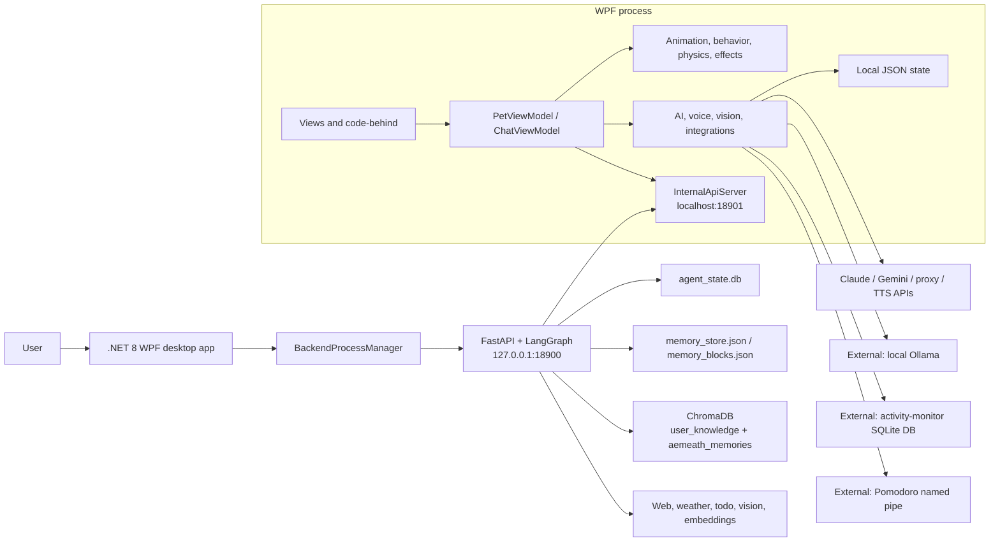

# Aemeath Desktop Pet: Current Architecture

> **Canonical current-state reference**
>
> **Verified against the working tree:** 2026-07-22
>
> Historical intent remains in `aemeath_desktop_pet_design.md`,
> `desktop_pet_design.md`, and `suggestion.md`. Those files are not evidence that a feature is
> currently wired into the application.

## Purpose and scope

Aemeath Desktop Pet is a Windows desktop companion implemented as a .NET 8 WPF application.
The desktop process owns the visible pet, animation and behavior timers, local configuration and
JSON state, direct AI-provider integrations, voice input/output, screen-awareness controls, and
optional productivity integrations. An optional Python FastAPI/LangGraph sidecar adds an agent
loop, tools, RAG, memory extraction, and semantic memory retrieval.

This document describes what the current working tree actually connects end to end. It does not
turn design intentions, isolated classes, settings fields, or passing unit tests into runtime
features.

## Status vocabulary

| Status | Meaning |
|---|---|
| **Implemented** | Connected to normal application startup or a reachable user flow. |
| **Partial** | Useful code exists, but an integration, UI, asset, or contract gap prevents the full advertised behavior. |
| **Planned** | Design or scaffolding exists without a working end-to-end path. |
| **External dependency** | Qualifier for a capability that requires a user-supplied service, process, data source, device, or API key. It does not by itself mean incomplete. |
| **Asset placeholder** | Qualifier for behavior that is wired but still presents a temporary glyph or substitute instead of its intended visual asset. |

## Component view



## WPF layers and startup

| Area | Primary paths | Current responsibility |
|---|---|---|
| Application | `src/AemeathDesktopPet/App.xaml*` | Starts `PetWindow`, creates the local data directory, loads config, and optionally launches companion applications. |
| Views | `src/AemeathDesktopPet/Views/` | Pet, chat, settings, statistics, speech bubble, tray menu, and cat windows. Significant orchestration remains in code-behind. |
| View models | `src/AemeathDesktopPet/ViewModels/` | Pet service/engine orchestration and chat/voice conversation flow. |
| Models | `src/AemeathDesktopPet/Models/` | Configuration, stats, state, chat, and C# memory contracts. |
| Engines | `src/AemeathDesktopPet/Engine/` | GIF playback, behavior FSM, movement, effects, cat state, paper-plane simulation, and window-edge detection. |
| Services | `src/AemeathDesktopPet/Services/` | Persistence, direct AI clients, TTS/STT, screen awareness, backend lifecycle, local HTTP bridge, memory bridge, and optional integrations. |

Startup follows this order:

1. `App.OnStartup` creates `%LOCALAPPDATA%\AemeathDesktopPet`, loads `config.json`, and launches
   enabled companion programs.
2. `PetWindow` constructs `PetViewModel`; the view model loads configuration and creates its
   engines and services.
3. `PetWindow.OnLoaded` calls `PetViewModel.Initialize`, creates the tray UI, starts idle and
   memory-distillation timers, registers initial hotkey/Pomodoro handlers, and optionally opens
   the cat window.
4. `PetViewModel.Initialize` loads statistics, restores position, starts engines and enabled
   awareness/integration services, starts the WPF loopback API, and attempts to launch the Python
   sidecar when `backend.enabled` is true.
5. Shutdown stops timers and child processes and persists statistics, messages, and pet position.

## AI request and memory flow

```mermaid
sequenceDiagram
    actor U as User
    participant C as ChatViewModel
    participant M as MemoryService
    participant A as Active IChatService
    participant P as Python sidecar
    participant X as Memory stores

    U->>C: text or transcribed audio
    C->>M: append user message
    C->>A: StreamMessageAsync(message, recent history, optional screenshot)
    alt BackendAgentService selected
        A->>P: POST /agent/stream
        alt backend ready and request succeeds
            P-->>A: SSE tokens/tool events
        else readiness lost or request fails
            A-->>C: OfflineResponses (no direct-provider retry)
        end
    else direct provider selected
        A->>A: Claude, Gemini, or proxy request
    else selected service unavailable/fails
        A-->>C: OfflineResponses fallback
    end
    A-->>C: response chunks
    C->>M: persist successful assistant response
    C-->>P: POST /memory/extract (fire-and-forget, if healthy)
    P->>X: facts/preferences to JSON store; episodic material to aemeath_memories
```

The startup/service-selection preference is:

1. `BackendAgentService` after `BackendReady`.
2. Otherwise, the configured direct C# provider: Claude, Gemini, or Claude-compatible proxy.
3. The selected service returns `OfflineResponses` when it is unavailable or a handled request
   fails.

This is not a per-request failover chain. Once `BackendAgentService` has been selected, loss of
backend readiness or a backend request failure produces offline output; the request is not retried
through the configured direct C# provider. Direct-provider selection occurs only when the chat
service is created while the backend is not ready.

The C# `MemoryBridgeService` can assemble core, procedural, observation, and retrieved episodic
context, but production `ChatViewModel` does not call `GetMemoryContextAsync`. Direct C# providers
therefore build prompts without the new `MemoryContext`. The Python agent does load its USER BLOCK,
but the compiled agent receives a static prompt created at agent startup; a USER BLOCK update does
not change that prompt until the agent is recreated.

## Python sidecar (external dependency)

The sidecar lives under `python-backend/aemeath_agent/` and exposes health, agent, STT, vision,
RAG, memory, and configuration routes. It binds to `127.0.0.1:18900` by default. The WPF process
communicates with it by REST and server-sent events, while Python tools call the WPF
`InternalApiServer` at `localhost:18901` for pet statistics, screen capture, and music control.

There is no sidecar `/shutdown` route. `BackendProcessManager.StopAsync` nevertheless attempts
`POST /shutdown`; the unmatched request normally returns 404, after which the manager waits up to
five seconds for exit and terminates the process tree if it is still running. A request exception
also falls back to process-tree termination.

The agent registers 11 tools. `rag_retrieve` is included in that list, but its retriever is never
configured during agent setup and therefore remains unavailable. The RAG API itself is separately
reachable and uses the `user_knowledge` collection. Episodic memory uses the dedicated
`aemeath_memories` collection.

Sidecar deployment remains developer-oriented:

- `python-backend/pyproject.toml` requires Python 3.11 or newer.
- The manifest omits the imported `langgraph-checkpoint-sqlite` dependency.
- The release workflow publishes only the WPF project; it does not bundle the sidecar executable.
- App-managed port configuration is ineffective for process launch. `BackendProcessManager` sets
  `AEMEATH_PORT`, but the Python CLI uses an argparse `--port` default of `18900` and does not read
  that environment variable; the manager does not pass `--port`. A non-default WPF backend port
  therefore changes the client's target without changing the sidecar's bind port.
- Startup catches agent-initialization failure and continues in degraded mode. `/health` can still
  report healthy even when agent routes cannot serve a working agent.

## Storage

| Owner | Data | Default location |
|---|---|---|
| WPF | Configuration and API keys | `%LOCALAPPDATA%\AemeathDesktopPet\config.json` |
| WPF | Pet statistics | `%LOCALAPPDATA%\AemeathDesktopPet\stats.json` |
| WPF | Up to 200 chat messages | `%LOCALAPPDATA%\AemeathDesktopPet\messages.json` |
| WPF | Core memory model | `%LOCALAPPDATA%\AemeathDesktopPet\core_memory.json` |
| WPF | Procedural memory model | `%LOCALAPPDATA%\AemeathDesktopPet\procedural_memory.json` |
| WPF | Text observation buffer | `%LOCALAPPDATA%\AemeathDesktopPet\observation_buffer.json` |
| Python | LangGraph checkpoint state | `%LOCALAPPDATA%\AemeathDesktopPet\agent_state.db` on Windows; `~/.aemeath/agent_state.db` fallback |
| Python | Persistent namespaced memory | `%LOCALAPPDATA%\AemeathDesktopPet\memory_store.json` on Windows; `~/.aemeath/memory_store.json` fallback |
| Python | USER BLOCK | `%LOCALAPPDATA%\AemeathDesktopPet\memory_blocks.json` on Windows; `~/.aemeath/memory_blocks.json` fallback |
| Python | RAG and episodic vectors | Configurable `AEMEATH_CHROMADB_PATH`; default relative `data/chromadb` |
| Python tool | Todo database | Relative `data/todos.db` |
| External integration | Activity/camera summaries | User-configured external SQLite database, opened read-only by WPF |

The JSON configuration and memory files are plaintext. API keys in `config.json` are not encrypted.
Relative Python paths depend on the sidecar working directory and should not be described as being
under `%LOCALAPPDATA%` unless explicitly configured there.

## Network and privacy boundaries

| Boundary | Data crossing it | Current safeguards and limitations |
|---|---|---|
| WPF -> direct chat provider | Prompt, recent messages, optional JPEG screenshot | Screenshot attachment is user-controlled, but it does not use the periodic screen-awareness blacklist/PII pipeline. |
| WPF screen awareness -> cloud | Downscaled screenshot or, in hybrid mode, Ollama-generated text | Feature defaults off. Periodic capture checks protected windows, blacklist, fullscreen, budget estimate, perceptual change, and response PII. Hybrid pixels stay with local Ollama. |
| Python embeddings -> Gemini | Document or memory text when Gemini embeddings are configured | Local embedding fallback exists; cloud embedding sends text off-device. |
| WPF <-> Python loopback | Chat, screenshots, audio, memory, pet state, tool calls | Both loopback APIs are unauthenticated. Loopback reduces exposure but is not an authorization boundary. |
| `/internal/screen` | Primary-screen JPEG | Available whenever the WPF internal server runs; it does not require screen-awareness consent. |
| `/rag/ingest` | Files from a caller-supplied local path | Unauthenticated loopback caller can request ingestion of arbitrary accessible local paths. |

Screen awareness defaults off. Activity monitoring defaults off. Pomodoro integration defaults on,
although launching the companion Pomodoro application defaults off. Backend startup defaults on and
therefore starts the WPF loopback API and attempts sidecar launch on a fresh configuration.

## Implementation status

| Capability | Status | Evidence / boundary |
|---|---|---|
| Pet GIF playback, behavior timers, movement, effects, stats | **Implemented** | `Engine/`, `PetViewModel`, `PetWindow` |
| Chat with direct providers and offline fallback | **Implemented** + **External dependency** | Provider keys or proxy determine direct-provider availability; offline responses remain local |
| Python agent chat and tools | **Partial** + **External dependency** | Sidecar is not bundled; health does not prove agent initialization |
| TTS and push-to-talk STT | **Partial** + **External dependency** | TTS and non-backend STT depend on external providers/devices; the backend-mediated STT path is nonfunctional as noted below |
| Screen awareness | **Implemented** + **External dependency** | Defaults off; direct WPF providers are used, not `BackendVisionService` |
| Pomodoro and activity-monitor integration | **Implemented** + **External dependency** | Named pipe and external read-only SQLite source |
| C# core/procedural/observation persistence | **Implemented** | Services load/save JSON and buffer observations |
| Python extraction, JSON memory, episodic collection | **Partial** | Routes and stores exist; cross-store semantics and deletion limitations remain |
| Direct-provider memory injection | **Partial** | Builder/bridge exist but are not called by production chat |
| Memory management UI and complete core synchronization | **Planned** | No Settings memory tab; Python `/core/update` does not update canonical C# JSON |
| General RAG API | **Implemented** + **External dependency** | `/rag/*` and `user_knowledge` collection require the sidecar and embedding dependencies |
| Agent `rag_retrieve` tool | **Partial** | Registered but not configured |
| MCP client/server | **Partial** | Settings and isolated classes exist; app startup never wires them |
| Paper-plane simulation | **Partial** | Engine runs, but no view renders `Planes` or subscribes to `PlanesChanged` |
| Black cat | **Partial** + **Asset placeholder** | Independent FSM/window uses Unicode glyph placeholders |
| Window-edge poses | **Planned** | Detection exists; no transition subscribes to `NearbyEdgeChanged` |
| Fullscreen auto-hide | **Planned** | Fullscreen is used for TTS mute/screen skip, not window visibility |

## Known limitations requiring care in documentation

- `McpClientService` and `AemeathPetTools` are not connected to application lifecycle.
- `PaperPlaneSystem` is simulated but invisible; its configured frequency is not consumed.
- Window-edge pose states are dormant, and drag release does not currently apply throw velocity.
- There is no fullscreen auto-hide/show behavior for the pet or cat.
- `closeToTray`, `behaviorFrequency`, `enableSinging`, `theme`, and several legacy privacy settings
  are persisted but not consumed by the runtime.
- C# memory context is not injected into direct-provider prompts; Python `/memory/core/update` updates
  only a Python-side mirror and ignores submitted events.
- `/memory/retrieve` searches only `aemeath_memories`; `/memory/forget` ignores `time_range`, and its
  Chroma deletion path needs contract verification. Status timestamps are approximate.
- There is no memory review/edit/export/import UI or session-end consolidation job.
- `rag_retrieve` is registered with the agent but remains unconfigured.
- `/config/sync` mutates a short-lived `Settings` instance and does not reconfigure the running
  agent or tools.
- Backend STT is nonfunctional end to end: WPF sends multipart `file`/`language` fields, while the
  FastAPI route requires a JSON `SttRequest` with `audio_base64`, `provider`, and `language`, so the
  request fails validation. Its Whisper branch also passes `anthropic_api_key`, and `Settings` has
  no `openai_api_key`.
- Backend port settings do not control the spawned sidecar because `AEMEATH_PORT` is ignored by
  the CLI and `BackendProcessManager` supplies no `--port` argument.
- The sidecar has no `/shutdown` endpoint. The manager's attempted POST is followed by a five-second
  exit wait and process-tree termination when the child remains alive.
- Sidecar releases are not bundled, and its declared dependencies are incomplete.
- Loopback APIs have no authentication. Treat them as local integration surfaces, not trusted
  security boundaries.

## Build and verification

From the repository root on Windows:

```powershell
dotnet build AemeathDesktopPet.sln -c Release
dotnet test tests/AemeathDesktopPet.Tests/
dotnet format --verify-no-changes
```

For the sidecar:

```powershell
Set-Location python-backend
python -m pip install -e ".[dev]"
python -m pip install langgraph-checkpoint-sqlite
ruff check .
pytest -v --cov=aemeath_agent
```

The separate `langgraph-checkpoint-sqlite` installation is required temporarily because the source
imports its SQLite checkpoint adapter but `pyproject.toml` does not yet declare that dependency.

Live cloud, microphone, speaker, Ollama, named-pipe, external SQLite, and packaged-sidecar behavior
requires separate integration checks with those dependencies available. A passing unit suite does
not establish that an optional provider is configured or that an isolated service is wired into
startup.

## Code-inspection evidence

This reference was derived from the current implementations, especially:

- `src/AemeathDesktopPet/App.xaml.cs`
- `src/AemeathDesktopPet/ViewModels/PetViewModel.cs`
- `src/AemeathDesktopPet/ViewModels/ChatViewModel.cs`
- `src/AemeathDesktopPet/Views/PetWindow.xaml.cs`
- `src/AemeathDesktopPet/Services/BackendProcessManager.cs`
- `src/AemeathDesktopPet/Services/InternalApiServer.cs`
- `src/AemeathDesktopPet/Services/ScreenAwarenessService.cs`
- `src/AemeathDesktopPet/Services/MemoryBridgeService.cs`
- `src/AemeathDesktopPet/Services/McpClientService.cs`
- `src/AemeathDesktopPet/Engine/PaperPlaneSystem.cs`
- `src/AemeathDesktopPet/Engine/WindowEdgeManager.cs`
- `python-backend/aemeath_agent/main.py`
- `python-backend/aemeath_agent/config.py`
- `python-backend/aemeath_agent/agent/graph.py`
- `python-backend/aemeath_agent/agent/prompts.py`
- `python-backend/aemeath_agent/api/routes_memory.py`
- `python-backend/aemeath_agent/api/routes_rag.py`
- `python-backend/aemeath_agent/tools/__init__.py`
- `.github/workflows/ci.yml` and `.github/workflows/release.yml`
