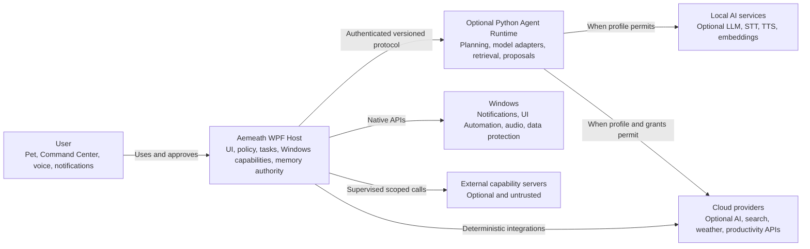
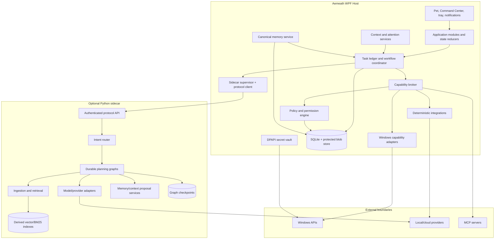
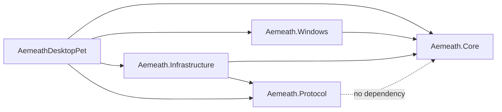
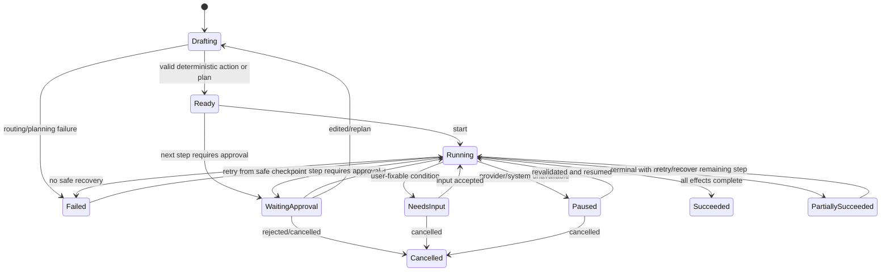
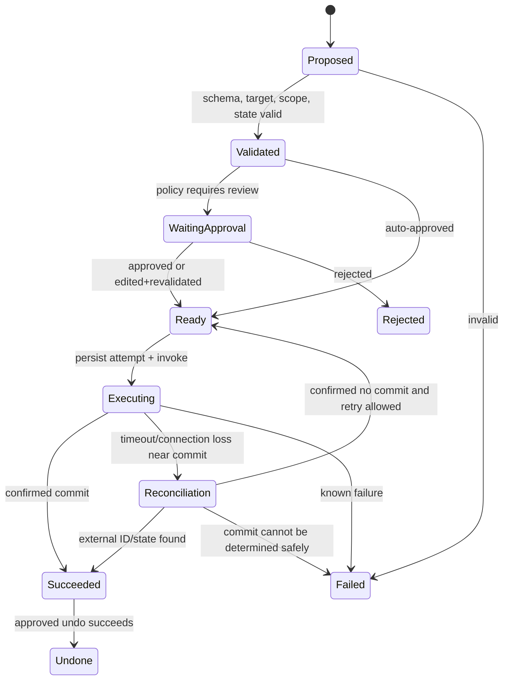
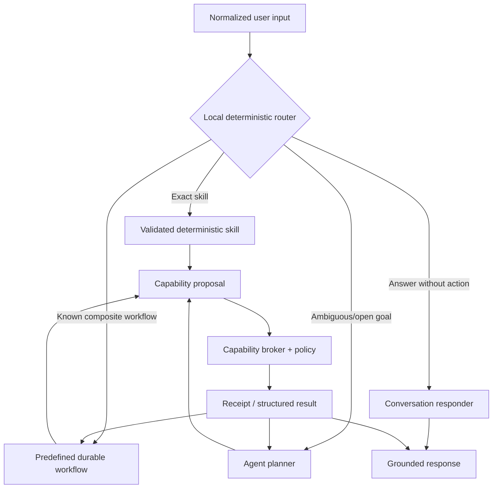
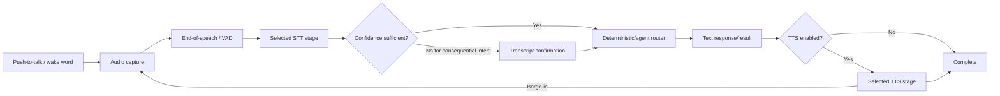
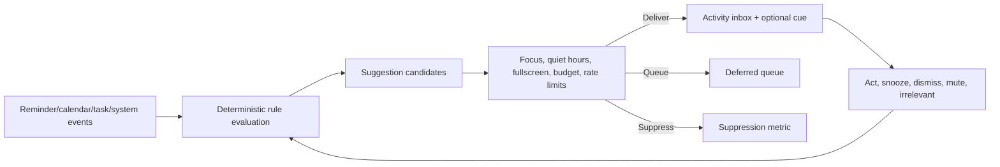

# Technical Design: Trusted Personal Assistant Architecture

**Status:** Accepted target design; execution remains gated by Gate 0 and pending disposition approvals  
**Version:** 1.1  
**Date:** 2026-07-22  
**Decision:** [ADR-0001](../adr/ADR-0001-evolutionary-modular-assistant-architecture.md)  
**Requirements:** [Personal Assistant PRD](../prd/jarvis_assistant_prd.md)  
**UI:** [Command Center UI specification](../ui-spec/jarvis_assistant_ui_spec.md)

> This document defines a future architecture and migration target. It does not claim that the
> described modules or contracts exist in the current working tree.

## 1. Executive design summary

Aemeath will remain a Windows-native WPF product and will be refactored into a modular monolith
composed through the .NET Generic Host. An optional Python sidecar remains responsible for model
orchestration, retrieval, and model-assisted proposals. The WPF host is authoritative for policy,
permissions, tasks, side effects, reminders, user-memory records, Windows context, and all visible
product state.

The most important architectural change is the execution boundary:

- models and workflows may **propose** typed capability calls;
- the WPF capability broker validates schema, state, target, scope, and risk;
- the WPF policy engine produces AutoApprove, NeedsApproval, or Forbidden;
- decisions and task state are persisted before execution;
- side-effect adapters execute with idempotency/reconciliation behavior;
- a receipt is stored and presented to the user;
- Python never calls a reverse unauthenticated WPF HTTP endpoint.

This design supports deterministic skills, durable agent workflows, Local/Hybrid/Cloud profiles,
restrained proactivity, inspectable memory, and optional MCP extensions while preserving pet behavior
and graceful degradation.

## 2. Existing-system evidence

The design is based on repository inspection, not an assumed greenfield system.

| Current evidence | Architectural implication |
|---|---|
| `src/AemeathDesktopPet/App.xaml.cs` constructs configuration and launches companions directly | Application lifecycle and service composition need a host and DI root |
| Windows/view composition occurs in WPF code-behind and concrete service construction | View models need injected use cases and state stores rather than provider construction |
| `ChatViewModel` directly depends on chat, memory, stats, voice, STT, configuration, and bridge services | Conversation orchestration must be split into application services and reducers |
| `AppConfig` contains ordinary string fields for many API keys | Secrets require protected storage and reference migration |
| `BackendProcessManager` launches Python and polls one health route | Process liveness, protocol compatibility, and capability readiness need separate states |
| `BackendAgentService` sends REST/SSE requests and owns thread payload construction | Replace with a generated protocol client and task/run adapter |
| `InternalApiServer` exposes stats, screen, music, and pet state on loopback | Remove reverse API; sidecar capability requests return through the authenticated run protocol |
| `McpClientService` starts local processes and calls tools but is not integrated into central policy | MCP must be adapted behind capability install consent, health, risk, and grants |
| C# has core, observation, procedural, bridge, and memory services | Migrate to one canonical user-memory repository with typed tiers and evidence |
| Python has JSON memory, checkpointing, retrieval, routes, and memory tools | Python becomes proposal/query client; derived indexes are caches, not a second authority |
| Python `graph.py` builds a general ReAct agent with a broad tool list | Introduce deterministic routing and task-scoped capability views before general planning |
| Sidecar CLI and WPF environment port behavior differ | One generated launch configuration and handshake must be authoritative |
| Backend STT request/credential contracts differ | Generated request schemas and end-to-end stage health are required |
| Current docs record an incomplete checkpoint dependency and unbundled sidecar | Packaging and dependency lock verification are foundation gates |

Current behavior and defects remain documented in [architecture.md](../architecture.md) and
[REQUIREMENTS.md](../../REQUIREMENTS.md). Those documents should be updated only as implementation
actually changes.

### 2.1 Gate 0 is a hard architecture precondition

No production refactor, testability/accessibility seam, or corrective product change starts until
Gate 0A passes against the frozen production source. Gate 0A uses public contracts, external process
observation, disposable Windows users/VMs, synthetic boundaries, and test-only harness code without
changing production behavior. Existing tests become a separate `legacy-regression` input only after
independent oracles freeze and cannot supply fixtures, helpers, snapshots, data, or oracles. Gate 0B
then repairs blocking gaps through characterization-protected TDD. No project split, persistence
migration, protocol replacement, new assistant capability, or UI redesign starts until final Gate 0
passes at one exact head SHA.

The default disposition of a current requirement or observable behavior is **Preserve**. A behavior
may instead be **Change**, **Defer**, or **Remove** only through the versioned FR-023 disposition map
and explicit approval. Preserving a user outcome does not freeze its defective implementation. For
example, the migration preserves access to chat and configuration data while replacing plaintext
secret storage, unauthenticated loopback control, mismatched STT contracts, misleading health, and
inaccessible mouse-only/emoji-only UI.

### 2.2 Preservation-boundary inventory

PB IDs are stable Gate 0 traceability identifiers. Each PB entry links its source requirements,
frozen independent tests, risk/lane manifest, exact-SHA evidence, and any approved non-Preserve
disposition.

| ID | Boundary to qualify during Gate 0 | Preserve | Replace or explicitly disposition; do not freeze as compatibility |
|---|---|---|---|
| PB-001 | Application startup, owned window lifecycle, shutdown | One pet starts per application instance, owned resources stop, user data path remains compatible | Direct construction and unbounded/background startup side effects |
| PB-002 | Pet window, sprite decode/playback, behavior and physics | Transparent topmost pet, configured size/opacity, movement, included sprite timing and offline companionship | Random time/position as an oracle; placeholder animation mappings as permanent design |
| PB-003 | Pet input, tray, hide/show, click-through and position restore | Equivalent mouse/keyboard/tray recovery paths and safe on-screen position | Mouse-only reachability, inaccessible programmatic menu items, fragile coordinate locators |
| PB-004 | Speech bubble, particles, paper plane and optional cat | User-visible companion feedback, lifecycle, optional cat behavior and existing data counters | Invisible paper-plane rendering, emoji-only cat/status semantics, uncontrolled timers |
| PB-005 | Text conversation, streaming, history and offline fallback | Send/stream/failure outcomes, readable history, offline availability | Placeholder stored as input, provider-specific orchestration in the view model, silent fallback ambiguity |
| PB-006 | Voice input, STT, TTS, global hotkey and audio policy | Opt-in push-to-talk, visible transcript/status, provider selection and text fallback | Mouse-only hold control, backend multipart/credential mismatch, hidden capture or unbounded audio tests |
| PB-007 | Screen awareness and privacy indication | Explicit opt-in, protected-window/blacklist behavior, visible capture indicator and budget settings | Background capture without task-scoped consent, screenshot attachment bypass, color-only status |
| PB-008 | Settings and configuration compatibility | All current settings have one disposition, Cancel is side-effect free, approved values migrate atomically | Plaintext keys, raw ordinary-user MCP command editing, monolithic code-behind and unlabeled inputs |
| PB-009 | Stats, conversation JSON and existing local-data lifecycle | Counts/content survive compatible migration with backup, compare and rollback evidence | Hard-coded test use of real LocalAppData and unversioned destructive writes |
| PB-010 | Companion, Pomodoro and activity integrations | Enabled/disabled behavior, event semantics and graceful absence | Direct process launch or registry/pipe mutation inside deterministic CI fixtures |
| PB-011 | Sidecar process supervision and offline degradation | Optional advanced runtime, bounded child lifecycle, offline WPF behavior | `/health`-only readiness, port/config drift, missing dependency and unbundled clean-machine assumptions |
| PB-012 | WPF-sidecar protocol, streaming and STT boundary | Intended request/result semantics and conversation continuity where compatible | Unauthenticated reverse API, handwritten divergent DTOs, unsafe retry and permissive version parsing |
| PB-013 | Python agent, deterministic tools and retrieval | Approved useful tool/RAG outcomes with citations and safe degraded behavior | Broad unscoped tool exposure, unconfigured RAG tool and model-owned side effects |
| PB-014 | Core, observation, procedural and Python memory data | Recoverable user facts/history with provenance and deletion expectations | Multiple authorities, stale derived cache, incomplete direct-provider injection and unclear forget semantics |
| PB-015 | MCP definitions and supervised process lifecycle | Compatible user-authored server definitions after consent/migration review | Unwired settings presented as working, raw execution without policy, schema-change grants that remain active |
| PB-016 | Secrets, privacy, redaction and local authorization | Existing user choices and non-secret settings migrate without disclosure | Plaintext credentials, token passthrough, unredacted diagnostics and loopback-as-authentication |
| PB-017 | Build, package, install, upgrade, rollback and clean-machine launch | Supported Windows artifact starts and degrades clearly without development tools | Source-tree-only sidecar assumptions, undeclared dependency, release evidence from a different SHA |
| PB-018 | Supported Windows UI, accessibility, performance and reliability | Windows 10/11 x64, PerMonitorV2 behavior, 100/150/200% scale, high contrast, reduced motion, keyboard and Narrator journeys within recorded budgets | Missing Automation IDs/peers/live regions, fixed low-contrast colors, pixel-perfect dynamic GIF or emoji snapshots |

The canonical item-by-item disposition remains a generated map from `REQUIREMENTS.md`; this table is
the boundary/risk index and must not be used to approve a Change, Defer, or Remove implicitly.

## 3. Design goals

1. Deliver PRD requirements through complete vertical slices.
2. Preserve existing pet, tray, animation, and offline behavior during migration.
3. Give each persisted entity one authoritative owner.
4. Eliminate unauthenticated reverse loopback control.
5. Make policy independent from the model and extension runtime.
6. Persist task/approval state before consequential execution.
7. Make retries safe through idempotency or reconciliation.
8. Support deterministic skills and durable agent plans through one capability path.
9. Make memory and context inspectable, revocable, and retention-aware.
10. Keep advanced AI optional so the product degrades rather than fails wholesale.

## 4. Non-goals

- converting the whole repository to Clean Architecture layers with one project per small concept;
- creating a distributed microservice system;
- cross-platform support;
- allowing arbitrary generated code or shell execution;
- treating MCP as the internal service bus;
- implementing multi-agent coordination as a product requirement;
- migrating every existing service before the first vertical slice;
- replacing WPF or the animation engine;
- guaranteeing that all inference can run locally on low-end hardware.

## 5. Target system context



## 6. Target container architecture



## 7. Proposed repository structure

Use a small number of projects with strong module namespaces. Avoid creating a project for every
entity.

```text
src/
├── AemeathDesktopPet/                 # Existing WPF executable and composition root
│   ├── App.xaml(.cs)
│   ├── Views/
│   ├── ViewModels/
│   ├── Engine/                        # Existing pet/animation/physics behavior
│   ├── Themes/
│   ├── Resources/
│   └── Composition/                   # Host registration by module
├── Aemeath.Core/                      # Domain + application modules, no WPF dependency
│   ├── Conversation/
│   ├── Tasks/
│   ├── Capabilities/
│   ├── Policy/
│   ├── Memory/
│   ├── Context/
│   ├── Reminders/
│   ├── Briefing/
│   ├── Attention/
│   └── Diagnostics/
├── Aemeath.Windows/                   # Windows-only adapters
│   ├── Audio/
│   ├── Notifications/
│   ├── ScreenCapture/
│   ├── UiAutomation/
│   ├── Hotkeys/
│   ├── Processes/
│   └── Secrets/
├── Aemeath.Infrastructure/            # SQLite, file stores, provider/integration adapters, MCP
│   ├── Persistence/
│   ├── Providers/
│   ├── Integrations/
│   ├── Mcp/
│   └── Telemetry/
└── Aemeath.Protocol/                  # Generated client and DTOs from contracts/

contracts/
├── aemeath-agent-v1.openapi.yaml
├── capability-manifest.schema.json
└── fixtures/

python-backend/aemeath_agent/
├── api/                               # Protocol endpoints and auth middleware
├── contracts/                         # Generated Pydantic models
├── orchestration/                     # Router, graphs, interrupts, run lifecycle
├── providers/                         # Model/STT/TTS adapters used by sidecar
├── retrieval/                         # Ingestion, indexes, citations
├── proposals/                         # Memory and context extraction proposals
├── persistence/                       # Checkpoint and derived-index lifecycle
└── evaluation/                        # Offline scenario fixtures/runners

tests/
├── Aemeath.Core.Tests/
├── Aemeath.Windows.Tests/
├── Aemeath.Infrastructure.Tests/
├── AemeathDesktopPet.Tests/           # Existing suite; legacy-regression lane only during Gate 0
├── Aemeath.Testing/                   # New shared utilities; never legacy-test code
├── Aemeath.Preservation.UnitTests/    # New pure/literal-oracle cases
├── Aemeath.Preservation.IntegrationTests/ # New isolated component cases
├── Aemeath.Preservation.WpfTests/     # New STA production-XAML cases
├── Aemeath.UiAutomation.Tests/        # New process-level Windows UIA journeys
├── Aemeath.RealBoundary.Tests/        # Resettable interactive Windows boundary cases
├── Aemeath.Packaging.Tests/           # Package/install/upgrade/rollback cases
├── Aemeath.ArchitectureTests/         # Dependency/authority rules and known-bad fixtures
├── Aemeath.Protocol.Tests/            # C#/Python contract fixtures
├── Aemeath.TestHost/                  # Non-shipping deterministic host using production XAML
└── fixtures/preservation/v1/
    ├── manifest.json                  # Frozen inputs, oracles, hashes and provenance
    ├── config/                        # Non-secret legacy/current configuration fixtures
    ├── data/                          # Stats, conversation and memory copies
    ├── protocol/                      # C#/Python request, event and error fixtures
    ├── ui/                            # State, long-string and accessibility scenarios
    └── expected/                      # Independently derived outcomes, never copied legacy snapshots
```

Migration does not require immediately renaming `AemeathDesktopPet` or moving every existing service.
New code goes into the target module, and old services are wrapped or moved when their vertical slice
is migrated. Preservation projects may reference production assemblies but must not reference
`AemeathDesktopPet.Tests`, its output, or any legacy test utility. Python preservation cases use a
separate `python-backend/preservation_tests/` package with the same dependency prohibition.

## 8. Dependency rules



Rules:

- `Aemeath.Core` references no WPF, Windows, provider SDK, FastAPI, or persistence package.
- `Aemeath.Windows` and `Aemeath.Infrastructure` implement interfaces defined in Core.
- Views reference view models and UI models, not provider or repository implementations.
- View models dispatch application commands and observe immutable/reduced state.
- Protocol DTOs do not become domain entities; adapters map them at the boundary.
- Python provider modules cannot import Windows bridge clients or perform WPF side effects.
- MCP adapters can invoke only through the same broker interfaces as native adapters.

Use NetArchTest or an equivalent dependency test to enforce core rules. Python import rules can be
checked with Ruff/import-linter or a focused test.

## 9. .NET Generic Host composition

`App.xaml.cs` becomes the only composition root:

1. create `HostApplicationBuilder`;
2. load non-secret configuration and validate it;
3. register logging/redaction and ActivitySource tracing;
4. register Core application modules;
5. register Windows and infrastructure adapters;
6. register WPF windows/view models as appropriate lifetimes;
7. register background services such as reminder scheduler, sidecar supervisor, context cleanup, and
   task recovery;
8. build and start the host in WPF startup;
9. resolve and show the pet/Command Center through the service provider;
10. stop the host with a bounded graceful-shutdown timeout on application exit.

Long-lived singleton services must be thread-safe. Per-task scopes are created by the task
coordinator. Views do not become service locators. Background services report readiness rather than
blocking the UI thread during slow provider startup.

### 9.1 Deterministic seams introduced in corrective Gate 0B

Gate 0A exercises the current production assemblies and executable without production-code changes
and retains their hashes. It uses disposable Windows users/VMs, local protocol-faithful servers,
synthetic media and process-level observation where the current code has no seam. After Gate 0A
accepts that baseline, Gate 0B behavior-preserving TDD steps introduce only the smallest seams
below and prove pre/post behavior with the frozen cases before broader host refactoring.
Target interfaces are `IClock`, `IRandomSource`, `IDataRoot`, `IAemeathApplicationLifetime`,
`ICompanionLauncher`, `ITrayService`, `IGlobalHotkeyService`, `IScreenEnvironment`,
`INotificationService`, `IAudioCapture`, provider clients, sidecar supervision, and user environment
preferences for DPI, theme, and motion. Required tests never write the developer's LocalAppData,
registry, startup folder, clipboard, microphone, screen, or running companion processes.

`Aemeath.TestHost` is a non-shipping executable that invokes the same production composition modules,
views, resource dictionaries, control templates, and XAML as the product. It swaps only external I/O
boundaries and uses a versioned fixture envelope with a fixed clock, culture, time zone, IDs, random
sequence, temporary data root, denied network/process launch, and selected failure injection. A
simplified duplicate test UI is invalid E2E evidence. Test control uses a random process-scoped named
pipe and nonce; no unauthenticated production HTTP test endpoint is added.

Where the unmodified baseline already permits production-XAML construction without side effects,
Gate 0A may use the test-only TestHost immediately. Otherwise Gate 0A uses the real executable in a
disposable worker; production TestHost seams wait until Gate 0B.
A duplicate or simplified XAML fixture never satisfies the WPF/fixture lane.

Every test creates its own state. The WPF suite uses one controlled STA `Application`/dispatcher,
fresh windows per case, dispatcher draining instead of sleeps, explicit timer/subscription cleanup,
and disabled parallelism for shared WPF process state. Process E2E launches a fresh TestHost with a
unique data root, records a fixture journal, and terminates the complete child-process job in cleanup.

## 10. Domain model

### 10.1 Assistant task

```text
AssistantTask
  Id: TaskId
  ThreadId: ThreadId?
  Intent: string
  Origin: User | Schedule | ProactiveRule | Integration
  ExecutionProfileRevision: long
  Status: Drafting | Ready | WaitingApproval | Running | NeedsInput |
          Paused | Succeeded | PartiallySucceeded | Failed | Cancelled
  CreatedAt / UpdatedAt / CompletedAt: Instant
  TraceId: string
  RowVersion: long
  Steps: TaskStep[]
```

`AssistantTask` status is reduced from persisted events and guarded commands. UI state is not allowed
to set it directly.

### 10.2 Task step

```text
TaskStep
  Id: StepId
  TaskId: TaskId
  Sequence: int
  DependsOn: StepId[]
  CapabilityId / CapabilityVersion: string
  ProposedArguments: JsonDocument
  ApprovedArguments: JsonDocument?
  RiskClass: R0 | R1 | R2 | R3 | R4
  PolicyDecisionId: DecisionId?
  ApprovalId: ApprovalId?
  IdempotencyKey: string
  State: Proposed | Validated | WaitingApproval | Ready | Executing |
         Reconciliation | Succeeded | Failed | Rejected | Cancelled | Undone
  Attempt: int
  ResultReference: string?
  Error: StructuredError?
```

### 10.3 Approval

Approvals are immutable decisions plus optional user-edited arguments. Changing an approval creates a
new approval revision; it does not mutate history.

```text
ApprovalDecision
  Id, TaskId, StepId
  ProposalHash
  Scope: ThisCall | ThisTask | TimeBoundGrant
  Decision: Approved | Edited | Rejected
  ApprovedArgumentsHash?
  UserFeedback?
  DecidedAt
  GrantId?
```

### 10.4 Receipt

```text
ExecutionReceipt
  Id, TaskId, StepId
  CapabilityId, CapabilityVersion, Origin
  TargetDisplay, TargetStableId?
  Proposed/Approved/ExecutedArgumentHashes
  StartedAt, EndedAt
  Outcome: Succeeded | Failed | UnknownCommit | Reconciled | Undone
  ExternalOperationId?
  DataUseSummary
  ResultSummary
  UndoCapabilityId?, UndoUntil?
  RedactedTechnicalReference
```

Receipts store hashes and redacted structured arguments according to retention policy. Sensitive raw
values live only in protected task payload storage for as long as required.

### 10.5 Capability definition

```text
CapabilityDefinition
  Id, Version, DisplayName, Description
  OwnerModule, Origin: Native | SidecarInternal | Integration | MCP
  InputSchema, OutputSchema
  ReadCategories[], WriteCategories[], TransmitCategories[]
  RequiredScopes[]
  DefaultRiskClass
  SupportsPreview, DryRun, Cancellation, Idempotency, Reconciliation, Undo
  Timeout, RetryPolicy, ConcurrencyPolicy
  AvailabilityProbe
  OriginMetadata / SchemaHash
```

Capability metadata is immutable within a version. Any risk-relevant schema or data-use expansion
requires a new version and grant review.

### 10.6 Context snapshot

```text
ContextSnapshot
  Id, TaskId?, ThreadId?
  CreatedAt, ExpiresAt
  Source[]: app/window, UIA text, screenshot, clipboard, file, brief item
  SourceStableId?, DisplayName, CapturedAt, Revision?
  Sensitivity, Redactions[], ProcessingRoute
  ProtectedPayloadReference?
  ContentHash
```

Raw context is ephemeral by default. Metadata can remain in receipts after payload deletion without
retaining content.

### 10.7 Memory record

```text
MemoryRecord
  Id, Revision
  Tier: CoreUser | Preference | Procedure | Episode
  Value
  TopicTags[]
  SourceEvidence[]
  Confidence
  Confirmation: Proposed | Confirmed | Rejected
  Sensitivity
  Owner: User | SystemPolicy | Persona
  CreatedAt, UpdatedAt, LastUsedAt?, ExpiresAt?
  RelearningPolicy: Allowed | SuppressedFromEvidence
```

Policy/persona records use a related read-only structure and are not represented as inferred user
facts.

## 11. Task and step state machines

### Task state



### Side-effect step



No transition from Proposed directly to Executing exists.

### 11.1 Assistant activity is separate from pet personality and animation

The existing `PetState` describes companion animation/physics states such as Idle, Fly, Drag, Sing,
Chat, and Speaking. It is not extended into the durable assistant task model. A separate reduced
`AssistantActivityState` has Idle, Listening, Transcribing, Thinking, WaitingApproval, Executing,
NeedsInput, Succeeded, Failed, Degraded, and FocusQuiet values plus the source state revision.

One `AssistantPresentationReducer` combines persisted task state, voice session state, subsystem
health, and attention preference. It produces the visible label, icon, severity, available command,
motion policy, and compatible animation cue for both pet and Command Center. UI code and animation
engines cannot infer task truth independently. For multiple tasks, WaitingApproval outranks
NeedsInput, which outranks Executing, which outranks Thinking; the reducer contract must also freeze
the documented composition of Listening/Transcribing and Degraded health before its first RED case.
The pet and Command Center must expose the same reducer revision in diagnostics and update within one
reducer publication.

## 12. Capability risk and policy model

### Risk classes

| Class | Meaning | Examples | Default behavior |
|---|---|---|---|
| R0 | No personal-data access and no side effect | Read app version, calculate duration | Auto within task |
| R1 | Scoped local read or reversible ephemeral operation | Read granted calendar range, inspect current-window UIA snapshot | Auto after category/source grant; visible in activity |
| R2 | Reversible local write or bounded cloud processing | Create local reminder, transform clipboard preview, cloud summarize approved snapshot | First-use/category grant; per-call review when target/data changes materially |
| R3 | External communication, destructive change, credential use, or hard-to-reverse effect | Send message, delete file, modify account, invoke sensitive MCP tool | Per-action approval; some unavailable initially |
| R4 | Prohibited in current product horizon | Arbitrary shell, privilege elevation, purchase, silent camera | Forbidden |

Risk can only be raised dynamically, never lowered below the capability definition's default. Inputs,
target, data classification, provider route, and active user mode can raise it.

### Policy inputs

- capability ID/version/origin/schema hash;
- requested and granted scopes;
- execution profile and revision;
- target identity and stability;
- data classifications and destination;
- task origin and initiating user presence;
- action reversibility and idempotency support;
- current attention/lock/full-screen state;
- extension trust/provenance;
- prior grant expiry and revocation;
- organization policy if introduced later.

### Policy outputs

```text
PolicyDecision
  Outcome: AutoApprove | NeedsApproval | Forbidden
  EffectiveRisk
  RequiredScopes[]
  MissingScopes[]
  EditableFields[]
  Reasons[]                 # stable codes plus localized display messages
  DecisionRevision
  ExpiresAt?
```

The UI never parses model prose to decide risk. Policy decisions are deterministic and extensively
unit-tested.

## 13. Deterministic and agentic routing



The local router should start with high-precision parsers and explicit command patterns. It is not a
large intent ontology. If confidence is insufficient, route to the planner or ask the user rather
than guessing a consequential command.

Planner input contains only:

- task goal and relevant conversation segment;
- policy-filtered context/memory references;
- task-scoped capability manifests;
- execution profile and non-secret route constraints;
- prior structured results and errors.

It does not contain raw credentials, permission mutation functions, all installed capabilities, or
unrelated long-term history.

## 14. WPF–sidecar protocol

### 14.1 Transport and startup

Initial implementation uses loopback HTTP plus SSE:

1. WPF reserves or selects an available loopback port.
2. WPF creates a 256-bit cryptographically random session token and startup nonce.
3. WPF launches the exact packaged/dev sidecar with explicit `--host 127.0.0.1`, `--port`, protocol
   version, parent PID, and nonce. The token is supplied through the child environment, never command
   line or normal configuration.
4. WPF polls authenticated liveness with bounded exponential backoff.
5. WPF performs handshake and checks protocol range, build, capabilities, and nonce.
6. WPF checks readiness for agent, checkpoint, retrieval, and configured providers independently.
7. On exit, WPF sends graceful shutdown, waits a bounded period, and terminates only the verified
   child process if necessary.

Environment variables are not a security boundary against malicious same-user processes. The token
primarily prevents accidental/ambient unauthenticated loopback use and cross-origin browser calls.
OS user isolation, narrow capabilities, and removal of the reverse WPF listener remain essential.

### 14.2 Contract source

`contracts/aemeath-agent-v1.openapi.yaml` is the source of truth. CI generates or verifies:

- C# DTOs and a typed client in `Aemeath.Protocol`;
- Pydantic request/response models or conformance types in Python;
- JSON fixtures for every event/error variant;
- a compatibility report for supported minor versions.

Breaking field removal/type change increments the major version. New optional fields and new event
types may increment minor version when older clients can ignore them safely. Unknown discriminators
produce a structured incompatibility error rather than silent coercion.

### 14.3 Endpoint outline

| Method and route | Purpose |
|---|---|
| `GET /v1/runtime/live` | Authenticated process liveness and instance ID |
| `POST /v1/runtime/handshake` | Nonce, build, protocol range, limits, feature negotiation |
| `GET /v1/runtime/readiness` | Per-subsystem readiness and actionable degraded states |
| `POST /v1/runs` | Start a response/plan run with task-scoped context and capabilities |
| `GET /v1/runs/{run_id}/events` | SSE stream of typed progress, tokens, proposals, citations, interrupts, terminal state |
| `POST /v1/runs/{run_id}/commands` | Cancel, resume with capability result, supply user input, or reject proposal |
| `GET /v1/runs/{run_id}` | Reconcile current run/checkpoint state after reconnect |
| `POST /v1/retrieval/sources:plan` | Validate ingestion plan without granting filesystem access |
| `POST /v1/retrieval/queries` | Scoped retrieval with source IDs and revision constraints |
| `POST /v1/memory/proposals` | Produce memory proposals from explicitly supplied evidence |
| `POST /v1/runtime/shutdown` | Graceful child shutdown |

The sidecar does not expose a general “call WPF tool” endpoint. It emits a `capability_call_proposed`
event and checkpoints. WPF executes through the broker, then resumes the run with a sanitized
`capability_result` command.

### 14.4 Run event union

```text
RunEvent =
  run_started
  | route_selected
  | plan_revised
  | response_delta
  | citation_emitted
  | capability_call_proposed
  | waiting_for_capability
  | memory_proposal_emitted
  | needs_user_input
  | warning
  | run_completed
  | run_failed
  | run_cancelled
  | heartbeat
```

Every event includes `event_id`, `run_id`, `task_id`, monotonic `sequence`, `occurred_at`, and
`traceparent`. WPF deduplicates by event ID and rejects sequence regression. Payload limits apply per
event and per run.

### 14.5 Capability-call field propagation

| Field | Planner event | Domain proposal | Policy | Approval UI | Adapter | Receipt |
|---|---:|---:|---:|---:|---:|---:|
| Capability ID/version | Required | Validated | Input | Displayed | Routing key | Required |
| Schema hash | Required | Validated | Input | Origin detail | Rechecked | Required |
| Arguments | Proposed JSON | Typed/normalized | Classified | Exact/redacted fields | Approved values | Hash + redacted summary |
| Target | Proposed reference | Resolved stable ID | Risk input | Exact target | Re-resolved before commit | Display + external ID |
| Data categories | Manifest + dynamic | Effective union | Scope/risk input | Read/write/send list | Enforced | Summary |
| Idempotency key | Not model-created | Host-created | Recorded | Technical detail | Required for retry | Required |
| Approval | None | Link later | Decision | User creates | Must match proposal hash | Decision reference |
| Secret reference | Never supplied | Host-only alias | Scope input | Provider/account label | Resolved at last moment | Never secret value |

## 15. Sidecar orchestration design

### 15.1 Graph structure

Replace one broad ReAct loop as the only orchestration shape with explicit graphs:

```text
Conversation graph:
  normalize -> retrieve context -> respond -> propose memories -> finish

Task planning graph:
  understand -> select capabilities -> draft plan -> validate plan ->
  emit proposal/interrupt -> accept result -> reassess -> finish

Knowledge answer graph:
  normalize query -> scoped retrieval -> rerank -> answer with citations -> confidence gate

Memory proposal graph:
  inspect evidence -> extract candidate -> classify tier/sensitivity -> deduplicate -> propose
```

Each node has typed input/output, timeout, retry classification, and trace span. Random/model calls are
encapsulated so checkpoint resume does not repeat completed effects. Side effects remain outside the
graph or behind interrupts.

### 15.2 Checkpointing

- Use a persistent checkpointer declared in `pyproject.toml` and verified during readiness.
- Thread/run IDs are assigned by WPF and passed explicitly.
- Retention follows conversation/task policy; delete APIs remove checkpoints associated with deleted
  threads/tasks after required receipt retention is separated.
- On protocol reconnect, WPF queries run state before resuming.
- A checkpoint migration version is exposed in readiness.

### 15.3 Provider routing

Provider routing consumes an execution-profile snapshot. It cannot select a provider outside the
allowed route list. The selection result records provider, model, locality, expected data categories,
and fallback chain before content is sent.

Fallback rules:

- Local never falls back to cloud.
- Hybrid falls back only among providers explicitly listed for the stage and data category.
- Cloud follows configured priority and budget but reports the final route.
- A provider failure after partial streaming cannot silently restart with a different model in the
  same response without marking a new attempt.
- Health and availability are separate from permission to transmit current content.

## 16. Voice pipeline



Interfaces:

```text
IAudioCaptureSession       Start, stop, level events, device, cancellation
IEndOfSpeechDetector       Process frames, signal speech boundary
ITranscriptionProvider    Capabilities, locality, languages, transcribe
ISpeechSynthesisProvider  Capabilities, locality, voices, synthesize/stream
IVoiceSessionCoordinator  Reducer/state machine and task linkage
```

Providers publish structured capability metadata. The backend STT contract is replaced rather than
patched independently, preventing current multipart/JSON and credential-name drift. Raw audio is not
persisted by default. Cloud transmission is recorded in task/activity data use.

## 17. Context acquisition and grounding

### Source adapters

- active application/window metadata;
- Microsoft UI Automation text, roles, values, and supported control patterns;
- explicit screenshot of selected window/monitor;
- clipboard snapshot on explicit user action;
- selected files or knowledge sources;
- daily-brief items and integration results.

### Capture pipeline

1. resolve requested source and stable target where possible;
2. evaluate exclusion/protected-window policy;
3. show capture route and active indicator;
4. capture minimum necessary data;
5. classify sensitivity and apply deterministic redaction/downscale;
6. optionally run local pre-filtering;
7. store raw payload only when the task needs durable continuation, using protected blob storage;
8. send only approved fields to the selected processing route;
9. attach source IDs, timestamps, hashes, and redaction metadata to results;
10. expire raw payload and invalidate caches according to policy.

UI Automation is preferred over coordinate clicks for inspection and selected actions because it
exposes structured control identities and patterns. It is not universally available and cannot
control higher-integrity processes without additional Windows privileges; those limitations should
surface as unavailable capability states, not trigger stealth elevation.

### Grounding contract

Every grounded answer segment can reference one or more `GroundingCitation` records:

```text
GroundingCitation
  SourceId, SourceRevision?
  DisplayName
  Locator: window/control/file/page/chunk/brief-item
  CapturedOrIndexedAt
  RetrievedAt
  SnippetHash
  Confidence
```

The UI may show a short permitted snippet but receipts should not duplicate sensitive source content.

## 18. Canonical memory architecture

### 18.1 Tiers

| Tier | Typical content | Prompt behavior | Write policy | Default retention |
|---|---|---|---|---|
| Read-only persona/policy | Aemeath identity, safety, user-selected tone | Always visible, separately versioned | Owner-controlled only | Until configuration changes |
| Core user | Confirmed name, stable preference, accessibility need | Bounded always-visible block | Confirm sensitive/identity facts | Until user edits/expires |
| Preference/procedure | Work style, recurring preference, learned routine | Retrieved by task/topic | Proposed with evidence; confirm when consequential | Review/expiry policy |
| Episode | Prior interaction or event summary | Retrieved only when relevant | Inferred/proposed with confidence | Time-bounded by default |
| Conversation/checkpoint | Raw turns and run state | Thread scoped | Normal conversation policy | Configurable, not memory itself |
| Knowledge | User-granted documents | Retrieved with citations | Explicit source grant | Until source removed/retention expires |

### 18.2 Authority and derived caches

WPF SQLite is authoritative for memory records, versions, evidence metadata, suppression, and user
decisions. Python receives scoped records for prompting or retrieval and may maintain embeddings as a
derived cache keyed by `memory_id + revision`. Cache entries with stale revisions are ignored and
removed asynchronously.

Python never updates a memory record directly. It returns a `MemoryProposal`:

```text
MemoryProposal
  CandidateValue
  ProposedTier
  EvidenceReferences[]
  Confidence
  Sensitivity
  ExpectedUse
  PossibleDuplicateIds[]
  ContradictionIds[]
```

WPF validates evidence accessibility, deduplicates, applies confirmation policy, and persists a new
revision. This prevents separate C# and Python stores from diverging.

### 18.3 Deletion and re-learning

Deletion flow:

1. preview record, evidence relation, derived caches, and retained source distinction;
2. persist deletion/suppression intent transactionally;
3. remove current value and protected evidence payload if selected;
4. publish `MemoryRevisionChanged` event;
5. sidecar invalidates vector/prompt cache and acknowledges revision;
6. UI shows propagation state and any inaccessible external/provider store;
7. optional suppression prevents identical evidence from recreating the memory.

## 19. Reminders, brief, and proactive system

### 19.1 Reminders

Reminders are WPF-owned and sidecar-independent. Store instants in UTC plus original time zone and
local expression metadata. Use a hosted scheduler backed by SQLite, not one timer per reminder.
On startup/resume, reconcile missed reminders according to a user policy: show, roll forward, or mark
missed. Repeating reminders calculate the next occurrence from the rule, not from delivery time.

### 19.2 Brief aggregation

Each source implements:

```text
IBriefSource
  Id, availability, granted scopes
  GetItems(window, cancellation) -> BriefSourceResult
```

The aggregator normalizes source items into `BriefItem`, deduplicates stable IDs, ranks deterministic
time/priority fields, and can optionally request a model-generated narrative. The narrative never
creates new factual items. Each displayed claim retains source/freshness.

### 19.3 Proactive engine



The LLM may phrase or rank non-urgent candidates but cannot create urgency or bypass attention policy.
The engine never performs a side effect merely because a suggestion is delivered.

## 20. MCP and extension architecture

MCP is postponed until the native broker is complete. Then:

- `McpSupervisor` owns process identity and lifecycle;
- `McpDiscoveryAdapter` translates tool descriptions/schemas into capability candidates;
- `McpCapabilityAdapter` maps validated calls and structured results;
- `ExtensionPolicy` combines server origin, command, transport, schema hash, and requested scope;
- credentials remain in the host and are not embedded in model-visible generated code;
- `stdio` is preferred for local servers;
- HTTP servers require current MCP authorization behavior and outbound URL validation;
- tool schema changes invalidate affected grants;
- each runtime call is evaluated by the same broker, even inside a previously approved script or
  workflow.

Local MCP servers run with the user's privileges unless an explicit sandbox exists. Installation UI
must show the full command and access implications. Arbitrary one-click configuration is rejected.

## 21. Persistence and data lifecycle

### Files

```text
%LOCALAPPDATA%\AemeathDesktopPet\
├── assistant.db                 # Tasks, receipts, reminders, memory metadata/content, grants
├── assistant.db-wal / -shm      # SQLite runtime files
├── secrets.vault                # DPAPI-protected secret records
├── protected-context\           # Short-lived DPAPI-protected task blobs
├── sidecar\                     # Packaged runtime or verified install metadata
├── indexes\                     # Derived Python retrieval/vector data
├── checkpoints\                 # Sidecar graph state if not in current DB path
├── logs\                        # Structured redacted rotating logs
└── backups\                     # Bounded pre-migration backups
```

Exact paths remain configurable only where security and support permit. The application reports
location category and size in Privacy, without exposing secret file content.

### SQLite practices

- WAL mode where appropriate;
- foreign keys enabled;
- migrations tracked in a schema history table;
- explicit transactions for task transition + approval/attempt event;
- optimistic row version for task/grant/memory mutation;
- UTC instants with original time-zone metadata where user intent requires it;
- outbox table for cross-runtime invalidation and external sync;
- bounded indexes for status/time/filter queries;
- backup before destructive schema migration;
- integrity check and recovery guidance on startup failure.

### Secret vault

Use a DPAPI-backed `ISecretStore` under CurrentUser scope rather than storing API keys in JSON. A
vault record contains secret alias, provider, protected bytes, created/updated time, and non-secret
display metadata. It is written atomically. Normal settings store `SecretReference` aliases.

Credential Locker may be evaluated for account credentials, but its small per-app credential limit
and roaming behavior make a DPAPI vault the default for numerous provider API keys.

### Retention defaults to validate with users

| Data | Proposed default |
|---|---|
| Raw push-to-talk audio | Delete immediately after transcription |
| Explicit screenshot/context payload | Delete at task completion or within 24 hours if waiting for user |
| Conversation transcript | Retain until user deletes, configurable |
| Task receipts | 90 days detailed; aggregate reliability may remain without personal payload |
| Confirmed core memory | Until edited/expired/deleted |
| Episode memory | 90 days unless reinforced/confirmed |
| Derived indexes | Until source/memory revision invalidation |
| Redacted operational logs | 14 days, size bounded |
| Pre-migration backups | Last two successful migrations or 30 days |

These are proposed defaults, not final policy; the Privacy page must expose them.

## 22. Security and threat model

### Assets

- API keys, OAuth tokens, and external account access;
- screen, clipboard, audio, documents, calendar, task, and conversation content;
- long-term user memory and inferred preferences;
- permission grants and approval decisions;
- ability to modify local or external state;
- pet identity/prompt and capability schemas;
- task/receipt audit integrity.

### Threats and controls

| Threat | Example | Primary controls |
|---|---|---|
| Ambient loopback caller | Browser page or local app invokes endpoint | Ephemeral bearer token, loopback bind, no CORS, request limits, remove reverse WPF API |
| Same-user malicious process | Reads process environment or controls local files | Least-privilege capabilities, OS account isolation limits documented, DPAPI, protected ACLs, no broad server |
| Prompt injection | Document tells agent to exfiltrate data | Treat context as data, task-scoped tools, policy outside model, destination scopes, citations |
| Tool-schema poisoning | MCP server changes benign tool into broad write | Schema hash/version, grant invalidation, origin display, risk remapping |
| Confused deputy/token misuse | Extension reuses host token for downstream API | Audience validation, host-held credentials, no token passthrough, per-capability scopes |
| Duplicate side effect | Timeout after external commit triggers retry | Idempotency keys, external operation IDs, reconciliation, receipts |
| Wrong-target action | Active window changes after preview | Stable target identity, re-resolve immediately before commit, reapproval on mismatch |
| Secret leakage | Key appears in prompt/log/export | Secret references, last-moment resolution, redaction tests, structured logging allow-list |
| Excess context capture | Background screenshots continue silently | Explicit source grants, global indicator, stop control, retention, exclusions |
| Memory poisoning | Model saves false user fact | Evidence/confidence, confirmation policy, contradiction detection, edit/delete/suppression |
| Approval spoofing | Pet dialogue claims user approved | Persisted host decision bound to proposal hash; models cannot emit approval |
| Replay | Old approval/run command resent | Instance/run nonce, proposal hash, monotonic events, single-use decision transition |
| Extension code execution | Malicious local MCP command | Full command consent, provenance, stdio, sandbox when available, scopes, R4 exclusions |
| Data-remanence | Deleted source remains in vector cache | Revision keys, invalidation outbox, reconciliation, delete verification |

### Security invariants

1. There is no route from model output to side effect without schema validation and policy.
2. Approval is bound to capability version, proposal hash, target, and approved arguments.
3. A secret value is never serializable through a protocol or receipt DTO.
4. Local/Hybrid/Cloud route constraints are immutable for an already approved call.
5. Every external write has an idempotency or explicit no-retry/reconciliation policy.
6. Revocation prevents future step execution even when a plan was already generated.
7. Raw protected context cannot be accessed by unrelated tasks.
8. Extension installation and extension tool use are separate grants.

## 23. Observability and diagnostics

Use `Microsoft.Extensions.Logging` with structured templates and a redaction processor. Use
`ActivitySource`/W3C trace context across the protocol. Python accepts/emits `traceparent` and creates
child spans using an OpenTelemetry-compatible API; remote telemetry export remains off by default.

Required dimensions:

- task/run/step/capability IDs;
- route, provider, model identifier, and locality;
- policy outcome and stable reason codes;
- latency by voice/model/retrieval/capability stage;
- retry/reconciliation classification;
- task terminal state and failure class;
- proactive delivered/dismissed/muted feedback;
- memory proposal confirmation/edit/rejection;
- subsystem liveness/readiness/compatibility.

Never log raw authorization, credentials, unredacted screenshot/audio, protected context payloads, or
complete memory values by default. Diagnostic export performs a second redaction pass and presents a
preview.

## 24. Error taxonomy

```text
StructuredError
  Code: stable machine code
  Category: Validation | Permission | Authentication | Availability | Timeout |
            Conflict | UnknownCommit | Provider | Data | Internal | Incompatible
  UserMessageKey + safe parameters
  Retryability: Never | Immediate | Backoff | AfterUserInput | Reconcile
  PartialEffect: None | Possible | Confirmed
  RecoveryActions[]
  TechnicalReference
```

Provider exceptions map at the adapter boundary. User-visible copy must say whether any change may
have occurred. `UnknownCommit` always triggers reconciliation or manual review, never blind retry.

## 25. Change impact map

| Current area | Change | New owner/module | Migration notes |
|---|---|---|---|
| `App.xaml.cs` | Adopt Generic Host and graceful shutdown | WPF Composition | First foundation step; preserve launch behavior |
| `Views/*` and code-behind | Inject view models/use cases; add Command Center | WPF | Migrate page by page; existing windows remain temporarily |
| `ChatViewModel` | Split session state, composer, voice coordination, task linkage | Core Conversation + WPF VM | Compatibility adapter can keep current ChatWindow |
| `AppConfig` | Replace secret strings with references; group validated options | Core Configuration + secret store | Atomic migration with backup |
| Direct provider chat services | Move behind provider/router abstraction or sidecar | Infrastructure/Sidecar | Retain direct adapter only where execution profile requires it |
| `BackendProcessManager` | Replace with supervised authenticated runtime lifecycle | Windows Processes + Protocol | Explicit port, nonce, version, readiness |
| `BackendAgentService` | Replace payload/SSE parsing with generated run client | Protocol + Core Tasks | Old service removed after conversation slice |
| `InternalApiServer` | Remove reverse HTTP server | Replaced by capability events | Preserve pet/music/stats as native capabilities |
| `Memory*Service` and models | Migrate into canonical memory repository/schema | Core Memory + Infrastructure Persistence | Import existing JSON/SQLite carefully; derived Python cache |
| `Screen*Service` | Become context source adapters with explicit snapshot lifecycle | Core Context + Windows ScreenCapture | Existing privacy settings map to rules |
| `VoiceInputService`/STT/TTS | Split into pipeline interfaces and session reducer | Core Voice + Windows/Provider adapters | Fix backend path through generated stage contract |
| `McpClientService` | Wrap in supervisor/discovery/capability adapters | Infrastructure MCP | Do not runtime-wire until permission UI exists |
| Pomodoro/activity/companion integrations | Convert to event sources/capabilities | Core Attention/Integrations | Preserve existing behavior via adapters |
| Python `main.py` and API routes | Add auth, handshake, readiness, versioned runs | Sidecar API | Remove permissive reverse assumptions |
| Python `agent/graph.py` | Split graphs and proxy side effects through interrupts | Sidecar Orchestration | General ReAct retained only as bounded planner if useful |
| Python memory routes/store | Return proposals/query canonical records | Sidecar Proposals | Stop independent authoritative writes |
| Python RAG | Scope by source grants and revisions; return citations | Sidecar Retrieval | Derived index reconciliation required |
| Test projects | Add independent preservation, core, protocol, WPF, UIA, E2E, accessibility and packaging suites | Tests | Freeze independent oracles first; keep current tests in a separate legacy-regression lane |

## 26. Interface matrix

| Producer | Consumer | Interface | Data | Failure handling |
|---|---|---|---|---|
| WPF view model | Core use case | In-process command/query | User intent, IDs, UI-safe values | Validation result; no provider exception |
| Task coordinator | Task repository | In-process async interface | Tasks, steps, transitions, receipts | Transaction rollback/conflict retry |
| Task coordinator | Sidecar client | OpenAPI HTTP/SSE | Scoped task envelope/events | Reconnect, reconcile run, degrade |
| Sidecar planner | WPF broker | Proposed call event + resume command | Capability ID/schema/args/result | Interrupt persists; rejected/structured result resumes |
| Broker | Policy engine | Pure in-process decision | Capability, target, data, grants, profile | Deterministic decision; deny on unknown |
| Broker | Native adapter | Typed capability interface | Approved arguments, context, idempotency | Retry/reconcile per definition |
| Broker | MCP adapter | MCP JSON-RPC behind host | Approved scoped call | Stop/disable on protocol or schema violation |
| Context coordinator | Source adapters | Snapshot interface | Requested source and route | Refuse/redact/degrade without implicit fallback |
| Memory service | Sidecar proposal/index | Versioned protocol | Scoped records/proposals/revision events | Outbox retry and cache reconciliation |
| Brief aggregator | Source adapters | `IBriefSource` | Time window and scope | Partial result with per-source health |
| Voice coordinator | STT/TTS adapters | Stage interfaces | Audio/text + route metadata | Text fallback and stage diagnostics |
| Diagnostics UI | Health registry | Query/subscription | Liveness/readiness/compatibility | Last-known state with timestamp |

## 27. Early-proof strategy

Gate 0 and PB-001 through PB-018 qualification complete before the five time-boxed architecture
proofs below. A proof may add a new RED probe, but it cannot substitute for the passing independent
baseline or silently revise a frozen preservation oracle.

### Proof 1: Host composition without behavior change

Start/stop current pet through Generic Host, resolve one existing service by DI, and verify startup,
tray exit, companion launch, and no duplicate windows. **Pass:** existing smoke behavior and tests
remain stable; shutdown completes within 5 seconds.

### Proof 2: Authenticated protocol and generated fixtures

Implement only handshake/readiness and one echo-style streamed run. Inject wrong token, wrong version,
port collision, crash, and reconnect. **Pass:** both languages accept the same fixtures and all
failures produce actionable degraded state.

### Proof 3: Durable approval skeleton

Create a mock reversible capability, persist a task, close/reopen UI at WaitingApproval, approve,
inject timeout before/after commit, reconcile, and undo. **Pass:** exactly one effect and complete
receipt in all cases.

### Proof 4: Sidecar distribution

Build a clean-machine release candidate with dependencies and model-unavailable state. Measure size,
cold start, antivirus behavior, upgrades, and rollback. **Pass:** at least 99% automated
clean-machine startup and documented degradation.

### Proof 5: UI Automation target

Inspect one selected common application using standard UI Automation, resolve stable controls, preview
one read and one reversible action, and test target changes/integrity mismatch. **Pass:** safe target
identity and error behavior; otherwise defer UI Automation and choose a native integration.

If a proof fails, revise the affected architecture before migrating multiple features.

## 28. Verification strategy

### Gate 0 authoring and TDD protocol

Before an independent-suite author reads a legacy test implementation or result, freeze the
preservation specification, fixture inputs, independently derived oracles, requirement/PB
traceability, content hashes, and author/reviewer provenance. Previously exposed authors disclose
the affected area; a contributor without that exposure specifies and reviews its oracle. The new
projects have an executable dependency audit that rejects legacy test-project references and copied
fixture hashes.

For retained behavior, the newly authored characterization test is GREEN on the unmodified baseline
and is proven sensitive by an intentional representative mutation or negative control before the
refactor. For a new or changed outcome, write and retain a focused RED result that reaches the
intended assertion before production implementation. Compilation, discovery, setup, credential,
environment, or unrelated failures are not valid RED. Workflow, packaging, migration, configuration,
and CI-only changes use an executable failing probe. Each step then follows GREEN, REFACTOR, VERIFY;
all risk-mapped lanes and the separate legacy lane pass before the focused commit is pushed.

Before RED or characterization execution, freeze a step manifest containing step and requirement/PB
IDs, baseline SHA, affected boundaries, risks, required lanes, case/probe IDs, commands,
environments, fixtures/services, literal or property-based oracles, thresholds, expected artifacts,
and owners. New risk advances the manifest version and restarts affected verification without
removing prior obligations.

### Verification environments and lane ownership

| Lane | Required Gate 0 environment | Boundary and evidence |
|---|---|---|
| Unit/component/static | GitHub-hosted Windows and Ubuntu as applicable | Pure reducers, parsers, policies, dependency rules, nonzero discovery, test and coverage reports |
| Cross-runtime contract | Hosted Windows plus Ubuntu | The same frozen C#/Python fixtures, auth/version/unknown-field/error behavior |
| WPF state/layout | GitHub-hosted or disposable Windows, STA | Gate 0A uses public construction or the real process and records current production XAML/resources; Gate 0B adds deterministic view-model/layout seams test-first |
| Windows UI Automation | GitHub-hosted Windows graphical session | Gate 0A uses current name/role/pattern/keyboard locators against the real process; Gate 0B adds stable AutomationIds/peers and reruns the same journeys |
| Fixture E2E | GitHub-hosted/disposable Windows | Gate 0A uses the real executable, disposable OS user, offline/configurable local boundaries and external observation; Gate 0B may use the production-XAML TestHost |
| Real-boundary E2E | Supported Windows 10/11 x64 runner | Production executable with local sidecar, SQLite/files/DPAPI test account, and selected Windows APIs |
| Accessibility/platform UI | Interactive self-hosted Windows 10/11 x64 | Keyboard, Narrator, true high contrast, reduced motion, 100/150/200% scale and per-monitor behavior |
| Windows interaction | Interactive self-hosted Windows | Tray, global hotkey, transparent/topmost/click-through, drag/hover, toast/deep-link and shutdown behavior |
| Audio/display hardware | Scheduled interactive lab, not blocking per commit | Real microphone/speaker/GPU/multi-monitor exploratory and release-candidate evidence |
| Security/privacy | Hosted plus isolated Windows user | Seeded-secret redaction, authorization, path/process limits and export scanning |
| Performance/reliability | Pinned Windows image; interactive where DWM/device behavior matters | Startup, UI latency, memory/CPU, crash/soak and variance/p95 metadata |
| Packaging/clean machine | Disposable Windows 10/11 x64 VM | Install/start/upgrade/rollback/uninstall, missing sidecar/model/provider and signature/antivirus evidence |

Required CI never depends on a paid/live cloud provider, personal account, internet timing,
microphone, speaker, camera, or physical monitor. Provider behavior is tested with protocol-faithful
local servers and recorded synthetic media. Optional live-provider/device validation is clearly
non-gating; it cannot replace a required local contract or real product-owned boundary. If the risk
map selects a real product-owned service or Windows boundary, its unavailable runner blocks the gate
rather than being reported as passed.

GitHub-hosted UIA proves deterministic UIA-pattern journeys, not every desktop behavior. Windows 10
coverage, real Narrator announcement quality, OS High Contrast, DPI transitions, global hotkeys,
tray/click-through, raw pointer gestures, toast activation, DWM rendering, and audio devices require
the named interactive/self-hosted lane. The supported matrix is Windows 10 x64 and Windows 11 x64;
each manifest freezes exact editions/builds and includes 100%, 150%, and 200% scale, default/high
contrast, normal/reduced motion, keyboard, and Narrator cases.

### Exact-SHA evidence

Every local and remote result emits a machine-readable gate manifest with repository, branch, pushed
head SHA, workflow file/run/event, required jobs and matrix entries, commands, nonzero discovery
counts, tool/OS versions, fixture/manifest hashes, artifacts and retention. PR merge-SHA results are
additional; required jobs also pass for the pushed head SHA. Missing, skipped, cancelled, timed-out,
neutral, advisory, allowed-to-fail, path-filtered, zero-test, reduced-matrix, or expired-evidence
entries fail the gate. Changing a workflow, risk map, fixture, oracle, or lane manifest invalidates
affected evidence and reruns the complete affected manifest.

### Unit tests

- state reducers and legal/illegal transitions;
- policy matrix, scope expansion, revocation, and risk raising;
- deterministic reminder/time-zone parsing;
- capability schema validation and target binding;
- idempotency key generation and receipt redaction;
- memory tier/confirmation/deduplication/suppression;
- proactive attention budget and rule evaluation;
- secret-reference migration and redaction.

### Contract tests

- every OpenAPI request, response, event, and error fixture in C# and Python;
- unknown optional fields and event types according to version policy;
- authorization, size limits, cancellation, reconnect, sequence deduplication;
- STT audio request encoding and provider credential reference behavior;
- readiness difference between live process and usable agent.

### Integration tests

- SQLite migration, interrupted transaction, backup/restore, WAL recovery;
- task resume across WPF and sidecar restart;
- provider fallback constrained by Local/Hybrid/Cloud profile;
- context capture exclusion, redaction, expiry, and cache deletion;
- memory revision propagation to derived indexes;
- MCP process supervision and schema-change grant invalidation using a fixture server;
- Windows reminder delivery across restart/sleep where test environment permits.

### End-to-end tests

Stable scenarios for:

1. create/snooze/complete a reminder offline;
2. generate a partially degraded daily brief;
3. capture current-window context locally and answer with citations;
4. pause a planned action for approval, restart, approve, execute once, view receipt, undo;
5. confirm/edit/delete memory and verify retrieval invalidation;
6. begin voice, correct low-confidence transcript, approve visually, barge in during TTS;
7. run with missing/incompatible/crashed sidecar;
8. revoke permission between plan and execution;
9. change target window between preview and commit;
10. export redacted diagnostics and verify seeded secrets are absent.

### Model evaluation

- correct deterministic-vs-agent routing;
- selection only from supplied capabilities;
- refusal to obey prompt injection requesting new scopes or secret disclosure;
- plan minimality and dependency correctness;
- grounded-answer citation support;
- memory proposal precision, sensitivity classification, and contradiction detection;
- recovery from structured tool errors without repeated unsafe calls;
- persona consistency without invented actions or hidden-observation claims.

Use frozen scenario inputs, mock capability results, provider/model/version metadata, and scored
expected properties. Do not rely only on exact prose comparison.

### UI and accessibility tests

- view-model/reducer tests for every state × display case and state-priority combination;
- STA tests that load production XAML, apply templates, traverse visible interactive controls, and
  reject missing/duplicate stable Automation IDs or empty accessible names;
- AutomationPeer tests for Name, control type, ItemStatus/live state, IsPassword, and only the UIA
  patterns the control actually supports;
- process UI Automation smoke tests using IDs such as `Pet.Status`, `Chat.Input`, `Chat.Send`,
  `CommandCenter.Navigation.Today`, and `Tasks.Approval.Approve`; IDs are invariant and never
  localized, while Name/HelpText are localized semantic assertions;
- keyboard command, access-key, Escape priority, deep-link heading focus, dialog/flyout focus restore,
  and approval-close-without-decision tests;
- screenshot review matrix from the UI specification with frozen clock/culture/data/motion;
- manual Narrator, high contrast, 100/150/200% scale, reduced motion, keyboard and multi-monitor
  journeys on the frozen Windows 10/11 matrix;
- approval comprehension usability test before real high-risk capabilities.

Pixel snapshots are secondary evidence. Dynamic GIF frames, emoji rasterization, DWM shadows,
antialiasing, random particles, and absolute screen coordinates are not exact goldens. Every visual
baseline records source SHA, fixture/manifest hash, OS edition/build, runner image, DPI/text scale,
theme/high-contrast state, motion state, culture/font versions, window size, renderer/GPU, and
capture tool. Failure artifacts contain expected, actual, perceptual diff, automation tree, fixture
journal and logs. Baselines change only through explicit review; runner-image drift is not
auto-accepted.

### Performance and reliability tests

- cold/warm startup and Command Center open;
- sidecar cold/warm handshake and non-model call overhead;
- idle/active memory and CPU;
- 24-hour soak with reminders and proactive queue;
- event-stream reconnect and high-volume transcript behavior;
- large memory/receipt/source catalogs;
- crash injection at every task transition around persistence and external commit.

## 29. Migration and rollback

Gate 0 PB qualification, the frozen current-requirement disposition map, and exact-SHA evidence are
prerequisites to every migration below. Each migration step names affected PB and disposition IDs;
an unmatched or ambiguous current behavior defaults to Preserve and blocks the step until the map is
reviewed.

### General pattern

Each slice follows:

1. add new schema/module behind a disabled feature flag;
2. implement adapter from legacy behavior where needed;
3. dual-read for verification only, never uncontrolled dual-write;
4. migrate a copy and compare counts/hashes/semantic invariants;
5. switch authoritative reads/writes atomically;
6. retain backup and rollback reader for one confirmed release;
7. remove legacy path after telemetry/test/user gates.

### Configuration/secrets

- Back up config.
- For each nonempty secret field, write protected secret alias and verify retrieval.
- Atomically replace plaintext with alias/reference and a migration version.
- On failure, keep original config and report one actionable error.
- Never log migrated values.

### Memory

- Inventory C# core/observation/procedural records and Python JSON/vector records.
- Normalize into candidate canonical records with original source and timestamps.
- Detect duplicates and contradictions; do not silently merge ambiguous facts.
- Import as Confirmed only when existing user confirmation is evidenced; otherwise mark Proposed or
  retain as Episode according to rule.
- Build derived index from canonical IDs/revisions.
- Compare retrieval fixtures before switching.
- Keep read-only legacy backup until the user confirms or the rollback window closes.

### Conversation and checkpoints

Existing visible history can remain in its current store initially. New sidecar runs use new thread
IDs and checkpoint schema. A later migration can link/import history without blocking the foundation.

### Rollback

Feature flags select legacy/new paths only before a task begins. An in-flight task never switches
engines. Database migration rollback restores a bounded pre-migration backup only after validating
the target version and warning about post-backup changes. Releases that create new external effects
cannot “rollback” those effects; receipts and undo remain necessary.

## 30. Alternatives rejected within the selected architecture

### Named pipes immediately

Named pipes offer Windows ACLs and avoid listening TCP ports, but FastAPI and current protocol code
would require larger transport changes. Authenticated loopback plus removal of the reverse API proves
the contract sooner. Reassess after measurement/security review.

### Make Python authoritative for all tasks and memory

This simplifies agent state but makes reminders, UI, permissions, and memory unavailable or harder to
manage when the sidecar is absent. It also puts Windows-side effects behind a reverse control channel.
Rejected in favor of WPF product authority.

### Make C# authoritative for model orchestration too

One runtime simplifies packaging, but requires replacing the current LangGraph/RAG/provider ecosystem
and slows experimentation. The typed boundary makes future replacement possible without requiring it
now.

### Use MCP for every internal capability

MCP is useful for external interoperability, but it does not replace domain ownership, durable task
state, UI policy, or in-process interfaces. Wrapping every native call in MCP adds serialization and
trust ambiguity without product value.

### Allow shell execution inside a sandbox

A sandbox reduces but does not eliminate data loss, exfiltration, resource, or approval problems.
The initial loops do not require general code execution, so its risk is unjustified.

## 31. Risks and mitigations

| Risk | Likelihood | Impact | Mitigation |
|---|---:|---:|---|
| Too many new projects/interfaces slow delivery | Medium | Medium | Keep five .NET projects; migrate only by slice; enforce useful boundaries |
| Temporary legacy/new paths diverge | High | High | Single authority per feature flag; compare reads; time-limit adapters |
| Sidecar packaging remains unreliable | Medium | High | Early distribution proof and clean-machine smoke matrix |
| Approval model is technically sound but confusing | Medium | High | UI comprehension test before real write capability |
| DPAPI vault corruption locks credentials | Low | High | Atomic writes, backup metadata, re-entry flow, no custom cryptography |
| SQLite becomes contention point | Low/Medium | Medium | WAL, short transactions, async serialization where needed, measure before replacing |
| Derived index deletion lags | Medium | High privacy | Revision gating blocks stale results immediately; async deletion plus reconciliation |
| Prompt injection manipulates plan | High | High | Task-scoped tools, host policy, destination scopes, structured validation, evaluation |
| UI Automation is inconsistent | High | Medium | Narrow allow-list, stable-target proof, native APIs preferred, safe unavailability |
| Proactive engine creates noise | Medium | High product | Opt-in, deterministic events, attention budget, feedback metrics |
| Local profile disappoints on weak hardware | High | Medium | Hardware capability scan, stage disclosure, no silent cloud fallback |
| Detailed receipts retain too much data | Medium | High privacy | Hash/redact, short protected payload retention, user-configurable activity lifecycle |

## 32. Requirement traceability

| Design subsystem | Primary PRD requirements |
|---|---|
| Host composition and modules | FR-014, FR-015, FR-016, NFR-JA-004, NFR-JA-006 |
| Protocol and sidecar lifecycle | FR-002, FR-006, FR-008, FR-014, FR-016, FR-018 |
| Capability broker and policy | FR-006, FR-007, FR-008, FR-013, FR-018 |
| Task ledger and receipts | FR-003, FR-004, FR-007, FR-008, FR-010, FR-016 |
| Context and grounding | FR-002, FR-005, FR-012, FR-018, FR-019 |
| Canonical memory | FR-009, FR-019, FR-020 |
| Voice pipeline | FR-001, FR-002, FR-011, FR-014, FR-017 |
| Brief/reminders/proactivity | FR-003, FR-004, FR-010, FR-014 |
| MCP extensions | FR-007, FR-008, FR-013, FR-016, FR-018 |
| Persistence/secrets/data lifecycle | FR-008, FR-009, FR-016, FR-018, FR-019 |
| WPF UI/accessibility | FR-001, FR-015, FR-017, FR-020 |
| Gate 0 independent preservation and disposition | FR-021, FR-023, NFR-JA-005, NFR-JA-006 |
| TDD, verification manifests and exact-SHA delivery | FR-022, FR-024, NFR-JA-007, NFR-JA-008 |

## 33. Implementation-readiness checklist

Before the first production implementation task begins:

- [ ] Gate 0A has qualified PB-001 through PB-018 on the exact unchanged production hash; Gate 0B
  keeps that evidence green while correcting all blocking gaps.
- [ ] The provenance ledger records all prior legacy-test exposure; every affected oracle has an
  unexposed independent review or explicit approval of a separately derived external oracle, and the
  suite passes dependency, isolation, random-order, and mutation/negative-control checks.
- [ ] The `REQUIREMENTS.md` disposition map has exactly one approved disposition per normative item;
  unapproved Change, Defer, or Remove entries are absent.
- [ ] Required hosted, supported-Windows real-boundary, interactive accessibility, performance and
  clean-machine lanes pass for the pushed head SHA; the separate legacy-regression lane also passes.
- [ ] Exact-SHA manifests contain every required job/matrix entry, command, nonzero discovery count,
  environment, fixture hash and retained artifact.
- [ ] ADR-0001 is accepted or revised.
- [ ] First integration sources and first reversible write capability are selected.
- [ ] OpenAPI generation toolchain and compatibility rules are agreed.
- [ ] SQLite and protected-blob migration/backup mechanism is proven.
- [ ] Sidecar distribution spike identifies the supported release mode.
- [ ] Baseline startup, memory, build, test, lint, and release-smoke metrics are recorded.
- [ ] Risk-class matrix and approval copy receive security/product review.
- [ ] Raw context/audio/transcript/receipt retention defaults are approved.
- [ ] Architecture dependency checks are available before modules proliferate.
- [ ] UI wireframes validate pet/Command Center roles and approval comprehension.
- [ ] The work plan maps each task to requirement acceptance criteria and rollback gates.

## 34. Primary technical references

- [.NET Generic Host in WPF](https://learn.microsoft.com/en-us/dotnet/desktop/wpf/app-development/how-to-use-host-builder)
- [.NET Generic Host](https://learn.microsoft.com/en-gb/dotnet/core/extensions/generic-host)
- [Microsoft UI Automation overview](https://learn.microsoft.com/en-us/dotnet/framework/ui-automation/ui-automation-overview)
- [Windows Credential Locker](https://learn.microsoft.com/en-us/windows/apps/develop/security/credential-locker)
- [.NET Data Protection API](https://learn.microsoft.com/en-us/dotnet/standard/security/how-to-use-data-protection)
- [LangGraph persistence](https://docs.langchain.com/oss/python/langgraph/persistence)
- [LangGraph human-in-the-loop](https://docs.langchain.com/oss/python/langchain/human-in-the-loop)
- [MCP security best practices](https://modelcontextprotocol.io/docs/tutorials/security/security_best_practices)
- [MCP client best practices](https://modelcontextprotocol.io/docs/develop/clients/client-best-practices)
- [Home Assistant voice pipeline](https://developers.home-assistant.io/docs/voice/overview/)
- [Letta context hierarchy](https://docs.letta.com/guides/core-concepts/memory/context-hierarchy)

## 35. Document history

| Version | Date | Change |
|---|---|---|
| 1.0 | 2026-07-22 | Initial proposed trusted-assistant architecture. |
| 1.1 | 2026-07-22 | Added Gate 0 PB-001–PB-018 inventory, independent TDD/test topology, deterministic production-XAML TestHost, hosted/interactive Windows lanes, visual evidence rules, and exact-SHA advancement contracts. |
