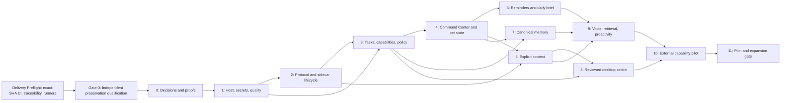

# Work Plan: Aemeath Trusted-Assistant Evolution

**Status:** Accepted direction; execution remains blocked by Delivery Preflight, Gate 0, and pending
item-specific disposition decisions  
**Date:** 2026-07-22  
**Plan type:** Incremental architecture migration plus vertical product slices  
**PRD:** [Aemeath Personal Assistant Evolution](../prd/jarvis_assistant_prd.md)  
**Design:** [Trusted Personal Assistant Architecture](../design/jarvis_assistant_design.md)  
**ADRs:** [ADR-0001](../adr/ADR-0001-evolutionary-modular-assistant-architecture.md) and
[ADR-0002](../adr/ADR-0002-test-driven-verification-and-exact-sha-delivery.md)  
**Authoritative execution checklist:**
[Test-driven implementation checklist](20260722-jarvis-assistant-tdd-checklist.md)

## 1. Outcome

Deliver a releasable Aemeath version that preserves the Windows desktop pet while proving four
trusted-assistant loops:

1. local reminders and a source-grounded daily brief;
2. explicit current-context questions with capture visibility and citations;
3. durable, reviewed execution of one narrow reversible desktop action;
4. inspectable and correctable canonical memory.

Text and push-to-talk access with clear Local/Hybrid/Cloud routing is a cross-cutting input layer for
those loops rather than a separate assistant loop.

The plan deliberately avoids a big-bang rewrite. Each phase has a user-observable or risk-reducing
exit, a rollback boundary, and a verification lane.

Before any phase below begins, Gate 0 independently qualifies the current behavior selected for
preservation. The execution checklist, rather than this strategic overview, is authoritative for
step order, required tests, RED/GREEN evidence, commits, pushes, and exact-SHA CI advancement.

## 2. Planning assumptions

- Windows 10/11 and .NET 8 remain the supported product platform during this plan.
- WPF and the existing pet/animation engine remain.
- Python 3.11+ remains optional for advanced agent/retrieval paths.
- Existing configuration and local user data must migrate without silent loss.
- The current build/test/lint debt is baseline work, not evidence that all new work can ignore gates.
- The first brief source is product-owned reminders plus local ICS import; the first selected
  knowledge source is an explicitly chosen local file/directory; and the first reversible action is
  a product-owned versioned scratch note. Phase 0 validates these choices against its frozen risk
  criteria rather than reopening scope informally.
- Effort bands below express relative complexity, not delivery dates: S (1–3 focused engineering
  days), M (4–8), L (9–15), XL (must be decomposed before implementation).

## 3. Delivery rules

1. Only one implementation path is authoritative for a persisted entity at a time.
2. Feature flags may choose legacy or new paths before task start; they do not switch an in-flight
   task.
3. No consequential capability ships before task, policy, approval, and receipt paths exist.
4. No new external provider secret is added to normal JSON configuration.
5. No broad model tool is exposed without a typed manifest and risk classification.
6. A phase is not complete when only service classes exist; its defined journey and failure modes
   must pass.
7. The current-state README, `REQUIREMENTS.md`, `CHECKLIST.md`, and `docs/architecture.md` are updated
   only after implementation truth changes.
8. Every migration produces a backup or has a proof that no user data changes.
9. Every phase ends with a clean review of new warnings, lint, test, accessibility, privacy, and
   compatibility impact.
10. Every implementation change follows RED-GREEN-REFACTOR-VERIFY. A pure behavior-preserving
    refactor uses an independently authored, mutation-sensitive GREEN characterization test first;
    every changed outcome, migration, package, configuration, or CI behavior requires a valid RED
    test or executable probe at the intended oracle.
11. Existing tests run only as a separate legacy-regression lane. Gate 0 specifications, fixtures,
    helpers, snapshots, and oracles are authored independently and frozen before legacy test review.
12. Each step freezes a risk/lane manifest, commits and pushes only after local verification, and
    waits for every required GitHub Actions job and matrix entry to succeed for the exact pushed head
    SHA. Missing, skipped, cancelled, advisory, zero-test, reduced-matrix, path-filtered, or
    merge-SHA-only evidence does not pass.
13. No phase begins while Gate 0 or a predecessor step is incomplete.

## 4. Cross-cutting connection map

| Connection | Producer | Consumer | Established in | Proved by |
|---|---|---|---|---|
| Host lifecycle | WPF `App` | All services/background workers/windows | Phase 1 | Startup/tray/shutdown smoke tests |
| Protected secrets | Settings migration | Provider and sidecar adapters | Phase 1 | Round-trip/migration/redaction tests |
| Protocol handshake | WPF supervisor | Python sidecar | Phase 2 | Cross-language fixtures and fault matrix |
| Run event stream | Python graphs | WPF task coordinator | Phase 2–3 | Reconnect/deduplication tests |
| Durable task state | Use cases/planner | UI, broker, receipts | Phase 3 | Restart-at-every-transition tests |
| Capability manifest | Native/integration/MCP adapters | Planner, policy, UI | Phase 3 | Schema/risk/compatibility tests |
| Approval decision | Command Center | Task coordinator/broker | Phase 3–4 | Proposal-hash and resume tests |
| Pet global state | Task/voice/health reducers | Animation/state presenter | Phase 4 | State-priority and visual checks |
| Brief/reminder events | Local scheduler/source adapters | Today/proactive inbox | Phase 5 | Offline/restart/time-zone scenarios |
| Context snapshot | Windows adapters | Conversation/planner/retrieval | Phase 6 | Exclusion/retention/citation tests |
| Memory revision | Canonical WPF memory store | Prompt builder/sidecar index/UI | Phase 7 | Invalidation and delete propagation |
| External side effect | Broker | Native/reversible adapter | Phase 8 | Idempotency/reconciliation/undo scenarios |
| Voice transcript | Voice pipeline | Unified conversation/task router | Phase 9 | Low-confidence and barge-in scenarios |
| Proactive candidate | Event/rule engine | Attention policy/inbox/pet cue | Phase 9 | Budget/focus/dismissal tests |
| MCP discovery | Supervised server | Capability registry | Phase 10 | Consent/schema-change/revocation tests |

## 5. Failure-mode plan

| Failure mode | Detection | Required behavior | Verification phase |
|---|---|---|---|
| Sidecar missing | Supervisor cannot resolve package/runtime | WPF pet/reminders/settings work; advanced capabilities disabled | 2, all later |
| Sidecar alive but agent initialization failed | Readiness subsystem state | Show degraded reason; no agent route selection | 2 |
| Protocol version incompatible | Handshake range mismatch | Stop dependent use; no best-effort unsafe parsing | 2 |
| Port collision | Explicit bind/startup failure | Select new allowed port or actionable failure; no stale process assumption | 2 |
| SSE disconnect | Sequence heartbeat/reconnect timeout | Query run state, deduplicate events, resume or fail safely | 2–3 |
| WPF closes while approval pending | Persisted WaitingApproval state | Reopen to same proposal; no execution | 3–4 |
| Timeout after external commit | Adapter returns UnknownCommit | Reconcile by idempotency/external ID; never blind retry | 3, 8 |
| Permission revoked mid-plan | Grant revision mismatch | Pause/reject next step and require new decision | 3 |
| Target changes after preview | Stable target re-resolution mismatch | Revalidate/reapprove; do not act on new target | 8 |
| Plaintext secret migration fails | Verification read fails | Keep original config and backup; no partial removal | 1 |
| SQLite migration interrupted | Schema history/integrity state | Restore/resume from bounded backup | 1, 3, 7 |
| Protected context expires while waiting | Missing protected payload | NeedsInput with recapture option; no stale use | 6 |
| Blacklisted/protected window selected | Capture policy | Refuse/redact visibly | 6 |
| Memory delete invalidation delayed | Revision acknowledgment missing | Block stale revision at query boundary; show pending cleanup | 7 |
| Cloud unavailable in Local mode | Stage health | Report unavailable; never route to cloud | 2, 6, 9 |
| Low-confidence voice command | STT confidence threshold | Confirm transcript before consequential routing | 9 |
| Proactive rule fires in focus mode | Attention policy | Queue/suppress; no speech or interruption | 5, 9 |
| MCP schema changes | Schema hash mismatch | Suspend grants and require review | 10 |
| Diagnostic export contains seeded secret | Redaction validation | Fail export and alert locally | 1, 4 |

## 6. Phase dependency graph



Phases 5, 6, and 7 can overlap after Phase 4 if separate owners are available and shared schema work
is coordinated. Phase 8 must not begin before policy/task mechanics and the context target model are
stable.

Delivery Preflight is an administrative prerequisite, not a product implementation phase. It
publishes the reviewed plan, bootstraps exact-head-SHA CI, validates traceability/manifest schemas,
and proves required runner/archive capabilities so Gate 0's per-push rules are enforceable.

## 7. Gate 0 — Independent preservation qualification

**Goal:** Prove every current behavior, datum, boundary, and supported Windows journey selected for
retention before architectural migration.  
**Effort:** XL, decomposed into unchanged-source Gate 0A and test-first corrective Gate 0B.  
**Requirements:** FR-021 through FR-024; NFR-JA-005, NFR-JA-007, and NFR-JA-008.

The new suite must not reuse existing test code, fixtures, helpers, snapshots, or expected values.
It is derived from requirements, documented behavior, public production contracts, independent
calculations, approved fixtures, and direct runtime observation. Existing .NET and Python tests run
later as a separate legacy-regression result and cannot alter a frozen preservation oracle.

Gate 0 covers `PB-001` through `PB-018` and includes:

1. specification, provenance, requirement-disposition, risk-map, lane, and fixture freeze;
2. unchanged-process offline launch/restart and real-Windows black-box journeys;
3. test-only external harnesses in Gate 0A, followed by characterization-guarded deterministic
   production seams in Gate 0B;
4. independently authored domain/engine unit and component-integration qualification;
5. data, application-composition, Python adapter, migration, and privacy qualification;
6. real-XAML WPF state, accessibility, layout, contrast, scale, high-contrast, and reduced-motion
   qualification;
7. process UI Automation and fixture E2E on Windows;
8. interactive/self-hosted Narrator, DPI, tray, hotkey, audio, fullscreen, multi-monitor,
   performance, reliability, security, and clean-package evidence;
9. separate legacy-suite admission after oracle freeze, then Gate 0B repair plus blocking format,
   Ruff, and dependency checks; and
10. a complete exact-SHA Gate 0 report with failure-detection controls and independent review.

The detailed acceptance conditions and commit/push/CI checkpoint for each item are in
[the execution checklist](20260722-jarvis-assistant-tdd-checklist.md#7-gate-0a--independently-qualify-the-unchanged-production-baseline),
followed by corrective Gate 0B.
No proof-of-concept, refactor, project split, host migration, protocol replacement, or feature work
below may begin until that gate is green.

## 8. Phase 0 — Decisions, baselines, and early proofs

**Goal:** Resolve high-risk unknowns before broad structural work.  
**Effort:** L, split into independent spikes.  
**Requirements:** G-008, G-010, NFR-JA-001, NFR-JA-005, NFR-JA-006.

### 0.1 Record baselines

**Files/artifacts**

- `docs/benchmarks/assistant-baseline.md` (new)
- repeatable scripts or test commands under existing test tooling

**Work**

- Record clean Release build result, .NET/Python test counts, Ruff/format status, and known
  environment-specific failures.
- Measure cold/warm startup, idle memory/CPU, Chat open, sidecar launch, first stream event, and exit.
- Record Windows version, CPU, RAM, storage, GPU, and provider/model conditions for each measurement.
- Define representative low/mid/high hardware tiers for later local-model measurements.

**Done when**

- Measurements are repeatable and include variance/p95 where applicable.
- Existing failures are categorized as product, test-environment, formatting, dependency, or flaky.
- No future phase can claim “no regression” without comparison to this record.

### 0.2 Validate initial sources and reversible action

**Approved starting decisions to validate**

- product-owned reminders plus local iCalendar/ICS import for the first brief source;
- explicitly selected local files/directories for the first knowledge-source type;
- a product-owned versioned scratch note for the first reversible desktop write action;
- supported Windows/application versions for the action;
- route/locality defaults and retention defaults for pilot.

**Evaluation criteria**

- user value and expected frequency;
- stable API/target identity;
- ability to mock and test;
- idempotency and undo support;
- credential/privacy scope;
- maintenance burden and licensing.

**Sequencing constraints**

- reminders as the first local write (already inside product control);
- local iCalendar/ICS import or a mock calendar source before OAuth-heavy integration;
- current-window structured read before UI Automation write;
- the versioned scratch note before modifying third-party application data; clipboard writes are a
  separate capability because they overwrite user state and need their own approval/undo decision.

### 0.3 Host-composition proof

Create a short-lived branch/spike or minimal implementation that starts the current pet using Generic
Host and DI for one existing service. Prove tray exit and companion launch. Keep if clean; otherwise
document the blocker before proceeding.

### 0.4 Protocol proof

Draft handshake/readiness/run-event schema, generate C#/Python fixtures, and prove authenticated
loopback, version mismatch, wrong token, stream reconnect, and child shutdown.

### 0.5 Durable approval proof

Use a fake in-memory/repository-backed reversible capability. Persist at WaitingApproval, restart,
approve, inject timeout around commit, reconcile, create receipt, and undo.

### 0.6 Sidecar distribution proof

Compare packaged executable/embedded environment/separate installation using clean Windows test
machines. Record artifact size, startup time, dependency/model absence, antivirus/signing behavior,
update/rollback, and support complexity.

### 0.7 Approval and privacy wireframe study

Prototype the approval card and execution-profile selection using static data. Test whether users can
answer:

- what will change;
- which target/account is used;
- what leaves the device;
- whether the action is reversible;
- what approval scope means.

**Phase exit**

- ADR-0001 accepted or revised with proof results.
- Selected integration/action decisions recorded.
- No kill criterion is triggered without explicit architecture review.

## 9. Phase 1 — Host, secrets, persistence foundation, and quality lanes

**Goal:** Establish supported lifecycle, protected credentials, schema migration, and reliable quality
signals without changing visible product behavior.  
**Effort:** L.  
**Requirements:** FR-014, FR-016, FR-018, FR-019; NFR-JA-002–006.

### 1.1 Introduce target solution projects

**Files**

- `src/Aemeath.Core/`
- `src/Aemeath.Windows/`
- `src/Aemeath.Infrastructure/`
- `src/Aemeath.Protocol/`
- solution and test-project updates

**Work**

- Create projects with the dependency direction from the design.
- Add architecture tests rejecting WPF/provider/persistence dependencies from Core.
- Add registration extension methods by module; avoid one giant service-registration file.

**Verification**

- Release solution build.
- Architecture tests demonstrate both an allowed and deliberately rejected dependency fixture.

### 1.2 Adopt Generic Host

**Files**

- `src/AemeathDesktopPet/App.xaml`
- `src/AemeathDesktopPet/App.xaml.cs`
- `src/AemeathDesktopPet/Composition/*`
- targeted existing windows/services

**Work**

- Integrate host startup/exit without blocking UI on slow dependencies.
- Register existing Config, Stats, Memory, pet/view-model, and companion-launch behavior incrementally.
- Add readiness registry and bounded shutdown.
- Preserve only one application/pet instance.

**Acceptance**

- Existing pet/tray/settings/chat smoke flows work.
- Exit stops owned child/background processes within the defined timeout.
- No view resolves services through a global service locator.

### 1.3 Add schema-managed SQLite foundation

**Files**

- `Aemeath.Infrastructure/Persistence/*`
- migration and backup tests

**Work**

- Establish connection factory, WAL/foreign-key configuration, schema history, transactions,
  optimistic row versions, integrity check, and bounded backup service.
- Do not migrate all current JSON data yet; prove infrastructure with a small internal table.

### 1.4 Implement protected secret store and config migration

**Files**

- `Aemeath.Core/Configuration/*`
- `Aemeath.Windows/Secrets/*`
- `Aemeath.Infrastructure/Persistence/SecretMetadata*`
- `AppConfig` compatibility/migration adapter

**Work**

- Implement `ISecretStore` with DPAPI CurrentUser protection and atomic vault writes.
- Replace runtime use of secret strings with `SecretReference` resolution at adapters.
- Migrate existing nonempty API-key fields with backup and verified round-trip before plaintext
  removal.
- Add display metadata and Delete/Re-enter flows without secret reveal.

**Verification**

- Seed every secret field with unique canary strings; assert no canary in config, logs, protocol
  fixtures, receipts, crash report, or diagnostic export.
- Inject vault-write and config-write failures; confirm no secret loss.

### 1.5 Stabilize quality lanes

**Work**

- Fix or quarantine only with evidence the known WPF environment-specific test setup failures.
- Align missing Python checkpoint dependency declarations.
- Add contract/lint commands to CI scaffolding without masking the current Ruff/format baseline.
- Set a no-new-violations policy, then burn down existing violations by touched module.

**Phase exit**

- Existing behavior runs under the host.
- Secrets no longer require plaintext runtime configuration.
- Migration/backup/redaction tests pass.
- Build/tests/lint status is documented and new code meets gates.
- Rollback: existing config backup plus feature flag to legacy composition for one development cycle,
  not for long-term production duality.

## 10. Phase 2 — Versioned protocol and sidecar lifecycle

**Goal:** Replace ad hoc backend health/payload assumptions with one authenticated generated contract.  
**Effort:** L.  
**Requirements:** FR-002, FR-006, FR-014, FR-016, FR-018; NFR-JA-001–006.

### 2.1 Establish contract source and generation

**Files**

- `contracts/aemeath-agent-v1.openapi.yaml`
- `contracts/fixtures/*`
- `src/Aemeath.Protocol/*`
- `python-backend/aemeath_agent/contracts/*`

**Work**

- Define common envelope, limits, errors, handshake, readiness, run commands/events, citations,
  capability proposals, and memory proposals.
- Pin and document generation tooling.
- Verify generated output is reproducible or commit it according to repository policy.
- Add fixtures for every discriminator and compatibility behavior.

### 2.2 Replace process startup

**Files**

- new sidecar supervisor under Windows/Infrastructure
- migration adapter for `BackendProcessManager`
- Python CLI/config/main

**Work**

- Pass explicit host/port/protocol/parent/nonce.
- Supply ephemeral session token through child environment.
- Verify child identity before force termination.
- Separate Live, Ready, Compatible, and Authorized.
- Surface missing dependency/model/provider as per-subsystem degradation.

### 2.3 Implement run lifecycle

**Work**

- Add `POST /v1/runs`, SSE events, commands, cancellation, reconciliation, heartbeat, and sequence
  deduplication.
- Implement one bounded conversation response through the new path.
- Keep legacy `BackendAgentService` behind a feature flag until the new path passes parity.

### 2.4 Remove reverse WPF API dependencies

Do not remove `InternalApiServer` until every active Python tool relying on it is disabled or adapted
to capability proposal events. Pet stats/music/screen become host capabilities later; the new agent
run must not depend on the old reverse API.

**Verification matrix**

- wrong/missing token;
- incompatible major and compatible minor versions;
- port collision and slow startup;
- process live but model/checkpoint failed;
- disconnect before/after event receipt;
- duplicate/out-of-order event;
- parent exit and child crash/restart;
- request/event size and timeout limit;
- Local profile with no cloud fallback.

**Phase exit**

- New conversation run works through generated client/fixtures.
- Diagnostics accurately distinguishes readiness states.
- No new sidecar path calls unauthenticated WPF HTTP.
- Clean-machine distribution path selected in Phase 0 passes smoke tests.

## 11. Phase 3 — Durable tasks, capability broker, policy, and receipts

**Goal:** Create the non-bypassable trust substrate for all assistant actions.  
**Effort:** XL; must be delivered as Tasks 3.1–3.6, each M/L.  
**Requirements:** FR-006–008, FR-014, FR-016, FR-018; G-001, G-002, G-004.

### 3.1 Task ledger and reducer

Implement task/step/event schemas, repositories, legal transitions, outbox, optimistic concurrency,
restart recovery, cancellation, NeedsInput, and terminal-state rules.

**Tests:** every legal transition; every illegal transition; restart after each persisted event;
conflicting UI/background commands; interrupted migration.

### 3.2 Capability registry and schemas

Implement immutable definitions, origin/version/schema hash, read/write/transmit categories,
availability, risk, preview/idempotency/reconciliation/undo metadata, and task-scoped registry views.

Register safe internal fixtures first; do not expose real writes yet.

### 3.3 Policy and grants

Implement R0–R4, scope records/revisions/expiry/revocation, execution-profile constraints,
AutoApprove/NeedsApproval/Forbidden outcomes, proposal hashing, and stable reason codes.

**Tests:** table-driven cross-product for origin, data, target, route, grant, action semantics, and
revocation. Unknown metadata must fail closed.

### 3.4 Approval persistence and resume

Implement approve/edit/reject, editable-field allow-list, revalidation after edit, single-use resume,
and restart-safe pending state. Bind decision to proposal/capability/schema/target hash.

### 3.5 Execution adapter contract

Define preview, execute, cancel, reconcile, and undo interfaces. Create a fake reversible adapter that
can inject known failure at every boundary. Never use a real external service to prove semantics.

### 3.6 Receipts and activity events

Implement receipt schema, protected payload/redacted summary split, external operation ID,
UnknownCommit, reconciliation, undo window, and retention cleanup.

**Phase exit scenario**

1. User starts fake task.
2. Planner/deterministic workflow proposes reversible write.
3. Policy pauses for approval.
4. WPF exits and restarts.
5. User edits and approves.
6. Timeout occurs after fake external commit.
7. Reconciliation finds exactly one effect.
8. Receipt shows proposed/approved/executed difference.
9. User undoes through the same broker.

All seeded-secret redaction and concurrency tests pass.

## 12. Phase 4 — Command Center, pet state, accessibility, and diagnostics

**Goal:** Make durable work, approval, memory placeholders, permissions, and health understandable.  
**Effort:** L/XL depending on UI decomposition.  
**Requirements:** FR-001, FR-007, FR-008, FR-014–017, FR-020.

### 4.1 Command Center shell

**Files**

- new WPF window/pages/view models/resources under `AemeathDesktopPet`
- navigation/state tests

Implement navigation, Today placeholder, Conversation integration, Tasks, Activity, Privacy,
Capabilities, Diagnostics, Settings link, responsive rail, details pane, and deep-link service.

### 4.2 Task and approval pages

Render every task state, plan timeline, policy details, exact approval fields, edit/reject/approve,
receipts, retry/recovery, and technical details. Default focus never lands on Approve.

### 4.3 Pet global-state presenter

Map task/voice/health reducer state to pet state priority. Reuse existing animations where adequate;
add labeled static halo/badge so no new asset blocks functionality. Add reduced-motion behavior.

### 4.4 Activity and Diagnostics

Expose user-readable events/receipts and per-subsystem Live/Ready/Compatible/Authorized states. Add
redacted export with canary test.

### 4.5 Accessibility and visual system

- Centralize semantic theme tokens and replace low-contrast required text.
- Implement AutomationPeers for custom state/progress controls.
- Verify keyboard/deep-link focus, 200% scaling, high contrast, reduced motion, and Narrator.
- Run screenshot matrix from UI spec.

**Phase exit**

- Static and fake Phase 3 scenarios are fully operable through UI and keyboard.
- Pet and Command Center never disagree on persisted state.
- Approval comprehension meets the Phase 0 study threshold.
- Closing any surface has no side-effect decision semantics.

## 13. Phase 5 — Offline reminders and daily brief vertical slice

**Goal:** Ship the first genuinely useful assistant loop through the new architecture.  
**Effort:** L.  
**Requirements:** FR-003, FR-004, FR-008, FR-010, FR-014–017.

### 5.1 Reminder domain and persistence

Implement natural/local deterministic parsing, explicit ambiguity, UTC + source time zone, recurrence,
snooze/complete/delete, missed reminder reconciliation, and local notification delivery. Convert
Pomodoro events only through an adapter; do not couple reminder storage to Pomodoro.

### 5.2 Scheduler and Windows notifications

Use one hosted scheduler and database query, handle restart/resume, quiet/focus mode, grouped toasts,
and receipt creation for mutations. Sidecar must not be required.

### 5.3 Brief source interface and first sources

Implement local reminders and the Phase 0-selected calendar/task source. Normalize source/freshness,
partial errors, stable IDs, and safe inline actions. Weather is optional and cannot block the brief.

### 5.4 Today page and pet cue

Implement ready/stale/empty/degraded/focus states, source links, action receipts, manual refresh, and
attention-policy delivery. Narrative summary is optional; source items are authoritative.

**Verification**

- no sidecar/network;
- restart and sleep/resume around due time;
- daylight-saving and time-zone boundaries;
- duplicate source item and recurrence;
- quiet hours/full screen/interruption budget;
- partial source outage and stale source;
- keyboard/Narrator notification-to-item journey.

**Phase exit**

- G-001 is measured for reminder/brief pilot scenarios.
- Users can obtain value without configuring an LLM.
- Current docs update status for implemented reminder/brief foundation.

## 14. Phase 6 — Explicit context snapshots and grounded answers

**Goal:** Let the assistant answer from current work without background surveillance.  
**Effort:** L.  
**Requirements:** FR-002, FR-005, FR-006, FR-012, FR-015–019.

### 6.1 Context model and protected blob lifecycle

Implement source metadata, protected payload references, classifications, route, redactions, expiry,
cleanup, task/thread scope, and cache invalidation. Raw context is ephemeral by default.

### 6.2 Windows source adapters

Implement active-window metadata and structured UI Automation read first. Add explicit selected-window
screenshot and clipboard sources only with preview, indicator, exclusions, stop, and retention.

### 6.3 Redaction and route policy

Implement blacklist/protected-window/private-field checks, deterministic redaction/downscale, Local/
Hybrid/Cloud validation, maximum payload, and no silent route change.

### 6.4 Grounded conversation flow

Pass task-scoped snapshots through the new sidecar run or deterministic summarizer. Return citations
with source/time/locator and insufficient-grounding behavior. Show sources in Context tray and answer
details.

**Verification**

- context disabled;
- protected/blacklisted/password window;
- active target changes during capture;
- raw payload expires while approval waits;
- Local mode with local provider unavailable;
- prompt injection embedded in UI text/document;
- deletion followed by cache/retrieval query;
- capture indicator survives page changes;
- 200% scale/Narrator.

**Phase exit**

- Users can answer “summarize this window” with source visibility.
- No background screen/clipboard capture occurs when context is off.
- Capture/deletion route passes privacy review.

## 15. Phase 7 — Canonical memory and correction

**Goal:** Replace split memory authority with user-controlled records and derived sidecar indexes.  
**Effort:** L/XL due migration.  
**Requirements:** FR-009, FR-016, FR-019, FR-020.

### 7.1 Inventory and migration rehearsal

Inventory current C# core/observation/procedural data, Python memory blocks/JSON/Chroma, conversation
history, and checkpoint links. Create read-only import report with duplicates, contradictions, missing
evidence, and counts. Rehearse on copies before any write.

### 7.2 Canonical memory schema and service

Implement tiers, evidence, confidence, sensitivity, confirmation, owner, versions, expiry,
suppression, optimistic concurrency, and export/delete.

### 7.3 Proposal and retrieval protocol

Change Python memory tools/routes from direct authoritative writes to `MemoryProposal`. Supply bounded
core blocks and scoped retrieval. Key derived embeddings by canonical ID/revision.

### 7.4 Memory Center

Implement filter/detail/evidence/history, confirm/edit/move/expire/forget/prevent-relearning, conflict
resolution, deletion propagation, and provider-store explanation.

### 7.5 Switch authority and retire legacy writes

Import according to approved mapping, switch writes atomically, block stale Python revision reads,
keep bounded read-only backup, and remove/warn on legacy mutation paths.

**Verification**

- duplicate/contradictory migration fixtures;
- edit/delete while sidecar down, followed by later reconciliation;
- stale vector result rejected by revision gate;
- deleted fact not regenerated from suppressed retained evidence;
- export/delete-all across stores;
- prompt evaluation confirms direct and sidecar paths use the same canonical context.

**Phase exit**

- Every visible personal memory is inspectable and mutable.
- Edit/delete propagates to all retrieval paths within one minute or stale revision is immediately
  blocked with cleanup pending.
- Legacy authoritative memory writes are disabled.

## 16. Phase 8 — First reviewed reversible desktop action

**Goal:** Prove safe real-world action from intent through receipt and undo.  
**Effort:** L.  
**Requirements:** FR-005–008, FR-014–018; G-001, G-002, G-004.

Use the Phase 0-selected action. Prefer a product-owned or narrowly scoped target before third-party
UI Automation.

### 8.1 Adapter and stable target

Implement capability manifest, preview, target resolution, approved editable fields, execution,
idempotency/reconciliation, cancellation, undo, and structured errors.

### 8.2 Deterministic skill and agent composition

Expose the same capability through one exact deterministic intent and one planner-composed scenario.
Verify both pass the same broker/policy/receipt path.

### 8.3 Real approval UX

Show exact target/effect/data/provider/undo, edited argument diff, and high-risk behavior if applicable.
Run comprehension test again with real content.

### 8.4 Fault and adversarial tests

- target changes before commit;
- permission revoked after plan;
- timeout before/after commit;
- duplicate event/resume;
- app/provider restart;
- prompt injection requests broader target;
- unsupported undo or expired undo;
- same action invoked twice intentionally vs replay.

**Phase exit**

- At least 99% exactly-once behavior in controlled pilot/injected scenarios.
- Every outcome has a receipt and honest partial-effect state.
- Supported undo reaches 95% success target in test scenarios.
- Security review approves only this narrow capability; no inferred broad desktop permission.

## 17. Phase 9 — Voice, knowledge retrieval, and restrained proactivity

**Goal:** Improve assistant access and initiative after trust substrate is proven.  
**Effort:** XL, split into 9A–9C.  
**Requirements:** FR-002, FR-010–012, FR-014–017, FR-020.

### 9A Modular push-to-talk voice

- Split audio capture, end-of-speech/VAD, STT, routing, TTS, and session coordinator.
- Replace broken backend STT contract with generated DTO/stage readiness.
- Add visible transcript, confidence confirmation, cancellation, barge-in, and route disclosure.
- Benchmark local and cloud stages on hardware tiers.
- Defer wake word until push-to-talk meets reliability/accessibility targets.

### 9B Selected-source knowledge retrieval

- Implement source catalog/grants, ingestion plan, status, revision reconciliation, citations, and
  deletion.
- Configure agent retrieval from task-scoped source IDs rather than a globally unwired retriever.
- Evaluate retrieval support/abstention and stale-source deletion.

### 9C Proactive rules and attention policy

- Introduce deterministic event/rule candidates, focus/quiet/fullscreen state, daily budget, inbox,
  feedback, and mute.
- Start with reminder/brief/task events; do not add continuous model polling.
- Model may phrase/rank non-urgent suggestions but cannot create urgency or actions.

**Phase exit**

- Voice remains optional and all flows work through text/keyboard.
- Knowledge answers cite granted sources and abstain below confidence gate.
- Proactivity is opt-in and pilot dismissal-as-irrelevant rate is below 5%, or it remains beta/off by
  default.

## 18. Phase 10 — External capability/MCP pilot

**Goal:** Validate the extension model with one reviewed server after native security gates.  
**Effort:** L.  
**Requirements:** FR-007, FR-008, FR-013, FR-016, FR-018.

### Work

- Build installation review showing full command, arguments, origin, working directory, transport,
  privileges, and requested scopes.
- Prefer stdio; implement process identity/lifecycle and bounded output.
- Translate discovered tools to capability definitions with schema hash/origin.
- Map each call through policy/approval/receipt.
- Keep credentials host-side; forbid token passthrough.
- Suspend grants on schema change.
- Add Stop, Disable, Revoke, Remove, and historical receipt behavior.
- Use a fixture server first, then one reviewed low-risk real server.

### Security verification

- malicious startup command display/consent;
- output flooding and malformed JSON-RPC;
- tool-list/schema mutation;
- filesystem/network scope expansion;
- HTTP redirect/SSRF rules if HTTP is supported;
- session replay and server restart;
- removal while task active;
- generated code attempting calls outside approved category.

**Phase exit**

- Security review approves the fixture and selected real server.
- No MCP-specific bypass of native policy exists.
- Public marketplace and one-click unreviewed install remain out of scope.

## 19. Phase 11 — Pilot, documentation truth, and expansion decision

**Goal:** Measure whether the project is more useful and trustworthy before adding breadth.  
**Effort:** M/L depending on pilot size.  
**Requirements:** G-001–G-010 and all release gates.

### Pilot measures

- correct terminal-state rate per loop;
- duplicate/unknown-commit/undo rate;
- approval edits/rejections and comprehension;
- proactive act/snooze/dismiss/mute/irrelevant rate;
- context/microphone/cloud indicator comprehension;
- memory proposal confirmation/edit/rejection and deletion latency;
- startup/readiness failure and degraded-use completion;
- latency and resource budget by hardware/profile;
- accessibility journey completion.

### Documentation updates

After verified implementation, update:

- `README.md` and `README_CN.md` user instructions/status;
- `REQUIREMENTS.md` current implementation status and acceptance evidence;
- `CHECKLIST.md` with completed/remaining work;
- `docs/architecture.md` current-state diagrams and boundaries;
- `docs/memory_system_design.md` to reflect canonical authority or mark it superseded;
- installation, privacy, data retention, extension, and troubleshooting guides;
- API/protocol compatibility policy and release notes.

### Expansion decision

Choose among:

- expand capabilities because gates and product metrics pass;
- hold capability breadth and improve reliability/UX;
- keep proactivity or voice beta/disabled due metrics;
- revisit the hybrid architecture if ADR kill criteria trigger;
- stop the “Jarvis” expansion and retain only successful vertical slices.

## 20. Test and review lanes by phase

| Lane | 0–1 | 2–3 | 4–5 | 6–8 | 9–10 | 11 |
|---|---:|---:|---:|---:|---:|---:|
| .NET build/unit | Required | Required | Required | Required | Required | Required |
| Python unit/Ruff | Baseline/no new | Required touched code | Required | Required | Required | Required |
| Architecture dependencies | Establish | Required | Required | Required | Required | Required |
| Cross-language contract | Proof | Required | Required | Required | Required | Required |
| Persistence/migration | Foundation | Task schema | Reminder | Context/memory/action | Source/extension | Upgrade matrix |
| Security/redaction | Secrets | Protocol/policy | Approval/export | Context/action/memory | Voice/MCP | Full review |
| Accessibility/visual | Wireframe | State model | Full UI | Full UI | Full UI | Pilot |
| E2E | Smoke | Fake durable task | Reminder/brief | Context/memory/action | Voice/RAG/MCP | Full matrix |
| Performance/soak | Baseline | Boundary/task | UI/scheduler | Capture/index/action | Voice/proactive | Release budgets |
| Model evaluation | Baseline scenarios | Tool constraints | Brief phrasing | Grounding/memory/plan | Voice/RAG/proactive | Locked release suite |

## 21. Requirement-to-phase traceability

| Qualified requirement | Primary phase(s) |
|---|---|
| PRD:FR-001 | 2, 4, 9 |
| PRD:FR-002 | 2, 6, 9 |
| PRD:FR-003 | 5 |
| PRD:FR-004 | 5 |
| PRD:FR-005 | 6 |
| PRD:FR-006 | 2, 3, 8 |
| PRD:FR-007 | 3, 4, 8, 10 |
| PRD:FR-008 | 3, 4, 5, 8 |
| PRD:FR-009 | 7 |
| PRD:FR-010 | 5, 9 |
| PRD:FR-011 | 9A |
| PRD:FR-012 | 6, 9B |
| PRD:FR-013 | 10 |
| PRD:FR-014 | 1, 2, all vertical slices |
| PRD:FR-015 | 4 |
| PRD:FR-016 | 1–4, all vertical slices |
| PRD:FR-017 | 4, all UI phases |
| PRD:FR-018 | 1–3, 6–10 |
| PRD:FR-019 | 1, 6, 7, 11 |
| PRD:FR-020 | 4, 7, 9, 11 |
| PRD:FR-021 | Delivery Preflight and Gate 0A/0B; all later preservation reruns |
| PRD:FR-022 | Every executable checklist child step |
| PRD:FR-023 | Delivery Preflight disposition/traceability; every affected step |
| PRD:FR-024 | Delivery Preflight exact-SHA bootstrap; every executable step |
| PRD:NFR-JA-001 | Gate 0 baseline; 1, 2, 4–6, 8–11 performance manifests |
| PRD:NFR-JA-002 | Gate 0; 1–3 and every durable/recovery vertical slice |
| PRD:NFR-JA-003 | Gate 0; 1–3, 6–10, final security review |
| PRD:NFR-JA-004 | 1–3 architecture gates and every code review |
| PRD:NFR-JA-005 | Delivery Preflight/Gate 0 and every test design |
| PRD:NFR-JA-006 | Gate 0 migration inventory; 1, 2, 7, 11 |
| PRD:NFR-JA-007 | Delivery Preflight and every exact-SHA CI gate |
| PRD:NFR-JA-008 | Delivery Preflight traceability/evidence and every measured gate |

The machine-checkable, acceptance-criterion-level mapping belongs to
`docs/verification/traceability-v1.yml`, created and validated in Delivery Preflight D0.3. Bare
`NFR-*` identifiers from the current `REQUIREMENTS.md` are qualified as `CURRENT:NFR-*`; future
assistant targets use `PRD:NFR-JA-*`.

## 22. Definition of ready for an implementation task

A task is ready only when:

- its PRD acceptance criteria and affected release gate are named;
- authoritative owner and module are identified;
- target files/interfaces and migration impact are known;
- security/data categories and risk class are reviewed;
- failure modes and rollback are written;
- deterministic fixtures or external test doubles exist;
- UI states are defined for loading, empty, degraded, error, cancellation, and success where relevant;
- performance/accessibility/privacy implications are explicit;
- unresolved decisions would not materially change the implementation.

## 23. Definition of done for a phase

A phase is done only when:

- its end-to-end exit scenario passes on a clean supported environment;
- unit, contract, integration, E2E, lint/format, architecture, and relevant accessibility tests pass;
- injected failures reach safe terminal states with no hidden partial effect;
- migrations and rollback/recovery are tested on copied representative data;
- logs/exports pass seeded-secret and sensitive-context redaction checks;
- performance remains within budgets or an explicit accepted exception exists;
- user-facing states and troubleshooting are documented;
- current-state docs are updated to reflect only what is now true;
- legacy code made obsolete by the phase is removed or has an owner and removal deadline;
- the next phase does not rely on an undocumented manual setup step.

## 24. Plan reflection

This plan is intentionally longer on foundation than a feature-first roadmap. That cost is justified
because Aemeath already has many partial capabilities; adding another tool is easy, but making tools
safe, durable, and coherent is the actual product challenge.

The plan can still fail if the team attempts every subsystem in parallel. The critical path is:

```text
host/secrets -> protocol -> task/policy/receipt -> Command Center -> one useful loop -> one real action
```

Memory, advanced voice, RAG, proactivity, and MCP should not distract from completing that path. The
first question at every phase review should be: **Does this make one assistant loop more reliable,
understandable, or useful?** If the answer is no, defer or reduce the work.

The second reflection is that “Jarvis-like” should remain an experience goal, not a scope license.
Aemeath will feel intelligent when it remembers correctly, chooses a reliable route, respects focus,
shows what it is doing, and finishes a small task. It will not feel intelligent if it exposes dozens
of tools but frequently guesses, duplicates actions, or asks for blanket access.
