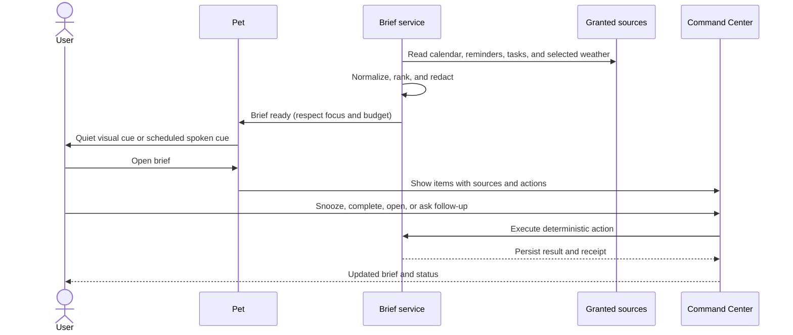
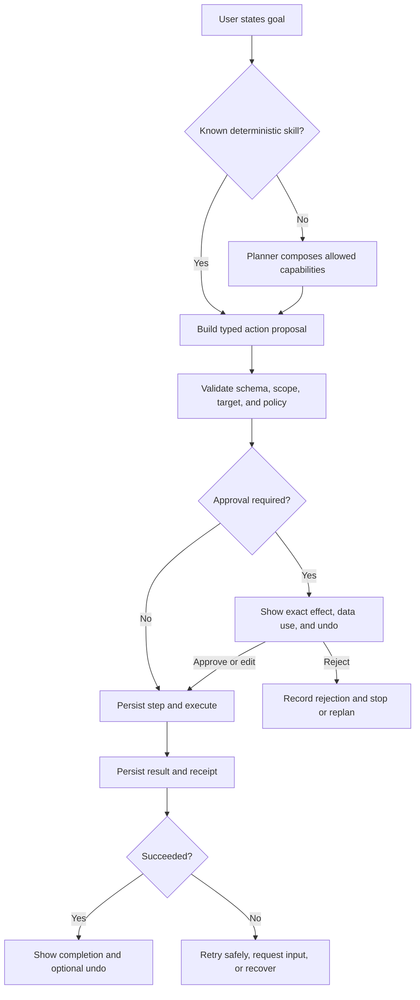
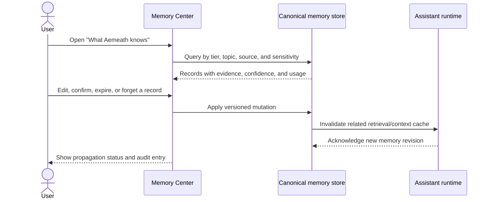
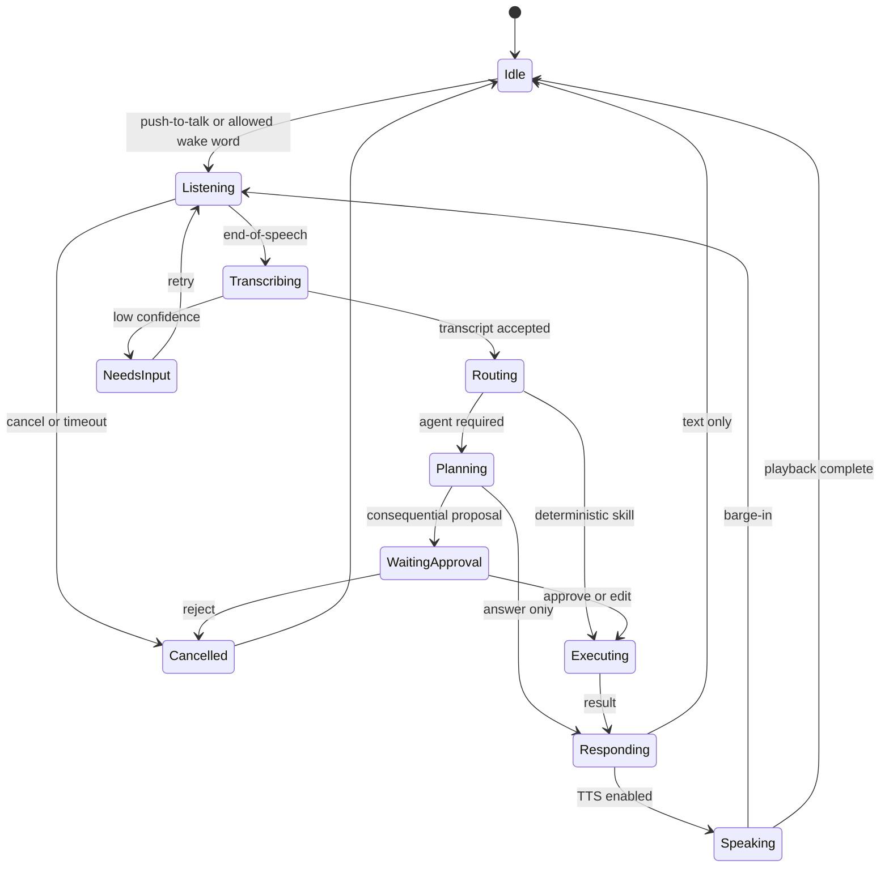
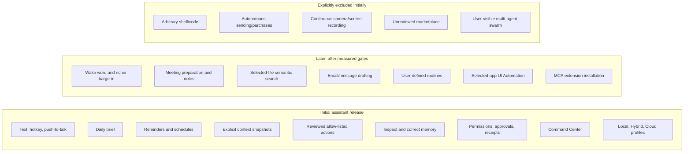

# Product Requirements: Aemeath Personal Assistant Evolution

**Status:** Accepted for phased implementation  
**Version:** 1.3  
**Date:** 2026-07-22  
**Product horizon:** Foundation and first trusted-assistant release  
**Related research:** [Personal Assistant Landscape and Product Direction](../research/jarvis_assistant_landscape.md)

**Implementation approval:** On 2026-07-22, the user approved this product direction and its phased
implementation in principle. That approval authorizes execution through the release gates in this
document; it does not waive unresolved product choices, safety review, test evidence, or a gate.

> This is a future-state proposal. [REQUIREMENTS.md](../../REQUIREMENTS.md) remains the authoritative
> statement of what the current working tree implements.

## 1. Product summary

Aemeath will evolve from a conversational Windows desktop pet into a **trusted, local-first personal
assistant with a visible character**. It will help a user understand current work, organize time,
prepare actions, execute bounded approved tasks, and maintain correctable long-term context. The pet
remains the assistant's embodiment; a new Command Center makes complex state, permissions, memory,
and activity inspectable.

The initial release will prove four end-to-end assistant loops:

1. organize time through a daily brief and create, update, or complete reminders;
2. answer questions from an explicitly captured desktop context snapshot;
3. prepare and execute a narrow, reviewed desktop action with a receipt;
4. inspect and correct what the assistant remembers.

The product will favor reliable deterministic workflows for known tasks and use model planning for
ambiguity or composition. Consequential side effects remain under a host-controlled permission and
approval system.

## 2. Problem statement

### User problem

Most desktop assistants fall into one of two unsatisfying categories:

- conversational tools that can explain but cannot reliably finish work; or
- automation tools that can act but require scripting knowledge and provide little relationship,
  context, or natural interaction.

A user who wants a persistent personal helper must repeatedly explain preferences and current work,
switch between separate task, calendar, note, voice, and AI interfaces, and manually verify whether
an agent's actions are safe and complete. Existing assistants also make it hard to understand what
data is being observed, retained, or sent to cloud providers.

### Aemeath-specific problem

Aemeath already provides a personable desktop presence and several AI/voice/context capabilities,
but its current behavior is primarily conversational and its advanced paths are fragmented between
C# and Python. More functions cannot be safely layered on until the product has one task model, one
permission path, clear runtime ownership, durable execution, canonical memory, and an administration
surface.

### Opportunity

Aemeath can occupy a distinctive position: **less sterile than a productivity agent, more useful
than a desktop mascot, and more understandable than an autonomous computer-use system**. The pet can
make assistant state emotionally legible, while the Command Center provides the precision needed for
serious work.

## 3. Goals and measurable outcomes

### Product goals

| ID | Goal | Measure for initial pilot |
|---|---|---|
| G-001 | Complete bounded assistant work reliably | At least 90% correct terminal-state rate across supported loop attempts |
| G-002 | Prevent duplicate consequential effects | At least 99% of approved actions create exactly one intended side effect |
| G-003 | Make data use understandable | At least 90% of test users correctly identify active microphone, screen, memory, and cloud use |
| G-004 | Make execution recoverable | Every side effect has a receipt; supported undo succeeds in at least 95% of injected scenarios |
| G-005 | Keep memory under user control | 100% of stored personal memories can be inspected, edited, expired, or deleted |
| G-006 | Offer useful restraint | Fewer than 5% of tuned proactive suggestions are dismissed as irrelevant in the pilot |
| G-007 | Preserve the pet experience | Pet, settings, reminders, and offline responses remain usable when the sidecar is unavailable |
| G-008 | Keep interaction responsive | Local UI actions respond within 100 ms p95; first visible agent progress appears within 500 ms p95 after routing |
| G-009 | Support inclusive operation | Core journeys are keyboard-operable, screen-reader named, high-contrast compatible, and usable at 200% scaling |
| G-010 | Enable incremental delivery | Each roadmap phase ends with a releasable vertical slice and rollback path |

### Non-goals for the initial release

- general autonomous control of every Windows application;
- arbitrary shell, PowerShell, or generated-code execution;
- autonomous email/message sending, purchasing, posting, deletion, or account modification;
- continuous camera or unbounded screen recording;
- cross-platform desktop support;
- smart-home control;
- multi-user household identity;
- a public extension marketplace;
- a multi-agent swarm as a user-visible feature;
- replacing professional medical, financial, legal, or emergency services;
- claiming that all workloads can run locally on all hardware.

## 4. Target users

### Persona A: Privacy-conscious knowledge worker

Works primarily on Windows, uses calendars, documents, browsers, and task lists, and wants assistance
without continuous surveillance. Values local processing, explicit data boundaries, and the ability
to verify or undo actions.

**Primary needs:** daily brief, reminders, contextual summarization, drafting, clear cloud disclosure,
memory control, quiet/focus mode.

### Persona B: Existing desktop-pet enthusiast

Values Aemeath's personality, animation, companionship, and idle interactions. Wants more usefulness
but does not want the character replaced by a corporate dashboard or a constantly interrupting agent.

**Primary needs:** preserved pet behavior, expressive assistant states, concise lightweight prompts,
optional deeper views, configurable proactivity.

### Persona C: Accessibility or hands-busy user

Uses keyboard navigation, screen reader, voice, or alternative input, or frequently needs assistance
while hands are occupied. Requires predictable focus behavior, captions/transcripts, and recoverable
voice interaction.

**Primary needs:** push-to-talk, optional wake word, barge-in, keyboard-complete UI, accessible names,
visible transcripts, no voice-only confirmations.

### Persona D: Power user and contributor

Wants to connect tools, define routines, switch models, inspect execution, and diagnose degraded
capabilities. Accepts complexity when it is explicit and reversible.

**Primary needs:** typed capabilities, permission scopes, workflow builder later, MCP adapters,
activity receipts, diagnostics, Local/Hybrid/Cloud profiles.

## 5. Product principles

1. **Trust before breadth.** A smaller reliable capability set is preferable to many opaque tools.
2. **Deterministic before agentic.** Known commands use validated workflows; planning handles
   ambiguity and composition.
3. **Local control, transparent routing.** The user chooses where data may go; no silent local-to-cloud
   fallback occurs.
4. **The model proposes; policy decides.** Models cannot grant permissions or bypass validation.
5. **Every action has a story.** The user can see what was requested, planned, approved, executed,
   changed, and recovered.
6. **Memory is editable data, not mystique.** Personalization must be sourced, bounded, and reversible.
7. **Proactivity earns attention.** Events respect availability, quiet hours, full-screen use, and a
   daily interruption budget.
8. **Character and clarity coexist.** The pet expresses state; the Command Center explains details.
9. **Degradation is explicit.** Unavailable models or integrations reduce capabilities without
   pretending the system is healthy.
10. **Accessibility is product quality.** Voice is an additional input, not a substitute for a fully
    accessible visual and keyboard interface.

## 6. User journeys

### 6.1 Daily brief journey

### 6.2 Reviewed desktop-action journey

### 6.3 Memory-correction journey

### 6.4 Voice-session journey

## 7. Scope model

## 8. Functional requirements

### FR-001: Unified invocation and conversation

**Priority:** Must

The user can invoke the same assistant identity through pet click, Command Center input, global
hotkey, or push-to-talk. All invocations create or continue an explicit conversation thread.

**Acceptance criteria**

1. AC-FR-001-01: Given Aemeath is running, when the user invokes any supported entry point, then an
   input surface becomes available within 300 ms p95 without starting a duplicate application.
2. AC-FR-001-02: Given a thread is active, when the user switches between text and voice, then both
   inputs appear in the same ordered transcript with modality metadata.
3. AC-FR-001-03: Given the sidecar is unavailable, when the user opens conversation, then the UI
   remains usable and clearly labels which assistant capabilities are unavailable.
4. AC-FR-001-04: Given a response is streaming, when the user cancels, then generation and any
   not-yet-started plan steps are cancelled and the transcript records the cancellation.

### FR-002: Execution profiles and data routing

**Priority:** Must

The user chooses Local, Hybrid, or Cloud execution profiles and can inspect the route used by each
voice, model, retrieval, and TTS stage.

**Acceptance criteria**

1. AC-FR-002-01: Given Local mode is active, when no suitable local provider is available, then the
   capability reports unavailable and does not silently call a cloud service.
2. AC-FR-002-02: Given Hybrid or Cloud mode is active, when content will leave the device for a new
   data category or provider, then Aemeath obtains an appropriate grant before transmission.
3. AC-FR-002-03: Given any completed response or action, when the user opens its details, then the UI
   lists the providers and data categories used without exposing secret values.
4. AC-FR-002-04: Given a profile changes during an active task, then already approved steps retain
   their recorded route while future steps are revalidated against the new profile.

### FR-003: Daily brief

**Priority:** Must

Aemeath composes a scheduled or on-demand brief from granted calendar, reminder, task, and optional
weather sources.

**Acceptance criteria**

1. AC-FR-003-01: Given at least one source is configured, when the brief runs, then it shows normalized
   items ordered by urgency and time, with source and freshness visible for each item.
2. AC-FR-003-02: Given no source is available, when the brief runs, then it presents an actionable
   empty/degraded state rather than inventing content.
3. AC-FR-003-03: Given focus mode, quiet hours, full-screen suppression, or the interruption budget is
   active, when a scheduled brief becomes ready, then it waits silently while remaining available in
   the Command Center.
4. AC-FR-003-04: Given an item supports a deterministic action, when the user selects complete,
   snooze, open, or reschedule, then the item and source are updated and a receipt is recorded.
5. AC-FR-003-05: Given the user asks a follow-up, then the answer cites the brief items and source
   timestamps used.

### FR-004: Reminders and timers

**Priority:** Must

The user can create, list, edit, complete, snooze, and delete local reminders and timers through text,
voice, or the Command Center.

**Acceptance criteria**

1. AC-FR-004-01: Given an unambiguous request such as “remind me at 3 PM to call Sam,” when routed,
   then a deterministic parser creates a preview containing local date, time zone, title, and repeat
   rule before persistence if ambiguity exists.
2. AC-FR-004-02: Given a reminder time is ambiguous or in the past, then Aemeath requests clarification
   or shows a corrected proposal; it does not silently guess a materially different time.
3. AC-FR-004-03: Given the sidecar and network are unavailable, when a local reminder becomes due,
   then the notification still fires.
4. AC-FR-004-04: Given a reminder is edited, completed, snoozed, or deleted, then the change is durable
   across restart and appears in the activity history.
5. AC-FR-004-05: Given a time-zone or daylight-saving transition, then stored instants and displayed
   local times follow the documented conversion rules and automated boundary tests.

### FR-005: Explicit desktop context snapshots

**Priority:** Must

The user can grant Aemeath a bounded snapshot of current context, including selected active-window
metadata, accessible UI text, clipboard content, selected files, or a screenshot.

**Acceptance criteria**

1. AC-FR-005-01: Given context capture is off, then no screenshot, clipboard, active-window text, or
   UI Automation content is captured merely because chat is open.
2. AC-FR-005-02: Given the user requests “use this window,” then the preview lists every context source,
   its freshness, sensitivity classification, and whether it will be processed locally or remotely.
3. AC-FR-005-03: Given a blacklisted, protected, password, private-browsing, or excluded application is
   active, then capture is refused or redacted according to policy and the refusal is visible.
4. AC-FR-005-04: Given a snapshot is used in an answer, then the answer details link to the snapshot
   sources and captured time.
5. AC-FR-005-05: Given the configured retention period expires or the user deletes the snapshot, then
   raw captured content is removed and retrieval caches are invalidated.
6. AC-FR-005-06: Given screen capture is active, then an always-visible indicator and immediate stop
   control are present.

### FR-006: Deterministic skills and agent planning

**Priority:** Must

The assistant routes known intents to deterministic skills and uses model planning only for ambiguous
or composed goals.

**Acceptance criteria**

1. AC-FR-006-01: Given a supported unambiguous reminder, timer, brief, settings, or media command, then
   it runs through its deterministic skill without requiring a general agent plan.
2. AC-FR-006-02: Given a request needs planning, then the planner can propose only capabilities present
   in the task-scoped registry view.
3. AC-FR-006-03: Given a proposal fails schema, policy, target, scope, or state validation, then it is
   rejected before execution and the planner receives a sanitized structured error.
4. AC-FR-006-04: Given a plan contains multiple steps, then each step has an explicit dependency,
   expected effect, risk class, status, and cancellation behavior.
5. AC-FR-006-05: Given an equivalent deterministic skill and open-ended tool plan both exist, then the
   deterministic skill is selected unless the user explicitly requests exploratory behavior.

### FR-007: Capability permissions and approval

**Priority:** Must

Every capability declares its data access and side effects. A host policy engine decides whether it
may run automatically, requires approval, or is forbidden.

**Acceptance criteria**

1. AC-FR-007-01: Given a new capability or expanded scope, when first requested, then the user sees its
   provider, target, data read, data written, data transmitted, risk, and revocation path.
2. AC-FR-007-02: Given a consequential action requires approval, then execution pauses durably and the
   user may approve, edit allowed fields, reject with feedback, or cancel the task.
3. AC-FR-007-03: Given an approval is edited, then the modified action is fully revalidated and the
   receipt distinguishes proposed from approved arguments.
4. AC-FR-007-04: Given a grant is revoked, then future steps cannot reuse it and any affected running
   task pauses or fails safely.
5. AC-FR-007-05: Given a model or extension requests a permission change, then it can only explain the
   need; it cannot modify grants directly.
6. AC-FR-007-06: Given a high-risk action such as external send, destructive file change, credential
   use, purchase, or account change, then per-action approval is mandatory in the initial release or
   the capability is unavailable.

### FR-008: Durable tasks, receipts, and recovery

**Priority:** Must

Assistant work persists as tasks and steps that survive process failure and produce user-readable
receipts.

**Acceptance criteria**

1. AC-FR-008-01: Given a task begins, then its intent, initiating user input, route, steps, policy
   decisions, and trace identifiers are persisted before a side effect executes.
2. AC-FR-008-02: Given the UI or sidecar restarts while waiting for approval, then the task returns to
   the same approval state without repeating completed side effects.
3. AC-FR-008-03: Given a timeout occurs around an external commit, then the adapter uses an idempotency
   key or reconciliation query before retrying.
4. AC-FR-008-04: Given an action succeeds, then the receipt states what changed, where, when, through
   which provider, and whether undo is available.
5. AC-FR-008-05: Given undo is supported, when requested within its validity window, then undo follows
   the same validation, approval, execution, and receipt path.
6. AC-FR-008-06: Given a task cannot recover automatically, then it enters NeedsInput or Failed with a
   plain-language next step; it does not remain indefinitely “thinking.”

### FR-009: User-controlled memory

**Priority:** Must

Aemeath stores bounded memory records with tier, source, confidence, sensitivity, ownership, and
retention. Users can inspect and correct them.

**Acceptance criteria**

1. AC-FR-009-01: Given the assistant proposes a new memory, then it contains a source reference,
   confidence, tier, sensitivity, and reason for expected future usefulness.
2. AC-FR-009-02: Given a memory is sensitive, identity-defining, or low confidence, then it requires
   confirmation before entering always-visible core memory.
3. AC-FR-009-03: Given the user opens Memory Center, then all personal memories are searchable and can
   be filtered by tier, topic, source, sensitivity, confidence, and last use.
4. AC-FR-009-04: Given a memory is edited, expired, or deleted, then all prompt, retrieval, and sidecar
   caches reflect the new revision within one minute.
5. AC-FR-009-05: Given a deleted memory was derived from a retained transcript, then the product
   explains the distinction and prevents automatic recreation unless the user permits re-learning.
6. AC-FR-009-06: Given the user requests export or delete-all, then the operation covers every
   authoritative store and reports any provider-held data outside local control.

### FR-010: Restrained proactive assistance

**Priority:** Should

Aemeath can suggest timely help based on explicit events and rules while respecting availability and
attention limits.

**Acceptance criteria**

1. AC-FR-010-01: Given proactive behavior is disabled, then no unscheduled suggestion is surfaced.
2. AC-FR-010-02: Given focus mode, quiet hours, full-screen suppression, or Do Not Disturb is active,
   then non-urgent suggestions are queued silently.
3. AC-FR-010-03: Given the daily interruption budget is exhausted, then additional non-urgent events
   appear only in the activity inbox.
4. AC-FR-010-04: Given a suggestion is shown, then the user can act, snooze, dismiss, mute its rule, or
   explain why it was irrelevant.
5. AC-FR-010-05: Given repeated dismissals for a rule, then the system recommends lowering or disabling
   it; it does not silently expand observation to improve predictions.
6. AC-FR-010-06: Given an event is urgent, then urgency must come from a user-defined rule or source
   field, not solely from model interpretation.

### FR-011: Modular voice interaction

**Priority:** Should

Voice interaction is implemented as a staged pipeline with push-to-talk in the initial release and
optional wake word later.

**Acceptance criteria**

1. AC-FR-011-01: Given push-to-talk begins, then the pet and Command Center show Listening, the active
   microphone, processing route, and a cancel control.
2. AC-FR-011-02: Given transcription confidence is below the configured threshold for a consequential
   command, then the user must confirm or correct the transcript.
3. AC-FR-011-03: Given TTS is speaking, when the user invokes barge-in or cancel, then playback stops
   within 250 ms p95 and the new input does not overlap the prior session.
4. AC-FR-011-04: Given any voice stage is unavailable, then text input remains available and diagnostics
   identify the failed stage.
5. AC-FR-011-05: Given cloud STT or TTS is selected, then audio transmission is governed by the active
   execution profile and grant.
6. AC-FR-011-06: Given voice interaction completes, then a visible transcript is retained according to
   the user's conversation policy; voice is never the only record of an approval.

### FR-012: Selected-source knowledge retrieval

**Priority:** Should

The user can grant selected files or directories to a knowledge catalog and receive answers grounded
in retrieved passages.

**Acceptance criteria**

1. AC-FR-012-01: Given a source is added, then the UI shows supported types, indexing status, location,
   retention, and whether embeddings are local or remote.
2. AC-FR-012-02: Given a file changes or is removed, then the index updates or removes its chunks without
   retaining inaccessible stale content beyond the documented reconciliation interval.
3. AC-FR-012-03: Given an answer uses indexed content, then it cites source file, section/page when
   available, and retrieval timestamp.
4. AC-FR-012-04: Given retrieval confidence is insufficient, then the assistant states that it could
   not find grounded support instead of presenting a confident unsupported answer.
5. AC-FR-012-05: Given source permission is revoked, then future retrieval is blocked immediately and
   cached content is invalidated.

### FR-013: Capability and MCP extension management

**Priority:** Could

Power users can connect reviewed external capabilities through MCP after the native trust substrate
is complete.

**Acceptance criteria**

1. AC-FR-013-01: Given a local server installation is proposed, then the exact executable, arguments,
   working directory, origin, requested filesystem/network scope, and same-user privilege warning are
   shown before launch.
2. AC-FR-013-02: Given a server connects, then its identity, protocol version, tool schemas, and health
   are recorded and each tool is mapped to an Aemeath capability risk policy.
3. AC-FR-013-03: Given a tool schema changes, then previously granted high-risk calls are suspended
   until reviewed.
4. AC-FR-013-04: Given an HTTP MCP server is used, then authorization and transport security follow
   current MCP requirements; token passthrough is forbidden.
5. AC-FR-013-05: Given an extension is disabled or removed, then its processes stop, grants revoke, and
   historical receipts remain readable.

### FR-014: Graceful degradation and offline core

**Priority:** Must

The product distinguishes healthy, degraded, unavailable, and misconfigured capabilities without
collapsing into a single backend status.

**Acceptance criteria**

1. AC-FR-014-01: Given the sidecar is missing, incompatible, or failed, then pet behavior, settings,
   local reminders, deterministic local skills, and offline responses remain available.
2. AC-FR-014-02: Given a provider fails after routing, then fallback occurs only within routes permitted
   by the execution profile and the user is told which provider completed the request.
3. AC-FR-014-03: Given a health check passes but model, checkpointer, retrieval, or tool initialization
   fails, then readiness is degraded and dependent capabilities are disabled.
4. AC-FR-014-04: Given a capability recovers, then it returns to service without application restart
   when safe, and active tasks revalidate before resuming.

### FR-015: Command Center and pet state

**Priority:** Must

The product provides a Command Center for detailed work and uses the pet for lightweight interaction
and expressive status.

**Acceptance criteria**

1. AC-FR-015-01: Given a task is active, then the pet visibly distinguishes Listening, Thinking,
   Waiting for Approval, Executing, Succeeded, Needs Input, and Failed without relying only on color.
2. AC-FR-015-02: Given the user opens the Command Center, then Conversation, Today, Tasks, Memory,
   Capabilities, Privacy, Activity, and Diagnostics are reachable through keyboard navigation.
3. AC-FR-015-03: Given an approval is pending, then it is accessible from both the pet cue and the
   Tasks/Activity inbox, and dismissing the cue does not approve or discard it.
4. AC-FR-015-04: Given the Command Center closes, then durable tasks continue or pause according to
   policy and the tray/pet accurately reflects their state.
5. AC-FR-015-05: Given compact pet mode is active, then dense receipts, policy text, and memory records
   are never forced into a small speech bubble.

### FR-016: Diagnostics and privacy-safe activity history

**Priority:** Must

Users and maintainers can inspect capability health and task history without exposing secrets or
unnecessarily retaining sensitive content.

**Acceptance criteria**

1. AC-FR-016-01: Given a task or response, then its details expose correlated WPF and sidecar trace IDs,
   timing, capability versions, route, retries, and terminal state.
2. AC-FR-016-02: Given logs or diagnostic bundles are exported, then authorization headers, tokens,
   API keys, credentials, raw protected context, and configured sensitive fields are redacted.
3. AC-FR-016-03: Given a subsystem is degraded, then Diagnostics reports liveness, readiness,
   compatibility, actionable cause, and a safe recovery step.
4. AC-FR-016-04: Given activity retention expires, then detailed payloads are deleted while minimal
   aggregate reliability metrics may remain according to policy.
5. AC-FR-016-05: Given telemetry is offered, then it is opt-in, documented by field, and disabled by
   default in the initial release.

### FR-017: Accessibility and localization readiness

**Priority:** Must

All initial journeys are operable without a mouse or voice and expose usable semantics to Windows
assistive technologies.

**Acceptance criteria**

1. AC-FR-017-01: Given keyboard-only operation, then every core function has a visible focus path,
   logical tab order, activation key, and escape/cancel behavior.
2. AC-FR-017-02: Given Narrator or a UI Automation inspector, then controls expose names, roles, values,
   states, and patterns sufficient to complete the core journeys.
3. AC-FR-017-03: Given 200% text scaling or high contrast, then no required control or status becomes
   clipped, hidden, or color-only.
4. AC-FR-017-04: Given animation reduction is enabled, then nonessential movement and glitches are
   reduced without hiding state changes.
5. AC-FR-017-05: Given a voice or audio cue occurs, then an equivalent visible cue and transcript exist.
6. AC-FR-017-06: Given user-facing text is added, then it is stored in localizable resources rather
   than assembled from untranslatable fragments where practical.

### FR-018: Secret and data protection

**Priority:** Must

Credentials and sensitive persisted data use Windows-protected storage and least-privilege access.

**Acceptance criteria**

1. AC-FR-018-01: Given an API credential is saved, then normal configuration stores only a reference
   and the secret is protected for the current Windows user.
2. AC-FR-018-02: Given an existing plaintext secret is migrated successfully, then the plaintext value
   is removed on the next atomic configuration save and the migration is recoverable from backup.
3. AC-FR-018-03: Given a secret is needed by the sidecar, then it is provided only for the required
   process/session/provider and never appears in model context, receipts, or logs.
4. AC-FR-018-04: Given the local API starts, then it binds to loopback, requires the session credential,
   enforces size/time limits, and rejects incompatible protocol versions.
5. AC-FR-018-05: Given the product exits, then child processes are stopped and ephemeral credentials
   become invalid.

### FR-019: Data lifecycle, export, and reset

**Priority:** Must

The user can understand, export, and remove locally controlled Aemeath data.

**Acceptance criteria**

1. AC-FR-019-01: Given Privacy is opened, then each data store lists purpose, location category,
   retention, approximate size, encryption/protection, and authoritative owner.
2. AC-FR-019-02: Given export is requested, then settings excluding secret values, conversations,
   tasks, receipts, memories, reminders, and knowledge catalog metadata are exported in documented
   machine-readable formats.
3. AC-FR-019-03: Given selective deletion is requested, then affected tasks, context, memory, or
   knowledge sources are previewed before deletion and caches are reconciled afterward.
4. AC-FR-019-04: Given full reset is confirmed, then all locally controlled personal content and
   credentials are removed while bundled application assets remain intact.
5. AC-FR-019-05: Given a cloud provider may retain submitted data, then Aemeath distinguishes local
   deletion from provider-side deletion and links to the configured provider's controls where known.

### FR-020: Persona and companion continuity

**Priority:** Should

Aemeath preserves a consistent character without allowing persona instructions to override policy or
fabricate personal memory.

**Acceptance criteria**

1. AC-FR-020-01: Given provider or model changes, then core identity, tone boundaries, and pet state
   vocabulary remain consistent within evaluation tolerances.
2. AC-FR-020-02: Given persona text conflicts with capability policy, safety, or user settings, then
   policy and explicit settings take precedence.
3. AC-FR-020-03: Given the assistant expresses emotion or initiative, then it does not claim human
   consciousness, hidden observation, or actions that did not occur.
4. AC-FR-020-04: Given a factual statement about the user comes from memory, then its source and
   confidence remain inspectable even if conversational phrasing is natural.
5. AC-FR-020-05: Given the user disables AI features, then pet animations, local behaviors, and
   non-deceptive offline companionship remain available.

### FR-021: Independent preservation qualification

**Priority:** Must

Before any refactor, Aemeath must establish independently authored evidence for the behavior and data
that will be retained. Existing tests remain a separate regression signal; they are not a source of
fixtures, helpers, expected results, or pass/fail oracles for the new preservation suite.

**Acceptance criteria**

1. AC-FR-021-01: Given the approved evolutionary architecture, before production refactoring begins,
   then an inventory identifies every retained component, user-visible behavior, persisted-data
   invariant, integration boundary, and supported Windows journey that must survive the migration.
2. AC-FR-021-02: Given that inventory, when the preservation suite is authored, then its cases,
   fixtures, helpers, and expected outcomes are created independently from product requirements,
   production contracts, documented behavior, and direct observation of the running application;
   no existing test implementation is imported, copied, adapted, or treated as an oracle.
3. AC-FR-021-03: Given the repository's pre-existing tests, when qualification runs, then those tests
   execute only in a clearly labeled legacy-regression lane and the new preservation suite has no
   code, fixture, data, helper, snapshot, or project dependency on that lane.
4. AC-FR-021-04: Given behavior intended to remain unchanged, when its newly authored
   characterization case runs against the unmodified production baseline, then the case passes
   before the relevant refactor starts and continues to pass after the refactor.
5. AC-FR-021-05: Given a retained area and its failure risks, when the qualification map is reviewed,
   then it assigns every risk to one or more of these explicit lanes: unit, component integration,
   cross-runtime contract, WPF UI state, Windows UI Automation, fixture end-to-end, real-boundary
   end-to-end, security/privacy, accessibility, performance/reliability, and packaging/clean-machine.
6. AC-FR-021-06: Given a lane is marked required by the risk map, when the preservation baseline is
   accepted, then that lane contains at least one independently authored executable case or a
   documented executable probe for every mapped critical risk; an untested critical risk blocks
   acceptance.
7. AC-FR-021-07: Given UI, Windows integration, sidecar, migration, or installer behavior is retained,
   when qualification runs, then the applicable test executes at the real boundary on a supported
   Windows environment in addition to any faster fixture or mock test.
8. AC-FR-021-08: Given preservation qualification completes, then its report records the exact source
   commit, environment, risk-to-test map, commands, results, artifacts, known unsupported cases, and
   legacy-regression result without combining the independent and legacy suites into one metric.
9. AC-FR-021-09: Given the independent suite will later coexist with legacy tests, before any suite
   author reads a legacy test source, fixture, snapshot, helper, or result, then the new suite
   specification, fixture inputs, expected oracles, source requirements, and traceability map are
   frozen in a versioned artifact with content hashes and author/reviewer provenance.
10. AC-FR-021-10: Given an author has previously read or worked on a legacy test for the same behavior,
    then that exposure is disclosed and the affected independent case is specified and oracle-reviewed
    by a contributor without that exposure before Gate 0 can accept it.
11. AC-FR-021-11: Given an independently authored case, when it is repeated alone, in random order,
    and immediately after every other case in its lane, then it produces the same result, creates its
    own state, cleans up owned state, and does not rely on execution order, shared mutable data,
    wall-clock timing, network coincidence, or residue from another case.
12. AC-FR-021-12: Given the independent preservation suite is fixed and passes the unmodified
    baseline, only then may the legacy-regression suite run; legacy results cannot retroactively alter
    a frozen independent oracle without a versioned discrepancy review and explicit approval.

### FR-022: Test-driven, exact-commit delivery

**Priority:** Must

Every changed behavior must follow a strict **RED-GREEN-REFACTOR-VERIFY** cycle, retain auditable RED
evidence, and pass the risk-mapped local and GitHub Actions gates at the exact pushed commit before
work advances to the next checklist step.

**Acceptance criteria**

1. AC-FR-022-01: Given a task intentionally adds or changes behavior, before production code for that
   behavior changes, then a focused new test fails for the intended missing or incorrect behavior and
   the evidence identifies the test, command, baseline commit, expected failure, and actual failure.
2. AC-FR-022-02: Given a behavior-preserving refactor, before production code changes, then the newly
   authored characterization test is GREEN against the production baseline; if the task also changes
   behavior, that change is represented by a separate new RED test rather than changing the
   characterization oracle silently.
3. AC-FR-022-03: Given valid RED evidence, when the GREEN stage completes, then the focused test passes
   with the smallest behavior change needed and no required mapped lane has regressed.
4. AC-FR-022-04: Given GREEN behavior, when code is refactored, then externally observable behavior
   and data invariants remain unchanged except for the explicitly approved behavior change and all
   focused tests remain GREEN throughout the refactor.
5. AC-FR-022-05: Given a checklist step reaches VERIFY, then all risk-mapped unit, integration,
   contract, WPF UI, UI Automation, fixture-E2E, real-boundary E2E, security/privacy, accessibility,
   performance/reliability, packaging, static-analysis, and independent preservation lanes required
   for that step pass, and the separate legacy-regression lane also passes.
6. AC-FR-022-06: Given a completed TDD cycle, then durable evidence retains the RED result and the
   subsequent GREEN and VERIFY results, including test source identity and exact source commits, so a
   reviewer can distinguish a meaningful failing test from an environment, compilation, or setup
   failure.
7. AC-FR-022-07: Given a checklist step passes locally, then its focused commit is pushed to the
   implementation branch and the pushed commit SHA is recorded before the next step begins.
8. AC-FR-022-08: Given a pushed gate commit, when GitHub Actions completes, then every job required by
   that step's risk map reports success for that exact commit SHA before implementation advances;
   success from another commit, branch, local run, or superseded workflow is insufficient.
9. AC-FR-022-09: Given a job is required for a step or release gate, then skipped, cancelled,
   timed-out, neutral, quarantined, allowed-to-fail, or advisory-only results do not satisfy the gate.
10. AC-FR-022-10: Given any required local or GitHub Actions check fails, is unavailable, or lacks
    attributable exact-SHA evidence, then the current checklist step remains incomplete, work does
    not advance, and diagnosis/fix repeats within the same RED-GREEN-REFACTOR-VERIFY cycle.
11. AC-FR-022-11: Given the exact-SHA workflow later reports a failure after an apparent success, then
    the gate reopens and subsequent dependent work pauses until a corrected commit passes the same
    required jobs.
12. AC-FR-022-12: Given any implementation checklist step, including a packaging, migration,
    configuration, workflow, or CI-only step, before its implementation changes, then a newly authored
    executable test or probe fails because that step's intended outcome is absent or incorrect.
13. AC-FR-022-13: Given a checklist step is strictly a behavior-preserving refactor with no new or
    changed outcome, then the failing-probe requirement immediately above is replaced only by a newly
    authored GREEN characterization
    test that would fail under a deliberate representative mutation; any mixed refactor/behavior
    step still requires a separate RED test for the changed outcome.
14. AC-FR-022-14: Given a proposed RED result, when it is reviewed, then its failure reaches the
    intended assertion or probe oracle with the expected diagnostic; compilation, discovery, setup,
    authentication, environment, unrelated-test, or infrastructure failure does not qualify as RED.

### FR-023: Canonical current-requirement disposition map

**Priority:** Must

The implementation must maintain one versioned disposition map from every normative item in the
current-state [REQUIREMENTS.md](../../REQUIREMENTS.md) to its approved treatment in this evolution.
Preservation is the default; no current requirement or behavior disappears through omission.

**Acceptance criteria**

1. AC-FR-023-01: Given the Gate 0 source commit, when the disposition map is generated and reviewed,
   then every normative requirement, acceptance statement, compatibility promise, and user-visible
   behavior in `REQUIREMENTS.md` has one stable source locator and exactly one disposition:
   Preserve, Change, Defer, or Remove.
2. AC-FR-023-02: Given an item has no explicit approved disposition, then its disposition is Preserve
   and the independent suite must qualify it before affected production work begins.
3. AC-FR-023-03: Given Change, Defer, or Remove is proposed, before implementation begins, then the
   user explicitly approves that item, rationale, user impact, replacement or migration where
   applicable, rollback path, and target release; architecture approval in principle is not a blanket
   approval for those exceptions.
4. AC-FR-023-04: Given an item is ambiguous, duplicated, unmatched, or newly discovered after the map
   freezes, then affected work is blocked, the item defaults to Preserve, and a versioned map revision
   is reviewed before work resumes.
5. AC-FR-023-05: Given a map revision, then its source `REQUIREMENTS.md` commit and content hash,
   previous version, changed entries, approval evidence, and affected tests/checklist steps are
   recorded and all affected gates rerun.
6. AC-FR-023-06: Given a checklist step reaches VERIFY, then an executable coverage check proves that
   every affected map entry remains present, has one valid disposition, links to evidence, and has no
   unauthorized downgrade from Preserve.

### FR-024: Frozen per-step verification contract

**Priority:** Must

Before each checklist step begins, its risks and required verification lanes must be frozen in a
versioned manifest. Results are evaluated against that pre-step contract rather than a reduced or
retrofitted definition of success.

**Acceptance criteria**

1. AC-FR-024-01: Given a checklist step is ready to start, then a versioned risk map and lane manifest
   are frozen before RED/probe execution and identify the step ID, requirement/disposition IDs,
   source baseline SHA, risks, affected boundaries, required lanes, test/probe IDs, commands,
   environments, fixtures/services, oracles, thresholds, expected artifacts, and owners.
2. AC-FR-024-02: Given Gate 0, then unit, component integration, WPF UI state, Windows UI Automation,
   fixture end-to-end, and real-boundary end-to-end are all required and each executes at least one
   independently authored non-trivial case; contract, security/privacy, accessibility,
   performance/reliability, packaging/clean-machine, and static-analysis lanes are additionally
   required wherever their mapped retained risk exists.
3. AC-FR-024-03: Given a lane is not applicable to a later step, then that status and its boundary-based
   rationale are approved in the frozen pre-step manifest before any result exists; a required lane
   that fails, is unavailable, discovers zero tests, or lacks evidence cannot be reclassified as not
   applicable, advisory, quarantined, or optional for that step.
4. AC-FR-024-04: Given new risk is discovered after the manifest freezes, then the manifest version is
   advanced, the new lane/test is added without removing prior obligations, approval is recorded, and
   RED-GREEN-REFACTOR-VERIFY restarts for every affected outcome.
5. AC-FR-024-05: Given a gate commit is pushed, then its exact-SHA gate manifest records repository,
   branch, commit SHA, workflow file and run ID, triggering event, required job/check names and IDs,
   complete matrix dimensions/entries, local and CI commands, expected nonzero test/probe discovery,
   environment/tool versions, artifact names/retention, and links to RED, GREEN, VERIFY, and legacy
   regression evidence.
6. AC-FR-024-06: Given exact-SHA verification, then a missing required workflow/job/matrix entry,
   path-filtered non-execution, reduced matrix, merge-SHA-only result, command mismatch, expired or
   missing artifact, or zero discovered tests/probes fails the gate even if all visible checks are
   green.
7. AC-FR-024-07: Given a pull-request workflow reports only a synthetic merge SHA, then the same
   required manifest must also pass against the pushed head SHA; the merge result is additional
   compatibility evidence, not a substitute for head-SHA evidence.
8. AC-FR-024-08: Given the risk map, lane manifest, test selection, or CI workflow changes after a gate
   passed, then affected exact-SHA evidence is invalidated and the complete affected manifest reruns
   before dependent work continues.

## 9. Non-functional requirements

### NFR-JA-001: Performance budgets

- NFR-JA-001-01: Cold WPF startup has no more than 2 seconds p95 regression from the recorded
  pre-refactor baseline.
- NFR-JA-001-02: Warm Command Center open is under 300 ms p95.
- NFR-JA-001-03: Pet input feedback is under 100 ms p95.
- NFR-JA-001-04: Push-to-talk stop to visible Transcribing is under 150 ms p95.
- NFR-JA-001-05: First agent progress appears under 500 ms p95 after request acceptance, excluding
  runtime cold start;
  cold-start state must be shown separately.
- NFR-JA-001-06: Non-model WPF-sidecar call overhead is under 100 ms p95 on the same machine.
- NFR-JA-001-07: Idle memory regression from the new foundation is under 150 MB combined.

### NFR-JA-002: Reliability

- NFR-JA-002-01: No user-approved action is lost silently.
- NFR-JA-002-02: Side-effect adapters document at-most-once, at-least-once, or reconciliation semantics.
- NFR-JA-002-03: Persistence writes use transactions and schema versions.
- NFR-JA-002-04: Startup recovery handles incomplete migrations and interrupted tasks.
- NFR-JA-002-05: Release smoke tests cover missing sidecar, incompatible sidecar, provider outage, port conflict,
  corrupted cache, and abrupt previous termination.

### NFR-JA-003: Security and privacy

- NFR-JA-003-01: Loopback is not treated as authentication.
- NFR-JA-003-02: Permissions use least privilege and progressive scope grants.
- NFR-JA-003-03: Secret values never enter normal logs, model prompts, or diagnostic exports.
- NFR-JA-003-04: Context capture is opt-in per category and has visible active indicators.
- NFR-JA-003-05: External capabilities are untrusted until installed, scoped, and mapped through policy.
- NFR-JA-003-06: No execution policy relies only on the model's natural-language description of an action.

### NFR-JA-004: Maintainability

- NFR-JA-004-01: WPF application composition uses the Generic Host and constructor injection.
- NFR-JA-004-02: Product modules expose interfaces/contracts and do not depend on Views.
- NFR-JA-004-03: One generated schema defines cross-runtime request/event DTOs.
- NFR-JA-004-04: Architecture tests enforce forbidden dependencies and authoritative ownership.
- NFR-JA-004-05: New capabilities include schema, policy metadata, unit tests, contract fixtures, and failure-mode
  documentation.

### NFR-JA-005: Testability and evaluation

- NFR-JA-005-01: A newly authored preservation suite qualifies retained behavior before structural change; existing
  tests run only as a separate legacy-regression lane and cannot provide its fixtures, helpers, data,
  snapshots, expected results, or oracles.
- NFR-JA-005-02: The risk-to-test map explicitly considers unit, component integration, cross-runtime contract, WPF
  UI state, Windows UI Automation, fixture-E2E, real-boundary E2E, security/privacy, accessibility,
  performance/reliability, and packaging/clean-machine lanes.
- NFR-JA-005-03: Every approved behavior change follows RED-GREEN-REFACTOR-VERIFY; preservation-only refactors start
  from passing independent characterization tests, while changed behavior starts from a focused RED
  test whose failure proves the intended gap.
- NFR-JA-005-04: Unit tests cover deterministic parsers, policy decisions, reducers, persistence, redaction, and
  adapters; contract tests exercise C# and Python independently generated consumers and producers.
- NFR-JA-005-05: Integration and end-to-end tests inject provider/process failures and exercise the initial loops
  with both stable fixtures and the real boundary selected by the risk map.
- NFR-JA-005-06: Model behavior has scenario evaluations for tool selection, unsafe proposal rejection, grounding,
  memory extraction, and recovery.
- NFR-JA-005-07: RED, GREEN, refactor, and VERIFY evidence is attributable to exact commits and retained for gate
  review.

### NFR-JA-006: Compatibility and migration

- NFR-JA-006-01: User data migrations are versioned, backed up, resumable, and reversible until the release is
  confirmed healthy.
- NFR-JA-006-02: WPF and sidecar negotiate protocol compatibility before enabling dependent capabilities.
- NFR-JA-006-03: Existing configuration remains readable through at least one migration release.
- NFR-JA-006-04: Existing pet behavior and local data paths retain feature parity unless a separately approved
  change says otherwise.

### NFR-JA-007: Delivery and CI integrity

- NFR-JA-007-01: Every checklist step ends in one focused commit and push after its locally required lanes pass.
- NFR-JA-007-02: GitHub Actions is the authoritative remote gate and must report success for the exact pushed commit
  SHA before dependent work advances.
- NFR-JA-007-03: Every required job is blocking. Skipped, cancelled, timed-out, neutral, quarantined,
  allowed-to-fail, and advisory-only outcomes are not successes.
- NFR-JA-007-04: Workflow and artifact retention preserves enough exact-SHA evidence to audit every release gate
  and its TDD cycles.
- NFR-JA-007-05: If a required hosted environment or real service is unavailable, the step remains blocked rather
  than being reclassified as passed; fixture coverage may diagnose the issue but cannot replace the
  risk-mapped real-boundary lane.

### NFR-JA-008: Reproducible verification evidence

- NFR-JA-008-01: Every testable NFR bullet, release-gate criterion, risk control, pilot metric, and
  checklist exit condition has a stable ID used unchanged in manifests, CI output, artifacts, and
  approval records.
- NFR-JA-008-02: Before measurement begins, each evidence specification freezes the intended oracle,
  eligible numerator and denominator, inclusion/exclusion rules, supported environment and versions,
  measurement window and repetition count, threshold and comparison rule, command/test identifiers,
  input/fixture version, and retained artifact names.
- NFR-JA-008-03: Each result records raw observations and exclusions, exact source SHA, manifest version,
  environment/tool versions, timestamps, commands, discovered/executed case counts, artifact hashes,
  and an unambiguous pass/fail evaluation against the frozen specification.
- NFR-JA-008-04: A metric whose valid threshold, denominator, study population, confidence rule, or
  measurement environment requires product research is not assigned an arbitrary final target; its
  protocol and threshold require explicit approval before the affected gate starts, and the gate is
  blocked while any required field remains unresolved.
- NFR-JA-008-05: Post-result changes to an oracle, denominator, exclusion, environment, window,
  threshold, or artifact requirement create a new manifest version and require the affected evidence
  to be collected again; they cannot convert an observed failure into a pass retroactively.

## 10. Prioritization (MoSCoW)

### Must have

- canonical, preserve-by-default disposition control for every current `REQUIREMENTS.md` item;
- frozen per-step risk maps, lane manifests, and reproducible evidence specifications;
- independent preservation qualification of every retained behavior before refactoring;
- strict RED-GREEN-REFACTOR-VERIFY evidence and exact-commit GitHub Actions gates;
- Generic Host composition and explicit module ownership;
- protected secrets and authenticated/versioned runtime boundary;
- capability registry, policy, approvals, durable tasks, and receipts;
- Command Center foundation and pet execution states;
- daily brief, reminders, explicit context snapshots, reviewed allow-listed action;
- canonical inspectable memory and data lifecycle controls;
- graceful degradation, diagnostics, accessibility, and quality gates.

### Should have

- Local/Hybrid/Cloud routing for all AI/voice stages;
- modular push-to-talk voice with barge-in;
- selected-source knowledge retrieval;
- restrained proactive suggestions;
- persona consistency evaluation;
- supported undo for initial write capabilities.

### Could have

- optional wake word;
- user-defined routine composition;
- meeting preparation and notes;
- email/message drafting without autonomous send;
- selected-application UI Automation;
- MCP extension management after security gates;
- encrypted multi-device sync research.

### Will not have in this horizon

- arbitrary shell/generated-code execution;
- unattended destructive or financial actions;
- continuous camera or screen recording;
- public unreviewed extension marketplace;
- user-visible multi-agent swarms;
- cross-platform rewrite.

## 11. Release gates

### Gate 0: Retained behavior independently qualified

This is the first implementation gate and must pass before Gate A work changes production structure
or behavior. Gate 0A freezes and passes independent evidence against the unchanged production source
before legacy results influence triage or any production correction begins. Gate 0B then applies
characterization-protected, test-first corrections to all blocking baseline, testability,
accessibility, dependency, static-analysis, and legacy-regression gaps. Gate 0 passes only when both
subgates and the final exact-head-SHA manifest are green.

- GATE-0-01: The retained-surface inventory, canonical `REQUIREMENTS.md` disposition map, and critical
  risk map are complete, versioned, and frozen.
- GATE-0-02: A new preservation suite, authored without existing test fixtures, helpers, data,
  snapshots, or oracles, passes against the unmodified production baseline for every implemented
  behavior and implemented subset/invariant of a Partial requirement. Every unimplemented Partial
  gap and Planned promise maps to a later RED step and is never counted as passing baseline evidence.
- GATE-0-03: Unit, component integration, WPF UI state, Windows UI Automation, fixture-E2E, and
  real-boundary E2E lanes each execute at least one independently authored non-trivial case and pass;
  none of these six mandatory Gate 0 lanes may be marked not applicable.
- GATE-0-04: Contract, security/privacy, accessibility, performance/reliability,
  packaging/clean-machine, and static-analysis lanes pass every retained risk assigned by the frozen
  Gate 0 map; any not-applicable decision was approved before execution and identifies the absent
  boundary rather than a failed or unavailable runner.
- GATE-0-05: For unexposed authors, the independent specification, fixtures, and oracles were frozen
  with provenance before legacy test sources were read. All earlier exposure is declared and every
  affected oracle has the FR-021 prior-exposure review or explicitly approved external derivation;
  independence, cleanup, random-order, and repeatability probes pass.
- GATE-0-06: The legacy test suite runs only after the independent suite is fixed, passes separately
  as regression evidence, and is not counted as preservation coverage; a discovered failure enters
  Gate 0B correction without changing a frozen independent oracle silently.
- GATE-0-07: The baseline report and artifacts satisfy NFR-JA-008 and identify the exact commit,
  supported Windows environments, test discovery/execution counts, commands, oracles, thresholds,
  raw results, cleanup/randomization results, and artifact hashes.
- GATE-0-08: The Gate 0 commit is pushed and the FR-024 exact-SHA manifest proves every required
  GitHub Actions job and full matrix succeeds for the pushed head SHA.
- GATE-0-09: Before the first Gate 0B production change, Gate 0A evidence proves the complete
  independent suite passed the unchanged production hash. Every Gate 0B change has a valid RED test
  or mutation-sensitive GREEN characterization, keeps Gate 0A green, and the final Gate 0 result has
  zero required legacy, build, format, Ruff, dependency, accessibility, security, or runner failure.

### Universal step and gate advancement rule

- ADV-001: Every implementation checklist step and Gate A through Gate E satisfies FR-022 and FR-024
  against its frozen, versioned risk map and lane manifest.
- ADV-002: A behavior addition or intentional change begins with a newly authored executable test or
  probe that fails at the intended oracle; a pure behavior-preserving refactor uses the narrow
  characterization exception defined in FR-022.
- ADV-003: All mapped local lanes pass, a focused commit is pushed, and the complete exact-SHA gate
  manifest proves all required GitHub Actions jobs and matrix entries pass for that pushed head SHA
  before dependent work begins.
- ADV-004: A required job or lane that is skipped, cancelled, timed out, neutral, quarantined,
  allowed-to-fail, unavailable, path-filtered, missing, reduced, merge-SHA-only, zero-discovery, or
  advisory does not pass and cannot be reclassified after the result.
- ADV-005: Every gate criterion uses its stable ID and an NFR-JA-008 evidence specification. If a pilot,
  usability, or evaluation protocol still lacks an approved oracle, denominator, environment,
  window, threshold, or artifact, the affected gate remains blocked.

### Gate A: Foundation ready

- GATE-A-01: Existing behavior runs through Generic Host composition.
- GATE-A-02: Secret migration, authenticated protocol, compatibility check, and degraded health pass tests.
- GATE-A-03: Task, capability, policy, receipt, and audit schemas are migrated and recoverable.
- GATE-A-04: All independently characterized retained behavior remains unchanged unless an
  intentional change has its own approved RED-GREEN evidence.
- GATE-A-05: No required build, test, lint, packaging, or regression failure remains.

### Gate B: First useful loop ready

- GATE-B-01: Reminders and daily brief work without the sidecar for deterministic operations.
- GATE-B-02: All changes produce receipts.
- GATE-B-03: Accessibility and failure-injection evidence passes its frozen specifications.
- GATE-B-04: Pilot users complete the flow without developer assistance at the threshold defined by
  an explicitly approved usability protocol; until its population, denominator, environment,
  observation window, success oracle, threshold, and artifacts are approved, Gate B is blocked.

### Gate C: Context and memory ready

- GATE-C-01: Capture indicators, source visibility, retention, redaction, and Local/Hybrid/Cloud routing pass.
- GATE-C-02: Memory edit/delete invalidates all retrieval paths.
- GATE-C-03: Grounding and privacy scenario evaluations meet their frozen, approved thresholds; Gate C
  is blocked until the oracle, denominator, environment, window, threshold, and artifacts are approved.

### Gate D: Reviewed action ready

- GATE-D-01: One read capability and one reversible write capability complete the full
  policy/approval/receipt path.
- GATE-D-02: Timeout-before/after-commit tests do not duplicate effects.
- GATE-D-03: Users predict the action effect from the approval card at the threshold defined by an
  approved comprehension-study protocol; Gate D is blocked while any NFR-JA-008 protocol field remains unresolved.

### Gate E: Expansion allowed

- GATE-E-01: Pilot success metrics meet G-001 through G-009 under their frozen approved evidence specifications.
- GATE-E-02: Proactive dismissal rate is under its approved target or proactivity remains opt-in beta.
- GATE-E-03: Architecture kill criteria in ADR-0001 are not triggered.
- GATE-E-04: Security and privacy review approves expansion of the capability surface.

## 12. Risks and product mitigations

Risk evidence is governed by NFR-JA-008. If a risk's study or pilot protocol is unresolved, the related
gate remains blocked instead of receiving an invented denominator or threshold.

| ID | Risk | Impact | Mitigation | Evidence required |
|---|---|---|---|---|
| RISK-001 | Scope expands into “do everything” | No complete release | Enforce four initial loops and explicit non-goals | Versioned roadmap traceability and gate-review artifact |
| RISK-002 | Approval fatigue | Users approve blindly | Risk tiers, bounded grants, concise exact effects | Approved approval-study protocol and raw read/edit/reject results |
| RISK-003 | Proactivity becomes annoying | Feature disabled, trust lost | Opt-in, modes, quiet hours, budgets, feedback | Approved denominator/window and raw act/snooze/dismiss/mute results |
| RISK-004 | Memory becomes false or invasive | Incorrect personalization | Provenance, confidence, confirmation, edit/delete | Approved memory-study oracle and raw precision/correction/deletion results |
| RISK-005 | Hybrid architecture is fragile | Startup and contract failures | Generated contract, readiness, packaging matrix | Full environment-matrix smoke results and compatibility artifacts |
| RISK-006 | Local models perform poorly | Slow or low-quality responses | Hardware-aware profiles, no silent fallback | Frozen hardware/model matrix with raw latency and quality results |
| RISK-007 | Automation affects wrong target | Data loss or confusion | Stable target IDs, previews, allow-lists, reconciliation | Injected target-change cases, oracles, side-effect ledger, and receipts |
| RISK-008 | Pet UI obscures serious state | Unsafe approvals or lost tasks | Command Center and persistent inbox | Approved journey protocol, recordings, event logs, and outcome results |
| RISK-009 | Extension compromises machine | Security incident | Defer MCP, show commands/scopes, sandbox, least privilege | Versioned threat model, adversarial test artifacts, and penetration review |
| RISK-010 | Reusing inherited tests hides shared mistakes | Refactor silently changes retained behavior | Freeze independent specifications/oracles first; keep legacy tests separate | Gate 0 provenance/dependency audit, mutation controls, and order-randomization results |
| RISK-011 | TDD or CI gate becomes ceremonial | Defects compound across phases | Retain intended-oracle RED evidence and require exact-SHA success | Per-step evidence packet and exact-SHA required-job/matrix audit |
| RISK-012 | Hosted runner or real service is unavailable | Pressure to skip a required lane | Keep the step blocked, diagnose with fixtures, and restore the required environment | Exact-SHA result proving no required lane is skipped, reduced, or advisory |
| RISK-013 | Current requirement disappears by omission | User-visible regression or data loss | Preserve by default and require explicit exception approval | Complete versioned `REQUIREMENTS.md` disposition map and coverage check |
| RISK-014 | Success definition changes after failure | False gate pass | Freeze risk, lane, oracle, denominator, environment, window, and threshold before execution | Manifest diff plus rerun artifacts for every post-freeze revision |

## 13. Open product questions

1. Which calendar and task sources represent the first supported integration: local iCalendar,
   Microsoft Graph, a file-based list, or another source?
2. Should the first reviewed write action operate on local files, reminders, clipboard, or a selected
   application through UI Automation?
3. Which Windows hardware tiers will be supported for local STT, embeddings, and LLM inference?
4. What default retention should apply to raw audio, screenshots, transcripts, task receipts, and
   memory evidence?
5. Should daily brief delivery default to silent pet cue, Windows notification, speech, or user choice
   during onboarding?
6. How should Aemeath explain model uncertainty without undermining the companion tone?
7. Which accessibility test matrix and Windows versions define release support?
8. What license and provenance requirements apply to future extensions and model downloads?
9. What study population, eligible denominator, observation window, confidence rule, and artifacts
   will qualify each pilot- or usability-based gate criterion?

These questions do not change the approved product direction, but a question blocks any checklist
step or release gate whose frozen manifest or NFR-JA-008 evidence specification depends on its answer.
In particular, the supported Gate 0 Windows/UI environment matrix must be approved before Gate 0.

## 14. Requirement traceability summary

| Product loop | Primary requirements |
|---|---|
| Daily brief | FR-002, FR-003, FR-004, FR-010, FR-014, FR-015 |
| Context question | FR-002, FR-005, FR-006, FR-012, FR-015, FR-018 |
| Reviewed action | FR-006, FR-007, FR-008, FR-014, FR-015, FR-016, FR-018 |
| Memory correction | FR-009, FR-015, FR-016, FR-019, FR-020 |
| Voice access | FR-001, FR-002, FR-011, FR-014, FR-017 |
| Extension ecosystem | FR-006, FR-007, FR-008, FR-013, FR-016, FR-018 |
| Preservation and delivery integrity | FR-021, FR-022, FR-023, FR-024, NFR-JA-005, NFR-JA-007, NFR-JA-008 |

## 15. Supporting documents

- [ADR-0001: Evolutionary modular assistant architecture](../adr/ADR-0001-evolutionary-modular-assistant-architecture.md)
- [ADR-0002: Test-driven verification and exact-SHA delivery](../adr/ADR-0002-test-driven-verification-and-exact-sha-delivery.md)
- [Jarvis-like assistant technical design](../design/jarvis_assistant_design.md)
- [Command Center and pet-state UI specification](../ui-spec/jarvis_assistant_ui_spec.md)
- [Implementation and validation plan](../plans/20260722-jarvis-assistant-evolution.md)
- [Authoritative test-driven execution checklist](../plans/20260722-jarvis-assistant-tdd-checklist.md)
- [Current architecture](../architecture.md)
- [Current implementation requirements](../../REQUIREMENTS.md)

## 16. Document history

| Version | Date | Status | Change |
|---|---|---|---|
| 1.0 | 2026-07-22 | Proposed | Defined the evolutionary local-first personal-assistant product direction. |
| 1.1 | 2026-07-22 | Accepted for phased implementation | Recorded user approval in principle; added independent preservation qualification, risk-mapped test lanes, strict TDD evidence, and exact-SHA CI advancement gates. |
| 1.2 | 2026-07-22 | Accepted for phased implementation | Added preserve-by-default current-requirement dispositions, clean-room suite provenance, frozen per-step lane manifests, mandatory Gate 0 boundaries, intended-oracle RED proof, complete exact-SHA manifests, and reproducible stable-ID evidence rules. |
| 1.3 | 2026-07-22 | Accepted direction; gated | Qualified future NFR IDs with `NFR-JA`, split unchanged-source Gate 0A from test-first corrective Gate 0B, and linked the exact-SHA execution checklist and ADR. |
