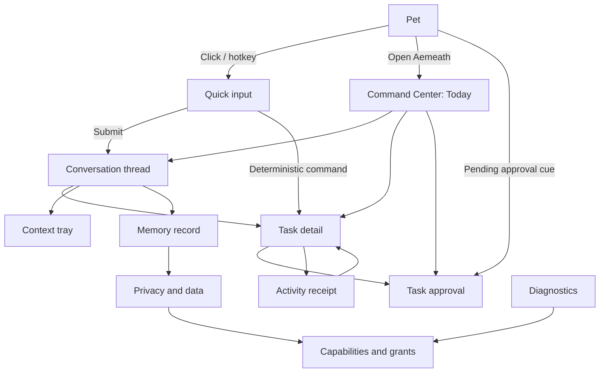

# UI Specification: Aemeath Command Center and Trusted-Action Experience

**Status:** Accepted target specification; implementation remains gated by Gate 0 and pending dispositions  
**Version:** 1.1  
**Date:** 2026-07-22  
**Platforms:** Windows desktop, WPF, keyboard/mouse/touch-compatible controls  
**Related requirements:** [Aemeath Personal Assistant PRD](../prd/jarvis_assistant_prd.md)

## 1. Experience intent

The evolved UI has two complementary surfaces:

- **The pet** is ambient, expressive, and immediate. It accepts lightweight input and communicates
  assistant state without covering the user's work.
- **The Command Center** is calm, information-dense, and auditable. It contains conversations, briefs,
  tasks, approvals, memory, permissions, activity, and diagnostics.

The visual language should preserve the current dark navy, pink, yellow, and blue Aemeath palette
while increasing contrast, spacing consistency, accessibility, and semantic state clarity. Serious
actions should feel deliberate, not threatening; the UI should explain risk using exact effects and
plain language rather than alarming every request equally.

## 2. Core interaction principles

1. No consequential action is approved by closing a dialog, clicking the pet, or pressing Enter in
   an unrelated field.
2. The user sees current state and an immediate cancel/stop affordance during listening, capture,
   planning, execution, and speech.
3. Color supplements icon, label, and shape; color never carries state alone.
4. Dense detail opens in the Command Center. Pet bubbles contain at most one decision or one short
   update.
5. The UI distinguishes proposal, approval, execution, completion, and undo.
6. Source, freshness, and processing route are visible wherever personal context informs an answer.
7. A dismissed notification remains in the inbox; dismissal never implies reject or approve.
8. Default focus goes to the safest useful action, never to a destructive or externally sending
   action.
9. Voice always has a visible equivalent, including transcript and approval state.
10. Reduced motion, high contrast, text scaling, and keyboard operation are tested modes.

### 2.1 Gate 0 UI preservation contract

Before Command Center implementation or current-window refactoring, Gate 0A PB-001–PB-018
qualification runs against the unchanged production baseline through public contracts, the real
executable, and disposable Windows users/VMs. Gate 0B then adds AutomationIds, peers, theme,
commands, or testability seams with their own test-first evidence while the Gate 0A journeys stay
green. The UI portion covers
PB-001–PB-008, PB-010, PB-016–PB-018 directly and observes the remaining boundaries through visible
health, degradation, data, and protocol states. Existing test projects, fixtures, helpers, snapshots
and oracles are excluded from the new suite and become `legacy-regression` input only after the
independent suite is frozen.

The UI preserves user outcomes, not known defects:

| Current surface | Preserve through migration | Replace; do not encode as compatibility |
|---|---|---|
| `PetWindow` | 200×200 configurable transparent/topmost pet, sprite/personality, drag, hide/show and recoverable access | Mouse-only access, unlabeled image/status, inaccessible generated menus and task state inferred by animation |
| `ChatWindow` | Empty/ready/sending/streaming/failure outcomes, history, screenshot opt-in, voice status and offline availability | Placeholder written into the input value, emoji-only buttons, mouse-only hold-to-record and provider logic in code-behind/view model |
| `SettingsWindow` | Discoverable current settings, side-effect-free Cancel, validated Save and compatible data migration | Plaintext secret editing/storage, raw MCP command flow for ordinary users, adjacent unassociated labels, fixed low-contrast layout |
| `StatsPopup` | Text values and lifetime counts | Border-width-only ranges without structured accessibility semantics |
| `SpeechBubble` | Immediate/streamed content, bounded dismissal and visible feedback | Character-by-character announcement, uninterruptible timers and animation when motion is reduced |
| `CatWindow` and decorative effects | Optional companion lifecycle and semantic state | Emoji pixels, particles, glitch or a random frame as exact test or accessibility oracle |
| Tray/hotkey/Windows surfaces | Equivalent show, input, settings, click-through recovery, toast/deep-link and exit paths | Coordinate-only automation, hidden approval semantics or actions unavailable to keyboard/UIA users |

Any intentional Change, Defer, or Remove uses the FR-023 disposition map and explicit approval.
Unmatched current behavior defaults to Preserve and blocks the affected UI step.

## 3. Information architecture

```text
Aemeath Desktop
├── Pet surface
│   ├── Status halo / compact state label
│   ├── Speech bubble
│   ├── Quick input
│   ├── Capture / microphone indicator
│   └── Context menu
├── Command Center
│   ├── Today
│   │   ├── Daily brief
│   │   ├── Reminders and timers
│   │   └── Suggestion inbox
│   ├── Conversation
│   │   ├── Thread list
│   │   ├── Transcript
│   │   ├── Context tray
│   │   └── Composer
│   ├── Tasks
│   │   ├── Active and waiting
│   │   ├── Task details / plan
│   │   └── Approval review
│   ├── Memory
│   │   ├── Memory list and filters
│   │   ├── Record details and evidence
│   │   └── Export / delete controls
│   ├── Knowledge
│   │   ├── Source catalog
│   │   └── Indexing and access status
│   ├── Capabilities
│   │   ├── Native capabilities
│   │   ├── Integrations
│   │   └── External/MCP servers
│   ├── Privacy
│   │   ├── Execution profile
│   │   ├── Grants and capture rules
│   │   ├── Retention and data stores
│   │   └── Export / reset
│   ├── Activity
│   │   ├── Receipts and audit events
│   │   └── Proactive feedback
│   ├── Diagnostics
│   │   ├── Capability health
│   │   ├── Runtime compatibility
│   │   └── Redacted diagnostic export
│   └── Settings
│       ├── Appearance and companion
│       ├── Voice and audio
│       ├── Behavior and attention
│       └── Advanced provider configuration
└── Windows surfaces
    ├── Tray menu
    ├── Toast notifications
    └── Global hotkey / push-to-talk overlay
```

## 4. Window model and responsive behavior

### Command Center

- Default size: 1120 × 760 device-independent pixels.
- Minimum size: 760 × 560.
- Restore last non-minimized position and size within the current monitor work area.
- At widths 960 and above: persistent 224 px navigation rail, content, optional 320 px details pane.
- At widths 760–959: compact 64 px icon rail; details open in the content column.
- At 200% text scaling: navigation may collapse automatically, content reflows vertically, and no
  required action is placed in a horizontally scrolling row.
- The window uses the normal taskbar and Alt+Tab model; it is not always-on-top.

### Pet surface

- Existing 200 × 200 default pet size remains configurable.
- Status halo must fit inside the pet window bounds and ignore hit testing except for its labeled
  status affordance.
- A compact state pill can appear below or above the sprite depending on screen-edge collision.
- Approval content never opens as an always-on-top modal over another application. Clicking the pet's
  approval cue activates the Command Center review page.

### Quick input overlay

- Default width: 520; max 720; min 360.
- Appears near the pet or centered on the active monitor when invoked by global hotkey.
- Does not steal focus during presentation/full-screen suppression unless the user explicitly invokes
  it.
- Escape closes or cancels; Ctrl+Enter submits multiline input; Enter submits single-line input.

## 5. Navigation and screen transitions



Navigation must preserve selected thread/task/filter when moving between related screens. Back
returns to the previous logical view, not merely the previous navigation item. Deep links such as a
toast or pet cue must show the target and provide a clear “Back to Today” path.

## 6. Shell component tree

```text
CommandCenterWindow
├── TitleBar
│   ├── ProductIdentity
│   ├── GlobalHealthBadge
│   ├── ExecutionProfileChip
│   └── WindowControls
├── NavigationRail
│   ├── PrimaryNavigationItems
│   ├── PendingApprovalCount
│   ├── SuggestionInboxCount
│   └── SettingsAndHelp
├── PageHost
│   ├── PageHeader
│   │   ├── BreadcrumbOrTitle
│   │   ├── PageStatus
│   │   └── ContextualActions
│   ├── PageContent
│   └── OptionalDetailsPane
└── GlobalRegions
    ├── CaptureIndicator
    ├── VoiceSessionBar
    ├── TaskProgressBar
    ├── ToastRegion
    └── ConnectionBanner
```

The global capture and voice regions remain visible above page content while active. They cannot be
obscured by a flyout. Global banners must not shift keyboard focus automatically.

## 7. Pet-state specification

| State | Visual treatment | Text equivalent | Interaction | Motion-reduced behavior |
|---|---|---|---|---|
| Idle | No halo; normal sprite behavior | Optional “Available” tooltip | Click opens quick input | Existing calm/idle sprite |
| Listening | Blue segmented halo and microphone glyph | “Listening — Esc to cancel” | Click stop; Esc cancel | Static blue ring |
| Transcribing | Blue progress dots and waveform-to-text glyph | “Transcribing locally/cloud” | Cancel | Static glyph plus text |
| Thinking | Pink/yellow slow halo; thinking glyph | “Thinking” plus elapsed time after 3 s | Open task/conversation; cancel | Static dual-color ring |
| WaitingApproval | Amber bracket halo and shield-check glyph | “Waiting for your review” | Opens approval page | Static amber border |
| Executing | Blue progress arc and tool glyph | Step label, for example “Updating reminder” | Open task; stop if cancellable | Determinate bar when known |
| NeedsInput | Yellow question badge | “Needs your input” | Opens focused request | No pulsing |
| Succeeded | Brief green/blue check cue | “Done” | Opens receipt | Static check for 2 s |
| Failed | Red outlined badge, never full-screen flash | “Couldn’t finish — review” | Opens recovery detail | Static error outline |
| Degraded | Gray broken-link badge | “Some features unavailable” | Opens Diagnostics | Static badge |
| Focus/Quiet | Moon/focus glyph, muted idle animations | “Focus mode” | Opens attention settings | No ambient animation |

Pet states are derived from persisted task and session state, never separately inferred by animation
code. If multiple tasks exist, WaitingApproval outranks NeedsInput, which outranks Executing, which
outranks Thinking for the global cue. The Command Center still shows all tasks individually.

The table above specifies **assistant activity**, not the existing personality/physics `PetState`
values such as Fly, Drag, Wave, Sing, Sleep, Chat, or Speaking. One authoritative presentation
reducer combines persisted task state, voice session, health and attention preference, publishes a
state revision, and maps the result to both pet badge/halo and Command Center status. Animation may
decorate that output but cannot set or infer durable activity. UI tests must freeze the composition
rule for active Listening/Transcribing and Degraded health before implementation; all other task
priority is as stated above. The pet and Command Center expose the same semantic state and revision
within one reducer publication.

## 8. Today page

### Layout

```text
┌──────────────────────────────────────────────────────────────┐
│ Good morning                         Local ▾   Brief updated │
├───────────────────────────────────┬──────────────────────────┤
│ Daily brief                       │ Next up                  │
│ ┌ Calendar item — 09:30 ───────┐ │ 25 min focus timer      │
│ │ Project review · Calendar     │ │ [Pause] [Finish]        │
│ │ [Open] [Prepare] [Snooze]     │ └──────────────────────────┤
│ └───────────────────────────────┘ │ Suggestions (2 of 4)     │
│ ┌ Reminder — Today ─────────────┐ │ • Prepare review notes   │
│ │ Call Sam                      │ │ • Resume yesterday's doc │
│ │ [Done] [Snooze] [Edit]        │ │ [See inbox]              │
│ └───────────────────────────────┘ │                          │
│ [Refresh brief] [Ask about today] │                          │
└───────────────────────────────────┴──────────────────────────┘
```

### State × display

| State | Required display | Primary action | Secondary action |
|---|---|---|---|
| First use | Source explanation and disabled preview skeleton | Connect a source | Use reminders only |
| Loading | Previous brief remains visible with updating label | Cancel refresh | — |
| Ready | Ranked items with source/freshness and inline actions | Most timely safe action | Ask follow-up |
| Empty | “Nothing scheduled from connected sources” | Add reminder | Manage sources |
| Partially degraded | Available items plus per-source error card | Retry source | Open Diagnostics |
| Focus mode | Brief available; no animated urgency | View when ready | End focus mode |
| Stale | Visible timestamp and stale label | Refresh | Use existing snapshot |
| Error | Plain cause; no fabricated items | Retry | Diagnostics |

Items use source icons, accessible source names, exact local times, and a relative freshness label.
Urgency cannot be represented only by red. Inline actions must remain deterministic; “Prepare” may
open a task proposal if it needs the agent.

## 9. Conversation page

### Component tree

```text
ConversationPage
├── ThreadList
│   ├── NewConversationButton
│   ├── SearchThreads
│   └── ThreadRows
├── Transcript
│   ├── UserMessage
│   ├── AssistantMessage
│   │   ├── Content
│   │   ├── SourceChips
│   │   ├── RouteAndModelDetails
│   │   └── RelatedTaskCard
│   ├── ToolProgressCard
│   └── ErrorOrNeedsInputCard
├── ContextTray
│   ├── ActiveWindowSource
│   ├── ScreenshotSource
│   ├── ClipboardSource
│   ├── SelectedFileSources
│   └── CaptureRouteSummary
└── Composer
    ├── MultilineInput
    ├── AttachContextButton
    ├── VoiceButton
    ├── ProfileIndicator
    ├── SendButton
    └── CancelButton
```

### Message rules

- Streaming content keeps an accessible live-region summary but does not announce every token.
- Tool progress is a separate structured card, not simulated assistant prose.
- Source chips use human labels such as “Current window · captured 10:42” and open details.
- Model/provider information is collapsed by default but always available.
- Failed responses preserve the user's input and provide Retry, Change route, or Continue without
  context when applicable.
- A proposed memory appears as a non-blocking “Remember this?” card; it is not silently shown as
  already remembered.

### Context tray interaction

| Action | Before activation | During capture | After capture |
|---|---|---|---|
| Add current window | Preview source type, app name, processing route | Global capture indicator and cancel | Chip with timestamp, redactions, delete |
| Add screenshot | Preview monitor/window and exclusions | Visible capture indicator; pet excluded | Thumbnail placeholder, not raw image in compact view |
| Add clipboard | Show detected type and sensitivity warning | No background polling | Text/file count summary and remove |
| Add files | Windows file picker with allowed types | Index/copy progress if needed | Source rows with access and processing status |

The user can submit without context even when capture fails. Context is task/thread scoped unless the
user explicitly adds a source to the Knowledge catalog or confirms a memory proposal.

## 10. Tasks page and task detail

### Task list states

Tabs/filters: Active, Waiting for me, Scheduled, Completed, Failed, All. Each row includes task title,
origin, current step, state label, elapsed/next time, and risk badge if any consequential work exists.

### Task detail component tree

```text
TaskDetailPage
├── TaskHeader
│   ├── IntentAndOrigin
│   ├── Status
│   ├── CancelPauseResume
│   └── MoreActions
├── PlanTimeline
│   └── TaskStep[]
│       ├── DependencyAndCapability
│       ├── ProposedEffect
│       ├── PolicyState
│       ├── ExecutionState
│       └── ResultOrRecovery
├── ApprovalRegion
├── ContextAndDataUse
├── Receipts
└── TechnicalDetails (collapsed)
```

### Task-state display matrix

| Task state | Header | Timeline behavior | Available actions |
|---|---|---|---|
| Drafting | “Preparing a plan” | Steps may stream but cannot execute | Cancel |
| Ready | “Plan ready” | All validated steps visible | Start, edit goal, cancel |
| WaitingApproval | “Your review is needed” | Approval step expanded | Review, reject, cancel |
| Running | Current step and elapsed time | Completed steps immutable; current highlighted | Stop/pause if supported |
| NeedsInput | Exact question and why it matters | Blocked step highlighted | Answer, edit plan, cancel |
| Paused | Reason and resumption condition | No progress animation | Resume, cancel |
| Succeeded | Outcome summary | Receipts attached to steps | Undo where valid, repeat |
| PartiallySucceeded | Completed and failed effects summarized | Recovery path highlighted | Retry safe steps, undo, finish |
| Failed | Failure class and preserved state | No endless spinner | Retry, change input, recover, dismiss |
| Cancelled | Whether any effects occurred | Receipts remain | Undo supported effects, duplicate task |

## 11. Approval review

Approval is a page or side panel backed by a durable task state, not a transient modal. Only one
approval is focused at a time; multiple pending approvals are listed in order without bulk approval
for high-risk actions.

### Approval card anatomy

```text
┌ Review action ───────────────────────────────────────────────┐
│ Create reminder                                      MEDIUM │
│                                                            │
│ Effect                                                     │
│ Add “Call Sam” for 22 Jul 2026, 15:00 Asia/Shanghai.       │
│                                                            │
│ Data used                  Data sent                        │
│ • Your typed request       • Nothing leaves this device    │
│                                                            │
│ Target                     Recovery                         │
│ Local reminders            Can be undone from Activity      │
│                                                            │
│ [Reject]  [Edit fields]                         [Approve]   │
│ Approval applies only to this action.                       │
└────────────────────────────────────────────────────────────┘
```

### Required fields

- capability display name, stable ID, version, and origin;
- risk label with explanation;
- exact target identity;
- human summary and structured arguments;
- data read, written, and transmitted;
- provider/account used;
- consequence of rejection;
- cancellation and undo behavior;
- scope and duration of the approval;
- differences between originally proposed and user-edited arguments.

### Approval interactions

| Input | Behavior |
|---|---|
| Approve | Persist decision first, then resume execution; announce status change |
| Edit fields | Open only schema-approved editable fields; revalidate and return to review |
| Reject | Optional feedback; persist rejection; stop or allow planner to propose a safer alternative |
| Escape / close | Leave approval pending; never approve or reject implicitly |
| Enter | Activates a focused button; default focus starts on the card heading, not Approve |
| Alt+A | Approve only when card has focus and shortcut is announced; never global |
| Alt+R | Reject with confirmation only for workflows where rejection discards work |

High-risk actions use an additional target confirmation or typed challenge only when it materially
reduces mistakes; ritual confirmation for every action is prohibited.

## 12. Memory Center

### Layout

- Search and filters across tier, topic, source, sensitivity, confidence, confirmation, and last use.
- List rows show concise fact, tier, source type, confidence, and last used.
- Details pane shows full value, evidence references, creation/update history, which experiences use
  it, expiration, sensitivity, and version.
- Actions: Confirm, Edit, Move tier, Set expiry, Prevent re-learning, Forget, Export.

### Memory states

| State | Treatment | Allowed actions |
|---|---|---|
| Proposed | Dotted outline, “Not remembered yet” | Confirm, edit, reject |
| Confirmed core | Solid pink/blue tier chip | Edit, expire, move, forget |
| Inferred archival | Confidence meter with text label | Confirm, edit, expire, forget |
| Read-only policy/persona | Lock icon and owner explanation | View; edit through owning setting/document |
| Conflicting | Two-source comparison and warning | Choose, merge, mark context-dependent |
| Expired | Muted row, excluded from prompts | Restore, delete permanently |
| Deleting/syncing | Progress and affected caches | Cancel before commit when possible |
| Deleted | Audit tombstone according to retention | Prevent re-learning toggle; no content after purge |

Deleting memory must explain whether original conversation or source data remains. “Forget and do not
re-learn from retained history” is a distinct option from “delete this extracted memory.”

## 13. Capabilities and permissions

Each capability row shows display name, origin, availability, health, risk class, granted scopes, last
used, and whether it can write or transmit data. The details page contains schema-friendly examples,
not raw JSON by default.

External/MCP installation uses a dedicated review flow:

1. show origin, publisher/provenance, executable, complete arguments, working directory, transport,
   and requested host access;
2. show that local servers run with the user's privileges unless sandboxed;
3. let the user reduce requested scope;
4. start the server and discover tools only after consent;
5. map each tool to a risk class and show schema changes before expanded use;
6. expose Stop, Disable, Revoke grants, and Remove as separate operations.

Raw command fields should move out of the ordinary Settings page once this flow exists.

## 14. Privacy page

### Sections

- **Execution profile:** Local, Hybrid, Cloud cards with a stage-by-stage route table.
- **Live access:** current microphone, screen, clipboard, files, calendar, and integration access.
- **Permissions:** grants grouped by capability, data type, provider, and expiry.
- **Capture rules:** protected/excluded apps, screenshot redaction, clipboard policy, raw-data retention.
- **Attention:** proactive opt-in, modes, quiet hours, daily budget, full-screen behavior.
- **Data stores:** purpose, owner, location category, size, retention, protection, export/delete.
- **Providers:** privacy link, configured account, data categories used, and last transmission.
- **Reset:** selective deletion and full local reset with preview.

Local/Hybrid/Cloud are radio-style profile cards, not a vague privacy slider. Each profile shows
unavailable stages before activation. A profile change that will pause running tasks requires a
plain-language confirmation.

## 15. Activity and receipts

Activity is a chronological, filterable history of user commands, proactive suggestions, policy
decisions, capability calls, results, undo operations, and failures. It is not a raw log viewer.

Receipt details show:

- task and step;
- proposed, approved, and executed arguments, with sensitive values redacted;
- exact target and provider;
- start/end time and duration;
- result summary and stable external identifier when available;
- data sent off-device;
- idempotency/reconciliation outcome;
- undo availability and expiration;
- linked diagnostic trace.

Technical raw events remain collapsed and can be copied only after a redaction preview.

## 16. Diagnostics

Subsystem cards: WPF host, sidecar process, protocol compatibility, model providers, checkpointer,
memory store, retrieval index, voice stages, Windows integrations, external capabilities.

Each card distinguishes:

- **Live:** process responds;
- **Ready:** required initialization works;
- **Compatible:** versions and schemas match;
- **Authorized:** required credential/grant exists;
- **Degraded:** optional dependency missing or failing;
- **Last checked:** timestamp and latency.

Actions include Retry, Open configuration, Run self-test, View affected capabilities, and Export
redacted diagnostics. “Healthy” cannot be green if dependent agent creation failed.

## 17. Onboarding

Initial onboarding is progressive rather than a long permission wizard.

1. **Meet Aemeath:** preserve companion identity; explain pet vs Command Center.
2. **Choose a starting profile:** Local recommended when viable; show hardware/provider availability.
3. **Enable one useful loop:** local reminders require no cloud account.
4. **Optional brief sources:** connect one source at a time with scope disclosure.
5. **Voice:** test microphone and route only if the user opts in.
6. **Context capture:** explain just-in-time the first time “use this window” is selected.
7. **Memory:** default to proposed/confirmable core facts and show Memory Center.

Skip is always available. Declining a permission must not produce repeated nagging; the related
feature shows a quiet disabled state and can be enabled later.

## 18. Interaction details

### Keyboard map

| Shortcut | Scope | Action |
|---|---|---|
| Configured global hotkey | System | Open quick input |
| Configured push-to-talk | System while app running | Start/stop voice capture |
| Ctrl+K | Command Center | Focus global assistant input |
| Ctrl+N | Conversation | New thread |
| Ctrl+Shift+A | Command Center | Open next pending approval |
| Ctrl+, | Command Center | Open Settings |
| Ctrl+L | Command Center | Focus page search/filter where present |
| Ctrl+Enter | Multiline composer | Submit |
| Escape | Active surface | Cancel capture/speech, close flyout, or navigate back by priority |

Shortcuts must be configurable when global and must not shadow common text-editing behavior inside
inputs.

### Notifications

- Windows toast contains source, concise reason, and at most two safe actions.
- A toast never contains Approve for high-risk work.
- Clicking opens the corresponding Today item, task, or approval.
- Speech is off by default for proactive suggestions and always suppressed by quiet/focus rules.
- Repeated reminders group without losing individual completion state.

### Errors

Error copy answers: what failed, whether anything changed, what Aemeath preserved, and what the user
can do next. Provider codes and stack traces belong in technical details. Avoid “Something went
wrong” when a structured cause exists.

### Automation, focus, and announcement contract

- Every interactive or asserted status element has a unique invariant hierarchical
  `AutomationProperties.AutomationId`, for example `Pet.Status`, `Pet.OpenCommandCenter`,
  `Chat.Input`, `Chat.Send`, `CommandCenter.Navigation.Today`, `Tasks.Approval.Approve`, and
  `Privacy.Capture.Stop`. IDs are not localized and do not depend on visual text or list position.
- Repeating rows append the stable task/memory/capability fixture or entity ID through the item
  container. Recycled/virtualized rows update the ID and semantic properties atomically.
- Every control has a localized accessible Name. Icon-only controls also expose HelpText/tooltip;
  emoji or a glyph name is never the accessible name. Labels target their input through WPF labeling
  or explicit `LabeledBy`/Name semantics.
- Native controls expose their native UIA pattern. Custom status/progress/pet controls implement a
  peer that exposes control type, Name, ItemStatus/state revision, HelpText and only supported
  patterns. Password controls expose `IsPassword` and never a retrievable secret value.
- Page headings, approval requests, capture start/stop, terminal task changes and errors are bounded
  live-region announcements. Streaming text is summarized at meaningful boundaries and never
  announced token by token. Duplicate publications of one state revision are not re-announced.
- Opening a deep link focuses the target heading. Opening a dialog/flyout records the invoker and
  restores focus when it closes. Approval opens on its heading/summary; Approve is never default
  focus. Escape/close leaves approval pending and cannot imply approve, reject, delete, or complete.
- All user journeys use commands/access keys and logical tab order so hosted UIA can invoke
  `Invoke`, `Toggle`, `Value`, `Selection`, or `ExpandCollapse` patterns without coordinate clicks.

## 19. Visual design tokens

The existing palette is retained but reorganized semantically. Final values must pass contrast tests
in actual control states.

### Color tokens

| Token | Proposed base | Purpose |
|---|---|---|
| `Surface.App` | `#1E1E2E` | Main dark background; existing DarkSlate |
| `Surface.Panel` | `#252540` | Navigation/header/panels |
| `Surface.Raised` | `#2A2A4A` | Cards and inputs; existing MidDark |
| `Border.Default` | `#4A4A68` | Stronger separator than current default |
| `Text.Primary` | `#F5F0F0` | Primary text; existing PureWhite |
| `Text.Secondary` | `#C8C8D6` | Secondary text; replace low-contrast `#888` use |
| `Accent.Persona` | `#F2A0B5` | Aemeath identity and selected state |
| `Accent.Info` | `#5CB8E6` | Listening, links, informational state |
| `Accent.Warm` | `#F5E06D` | Attention and NeedsInput |
| `State.Approval` | `#D4A843` | WaitingApproval and medium risk |
| `State.Success` | `#70C9A4` | Success |
| `State.Danger` | `#FF718E` | Error/high risk; not the same as persona pink |
| `Focus.Ring` | `#A8E0F0` | 2 px keyboard focus indicator |

### Typography

- UI font: Segoe UI Variable when available, Segoe UI fallback.
- Body: 14 px/20 line height.
- Secondary: 12 px/18; never below 11 px for required content.
- Page title: 28 px/34 Semibold.
- Section title: 18 px/24 Semibold.
- Card title: 15 px/21 Semibold.
- Monospace technical values: Cascadia Mono, 12 px/18.
- Respect Windows text scale; do not hard-code control heights around one font size.

### Spacing and shape

- 4 px base grid; common gaps 4, 8, 12, 16, 24, 32.
- Minimum interactive target: 32 × 32; preferred primary target 40 × 40.
- Cards: 8 px radius; primary panels 12 px; compact chips 999 px pill radius.
- Focus ring: 2 px outside with 2 px separation where clipping permits.
- Shadows are subtle and optional in high-contrast/reduced-transparency modes.

### Icons

Use a consistent Windows-compatible vector icon set. Every icon button has an accessible name and
tooltip. Risk/state icons pair with text. Emoji are not used as the only production icons because
their rendering and accessibility names vary.

## 20. Motion and sound

- Ambient pet animation follows existing behavior but pauses/reduces in focus, battery saver, remote
  desktop, or reduced-motion mode.
- Status transitions use 120–200 ms opacity/scale changes; no indefinite pulsing except an optional
  low-frequency listening indicator.
- WaitingApproval does not flash.
- Success cues last at most 2 seconds before returning to the next true state.
- Sound cues are optional, have visible equivalents, honor system volume and quiet hours, and never
  substitute for error text.
- TTS and sound effects use separate user controls.

## 21. Accessibility acceptance criteria

1. Every page and approval flow is completable with keyboard only.
2. Narrator announces page title, task state changes, approval requests, capture start/stop, and
   errors once, without token-by-token chatter.
3. Custom pet-state and progress controls implement appropriate AutomationPeers and patterns.
4. Focus is restored to the invoking control after a flyout or edit flow closes.
5. Opening a deep link focuses the page heading, then exposes actions in logical order.
6. Text and meaningful icons meet WCAG 2.2 AA contrast targets where applicable to desktop UI.
7. High contrast uses system colors or explicit high-contrast resources, not fixed dark surfaces.
8. At 200% text scale and minimum window size, core content reflows without loss of actions.
9. Reduced motion removes glitches, parallax, decorative particles, and looping status animation.
10. Voice capture, TTS, and proactive speech have captions/transcripts and do not trap input focus.
11. Hosted-Windows STA and process UI Automation checks run against production XAML/TestHost for
    unique IDs, names, roles, states, patterns and focus, followed by manual Narrator validation.
12. Color-blind simulation confirms all task and risk states remain distinguishable by label/icon.
13. The supported release matrix covers Windows 10 x64 and Windows 11 x64. Each gate manifest freezes
    exact editions/builds and records 100%, 150%, and 200% scale, default/high contrast,
    normal/reduced motion, keyboard and Narrator results.
14. Password and protected-content controls do not expose values through UI Automation, screenshots,
    clipboard, logs, fixture journals, or failure artifacts.
15. Every automated accessibility case creates isolated state, passes alone and in random order, and
    uses dispatcher/event readiness rather than fixed sleeps.

## 22. Visual verification matrix

Capture and review each core page at:

| Dimension | Cases |
|---|---|
| Window | 1120×760, 960×640, 760×560 |
| Scale | 100%, 150%, 200% |
| Theme | Default dark, Windows high contrast |
| Motion | Normal, reduced |
| Content | Empty, nominal, long localized strings, many items, error/degraded |
| Input | Mouse, keyboard, Narrator |
| Runtime | Healthy, sidecar absent, provider unavailable, approval pending |

Required screenshot set: Today, Conversation with context, multi-step Task, Approval, Memory details,
Privacy profile, Capabilities/MCP consent, Diagnostics degraded, quick input, and every pet state.
Gate 0 additionally captures the retained Pet, Chat empty/nominal/status, all eight Settings category
roots and representative conditional panels, Stats boundary/nominal values, SpeechBubble wrapping,
capture/click-through indicators, and optional cat semantic states.

Each baseline records source/head SHA, PB/test ID, fixture and frozen-manifest hash, Windows
edition/build, runner image, DPI and text scale, theme/high-contrast and motion state, culture,
installed font versions, window dimensions, renderer/GPU, and capture tool/version. Failure artifacts
contain expected, actual, perceptual diff, automation tree, fixture journal and redacted logs.

Pixel comparison is secondary to layout, semantic UIA, contrast and state assertions. Dynamic GIF
frames, emoji rasterization, DWM shadows, antialiasing, random particles, absolute screen position and
wall-clock content are not exact goldens. Freeze clock, culture, IDs, random source, content and
motion before capture. Use reviewed perceptual tolerances only on a pinned Windows image; a runner
image or broad baseline change requires explicit review and is never auto-accepted.

GitHub-hosted Windows provides blocking STA layout/peer tests and deterministic process UIA/fixture
journeys using UIA patterns. Interactive self-hosted Windows provides the blocking release evidence
for true Narrator, OS High Contrast, 100/150/200% scale and per-monitor transitions, reduced-motion
system settings, tray/global hotkey, transparent/topmost/click-through, drag/hover/hold gestures,
toast/deep links, and DWM rendering. Real microphone, speaker, GPU and multi-monitor hardware plus
live cloud-provider checks are scheduled non-gating validation and cannot replace deterministic
contract or local real-boundary tests.

## 23. UI quality gates

- No placeholder labels, raw enum names, raw exceptions, or unformatted JSON appear in nominal flows.
- No required data uses `#888` or similarly low-contrast text on the current dark surfaces.
- Every spinner acquires a timeout or elapsed-time message and a cancel/recovery path.
- Every destructive action has a target-specific confirmation and preserves recovery information when
  technically possible.
- Every approval card can be understood without expanding technical details in moderated testing.
- Pet and Command Center show the same task state within one reducer update.
- Capture indicators remain visible regardless of selected Command Center page.
- Closing a window never implies approval, rejection, completion, or deletion.
- Every visible interactive control has one unique stable Automation ID and nonempty semantic Name;
  custom controls expose their required peers/patterns and secret fields remain protected.
- Gate 0A independent black-box UI tests pass the unchanged PB baseline before a retained surface
  changes; every Gate 0B testability/accessibility change keeps that evidence green;
  each later changed behavior has intended RED evidence, while a preservation-only refactor retains
  GREEN characterization plus mutation/negative-control sensitivity evidence.
- The exact pushed head SHA has all UI-manifest jobs/matrix entries, nonzero discovery counts and
  retained artifacts. A skipped, cancelled, timed-out, advisory, merge-SHA-only, missing interactive
  matrix or expired visual/accessibility artifact does not pass.

## 24. Requirement traceability

| UI area | Primary PRD requirements |
|---|---|
| Pet and quick input | FR-001, FR-011, FR-014, FR-015, FR-017, FR-020 |
| Today | FR-003, FR-004, FR-010, FR-014, FR-015 |
| Conversation and context tray | FR-001, FR-002, FR-005, FR-006, FR-012 |
| Tasks and approvals | FR-006, FR-007, FR-008, FR-015, FR-016 |
| Memory Center | FR-009, FR-019, FR-020 |
| Capabilities | FR-007, FR-013, FR-016, FR-018 |
| Privacy | FR-002, FR-005, FR-010, FR-018, FR-019 |
| Activity and Diagnostics | FR-008, FR-014, FR-016, FR-019 |
| Accessibility system | FR-011, FR-015, FR-017 |
| Gate 0 retained UI and Windows surfaces | FR-021, FR-023, PB-001–PB-010, PB-016–PB-018 |
| Test-first UI delivery and exact-SHA evidence | FR-022, FR-024, NFR-JA-005, NFR-JA-007, NFR-JA-008 |

## 25. Open UI questions

- Should Conversation remain a separate narrow window for lightweight use, or become only a
  Command Center page plus quick overlay after migration?
- Which pet animations best communicate WaitingApproval and NeedsInput without adding new assets?
- Should approval review use a full page or right details pane at wide widths after usability tests?
- How should a user compare Local/Hybrid/Cloud route quality and hardware impact without jargon?
- Which data-usage details belong on the approval card versus one expandable level deeper?
- How much activity history is useful before it feels like a technical audit log?

These questions require wireframe/usability validation. They do not change the rule that durable,
consequential state must be inspectable outside the pet bubble.

## 26. Document history

| Version | Date | Change |
|---|---|---|
| 1.0 | 2026-07-22 | Initial proposed Command Center and trusted-action UI specification. |
| 1.1 | 2026-07-22 | Added Gate 0 retained-surface dispositions, stable UI Automation/focus/live-region contracts, assistant-state separation, Windows 10/11 accessibility matrix, hosted/interactive verification boundaries, and visual evidence metadata. |
