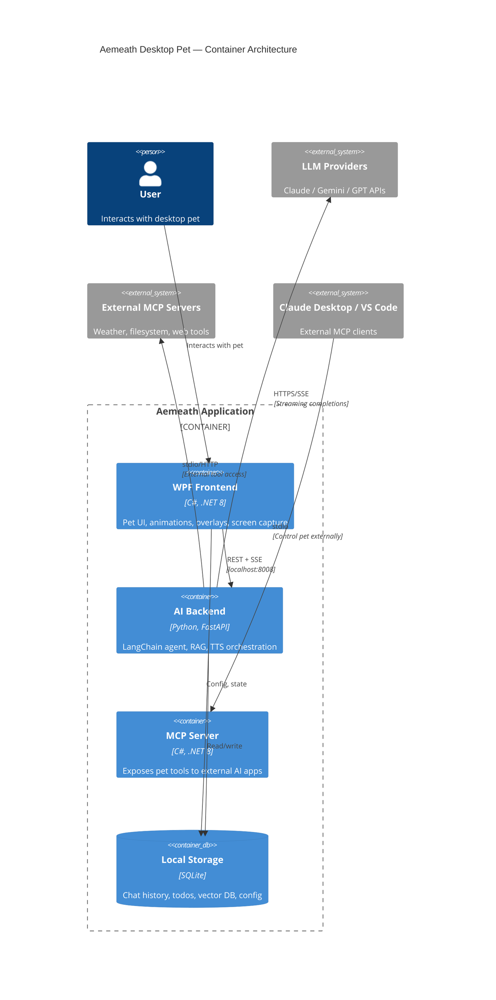

# Aemeath Desktop Pet: complete AI architecture implementation plan

> [!WARNING]
> **Archived proposal, not current instructions.** This document preserves an early architecture
> and career-positioning proposal. Its file paths, ports, dependency and model versions, Git
> commands, performance/cost claims, CI examples, roadmap state, and resume material may be stale
> or unsafe to apply to the current repository. In particular, do not run its history-rewriting or
> recommit commands as a maintenance workflow. Use [`docs/architecture.md`](docs/architecture.md),
> [`README.md`](README.md), [`REQUIREMENTS.md`](REQUIREMENTS.md), and the repository's actual
> manifests/workflows as current instructions.

**This plan provides battle-tested recommendations for transforming Aemeath from a prototype into a production-grade AI desktop companion.** The core architectural decision is a **hybrid C#/.NET 8 WPF frontend + Python FastAPI backend**, with LangChain/LangGraph powering the agent system, MCP enabling extensibility, and a full CI/CD pipeline providing professional polish. Every library, version number, and code pattern below reflects the state of the art as of early 2026.

---

## 1. Agent architecture: LangChain via Python sidecar wins over pure .NET

### The C# SDK landscape forces a decision

LangChain has **no official C# SDK**. The community port `tryAGI/LangChain` (NuGet `LangChain.Core` v0.14.0) covers basic LLM calls, embeddings, and vector stores but lacks the full agent framework, LangGraph, streaming infrastructure, and middleware system. It has a single primary maintainer and cannot be relied on for production agent architecture.

Microsoft's **Semantic Kernel** (v1.72.0, 22.9K GitHub stars) is the .NET-native alternative with first-class C# support, tool/plugin system, and agent capabilities. Microsoft announced the **Agent Framework** (October 2025) as Semantic Kernel's successor combining SK + AutoGen — currently in Release Candidate status. Semantic Kernel enters maintenance mode once Agent Framework reaches GA.

**The recommended path**: Since the user specifically wants LangChain, implement a **Python FastAPI sidecar microservice** running LangChain/LangGraph, communicating with the WPF frontend over REST + SSE. This provides full access to LangChain's ecosystem while keeping the WPF app native.

### Architecture comparison

| Approach | Pros | Cons | Verdict |
|----------|------|------|---------|
| **Python LangChain sidecar** | Full ecosystem, latest agent features, massive community, LangGraph | Extra process, Python runtime, IPC latency, packaging complexity | ✅ Best for LangChain requirement |
| **Semantic Kernel (.NET native)** | Single process, native C#, no IPC, Microsoft backing | Smaller ecosystem, transitioning to Agent Framework | Best if LangChain not required |
| **Direct API calls from C#** | Minimal dependencies, full control | Must build agent loop from scratch | Too much reinvention |

### The Python sidecar service

Bundle a Python FastAPI service as a **PyInstaller single-file executable** alongside the WPF app. The WPF app spawns it as a subprocess on startup, communicating over `localhost:8008`.

```
python-backend/
├── main.py                    # FastAPI entry, CORS, lifecycle
├── routers/
│   ├── agent.py               # Agent invoke/stream endpoints
│   ├── rag.py                 # Document ingestion, query endpoints
│   └── tools.py               # Tool status, health checks
├── agent/
│   ├── core.py                # create_agent setup, tool registration
│   ├── tools/                 # Individual tool implementations
│   │   ├── weather.py
│   │   ├── web_search.py
│   │   ├── todo.py
│   │   ├── screen_reader.py
│   │   ├── music_control.py
│   │   ├── pet_stats.py
│   │   ├── file_reader.py
│   │   └── rag_retrieval.py
│   └── memory.py              # Checkpointer, conversation management
├── rag/
│   ├── ingestion.py           # Document loading, chunking, embedding
│   ├── retriever.py           # Hybrid search, reranking
│   └── vectorstore.py         # ChromaDB/LanceDB setup
├── models/                    # Pydantic request/response schemas
├── config.py                  # Settings via pydantic-settings
└── requirements.txt
```

**Key Python packages and versions:**

| Package | Version | Purpose |
|---------|---------|---------|
| `langchain` | latest (0.3.x+) | Core framework, `create_agent` |
| `langgraph` | 0.4.6+ (v1.0 GA Oct 2025) | Agent runtime, graph execution |
| `langchain-anthropic` | 1.3.3 | Claude integration |
| `langchain-google-genai` | 4.1.3 | Gemini integration (uses consolidated `google-genai` SDK) |
| `langchain-community` | latest | BM25Retriever, community tools |
| `fastapi` | 0.115+ | HTTP framework |
| `uvicorn` | 0.32+ | ASGI server |
| `chromadb` | 0.5+ | Vector database |
| `sentence-transformers` | 3.x+ | Local embeddings, cross-encoder |
| `rank-bm25` | 0.2.2 | BM25 sparse retrieval |

### ReAct agent loop with LangGraph

LangGraph is now the **official runtime for all new LangChain agents**. The old `AgentExecutor` is deprecated. The ReAct pattern alternates between reasoning (LLM analyzes task, determines action), acting (execute tool call), and observation (process result, decide if done).

```python
from langchain.agents import create_agent
from langchain.tools import tool
from langgraph.checkpoint.sqlite import SqliteSaver

# Create agent with model string (auto-infers provider)
checkpointer = SqliteSaver.from_conn_string("agent_memory.db")

agent = create_agent(
    "anthropic:claude-sonnet-4-20250514",  # or "google-genai:gemini-2.0-flash"
    tools=[get_weather, search_web, manage_todo, set_reminder,
           read_screen, play_music, adjust_stats, control_pet, rag_retrieve],
    prompt="You are Aemeath, a helpful AI desktop pet companion...",
    checkpointer=checkpointer
)
```

Model string shortcuts enable provider auto-inference: `"anthropic:claude-..."`, `"google-genai:gemini-..."`, `"openai:gpt-..."`, `"ollama:llama3"`. This lets users switch providers via configuration.

### Streaming via SSE to the WPF frontend

LangGraph supports multiple streaming modes — `"messages"` for token-by-token chunks, `"updates"` for step-level events, and `"custom"` for tool progress. The FastAPI endpoint exposes these as Server-Sent Events:

```python
@app.post("/agent/stream")
async def stream_agent(request: AgentRequest):
    async def event_generator():
        config = {"configurable": {"thread_id": request.thread_id}}
        async for mode, chunk in agent.astream(
            {"messages": [{"role": "user", "content": request.message}]},
            config=config,
            stream_mode=["messages", "updates"]
        ):
            if mode == "messages":
                token, metadata = chunk
                if hasattr(token, 'content') and token.content:
                    yield f"data: {json.dumps({'type': 'token', 'content': token.content})}\n\n"
            elif mode == "updates":
                for source, update in chunk.items():
                    if source == "tools":
                        yield f"data: {json.dumps({'type': 'tool_result', 'data': str(update)})}\n\n"
        yield "data: {\"type\": \"done\"}\n\n"

    return StreamingResponse(event_generator(), media_type="text/event-stream")
```

The C# WPF side consumes SSE with `HttpClient`:

```csharp
var request = new HttpRequestMessage(HttpMethod.Post, "http://localhost:8008/agent/stream");
request.Content = JsonContent.Create(new { message = userInput, thread_id = _threadId });
var response = await _httpClient.SendAsync(request, HttpCompletionOption.ResponseHeadersRead);
using var stream = await response.Content.ReadAsStreamAsync();
using var reader = new StreamReader(stream);
while (!reader.EndOfStream)
{
    var line = await reader.ReadLineAsync();
    if (line?.StartsWith("data: ") == true)
    {
        var payload = JsonSerializer.Deserialize<StreamEvent>(line[6..]);
        await Dispatcher.InvokeAsync(() => UpdateChatUI(payload));
    }
}
```

### Conversation memory architecture

LangGraph manages memory through **checkpointers** — SQLite is ideal for desktop persistence. Each conversation thread gets a unique ID, enabling multi-conversation support.

- **Short-term memory**: `SqliteSaver` persists full message history per thread to `agent_memory.db`
- **Long-term memory**: LangGraph Store with semantic, episodic, and procedural namespaces for facts the pet learns about the user across sessions
- **Context window management**: Message trimming (keep last N messages) or summarization middleware compresses long conversations before hitting token limits

```python
from langgraph.checkpoint.sqlite import SqliteSaver
from langgraph.store.memory import InMemoryStore  # or persistent variant

checkpointer = SqliteSaver.from_conn_string("data/agent_memory.db")
store = InMemoryStore()  # Long-term cross-session memory

agent = create_agent(
    model, tools=tools,
    checkpointer=checkpointer,
    store=store
)

# Each conversation uses a thread_id
config = {"configurable": {"thread_id": "main-chat", "user_id": "owner"}}
```

---

## 2. RAG module: local-first retrieval for a desktop knowledge base

### Document ingestion pipeline

The pipeline loads documents, chunks them, generates embeddings, and stores vectors locally. Use `lazy_load()` everywhere for memory efficiency on desktop.

| Format | Library | LangChain Loader | Notes |
|--------|---------|-----------------|-------|
| PDF | `pypdf` | `PyPDFLoader` | Most reliable for standard PDFs, one Document per page |
| PDF (complex) | `PyMuPDF` (fitz) | `PyMuPDFLoader` | Fast, preserves layout well |
| DOCX | `docx2txt` | `Docx2txtLoader` | Lightweight, single document output |
| Markdown | Built-in | `TextLoader` + `MarkdownHeaderTextSplitter` | Structure-aware splitting |
| TXT | Built-in | `TextLoader` | Simplest loader |
| Directory | Built-in | `DirectoryLoader` with `use_multithreading=True` | Batch ingestion with glob patterns |

### Chunking strategy

**Start with `RecursiveCharacterTextSplitter`** — it splits using hierarchical separators (`\n\n` → `\n` → ` ` → `""`) and is proven to perform well when parametrized correctly. Chroma's own research confirms that "heuristic chunking strategies such as RecursiveCharacterTextSplitter often perform well in practice."

```python
from langchain_text_splitters import RecursiveCharacterTextSplitter

splitter = RecursiveCharacterTextSplitter(
    chunk_size=1000,
    chunk_overlap=200,
    separators=["\n\n", "\n", ".", "?", "!", " ", ""],  # Added sentence-level splits
    length_function=len
)
```

For Markdown files specifically, use `MarkdownHeaderTextSplitter` to preserve document structure before applying the recursive splitter. **Semantic chunking** (`langchain_experimental.text_splitter.SemanticChunker`) uses embeddings to detect meaning shifts — better coherence but slower ingestion. Reserve it as a premium option toggled in settings.

### Embedding models

The **hybrid approach** works best for a desktop app: use free API embeddings when online, fall back to local models offline.

| Model | Dims | Size | Latency | Best For |
|-------|------|------|---------|----------|
| `all-MiniLM-L6-v2` (local) | 384 | ~80MB | <30ms | Offline fallback, fastest |
| `nomic-embed-text` via Ollama (local) | 768 | ~275MB | Moderate | Better quality offline |
| `BGE-M3` (local) | 1024 | ~2.3GB | ~100ms+ | Best open-source, multilingual |
| **`gemini-embedding-001` (API)** | 3072 (truncatable) | — | — | **FREE via AI Studio**, excellent quality |
| `text-embedding-3-small` (API) | 1536 | — | — | $0.02/1M tokens, OpenAI ecosystem |

**Recommendation**: Default to `gemini-embedding-001` (free, high quality, **~71.5% MTEB**) with `all-MiniLM-L6-v2` as offline fallback. This costs nothing and provides excellent retrieval quality.

### Vector database for desktop deployment

**ChromaDB** is the strongest choice for a desktop RAG system. It installs with `pip install chromadb`, persists to disk automatically, has native LangChain integration, and was rewritten in Rust in 2025 for 4x performance gains. It handles up to ~1M vectors comfortably — far beyond typical desktop document collections.

| Database | Desktop Score | Key Strength | Key Weakness |
|----------|--------------|--------------|--------------|
| **ChromaDB** ⭐ | Excellent | Simplest API, built-in metadata + FTS | Not for >10M vectors |
| **LanceDB** | Excellent | Zero-config, native FTS, multi-modal | Younger ecosystem |
| **sqlite-vec** | Excellent | Everything in one .db file, zero dependencies | Brute-force only (no ANN) |
| FAISS | Good | Fastest raw search | No metadata filtering, manual persistence |
| Qdrant local | Good | Best filtering, native hybrid search | Heavier than needed |

```python
from langchain_community.vectorstores import Chroma
from langchain_community.embeddings import HuggingFaceEmbeddings

embeddings = HuggingFaceEmbeddings(model_name="all-MiniLM-L6-v2")
vectorstore = Chroma(
    collection_name="user_knowledge",
    embedding_function=embeddings,
    persist_directory="data/chromadb"
)
```

**Storage estimates**: Embedding model (~80MB) + cross-encoder (~80MB) + ChromaDB with 10K chunks (~50-100MB) = **~250MB total** — very reasonable for desktop.

### Hybrid search with BM25 + semantic retrieval

Combining keyword-based BM25 (catches exact terms) with dense vector search (captures meaning) using **Reciprocal Rank Fusion** dramatically improves recall.

```python
from langchain_community.retrievers import BM25Retriever
from langchain.retrievers import EnsembleRetriever

bm25_retriever = BM25Retriever.from_documents(docs, bm25_params={"k1": 1.5, "b": 0.75})
bm25_retriever.k = 10

vector_retriever = vectorstore.as_retriever(search_kwargs={"k": 10})

hybrid_retriever = EnsembleRetriever(
    retrievers=[bm25_retriever, vector_retriever],
    weights=[0.4, 0.6]  # Semantic emphasis
)
```

### Cross-encoder reranking for precision

Reranking improves RAG accuracy by **20–35%** while adding only **200–500ms latency**. Retrieve 20 documents broadly, then rerank to the top 5 for the LLM.

**Use `cross-encoder/ms-marco-MiniLM-L-6-v2`** (22M params) — fast enough for desktop, production-standard quality. For multilingual needs, upgrade to `BAAI/bge-reranker-v2-m3`.

```python
from langchain.retrievers.document_compressors import CrossEncoderReranker
from langchain.retrievers import ContextualCompressionRetriever
from sentence_transformers import CrossEncoder

compressor = CrossEncoderReranker(
    model=CrossEncoder('cross-encoder/ms-marco-MiniLM-L-6-v2'),
    top_n=5
)
precision_retriever = ContextualCompressionRetriever(
    base_compressor=compressor,
    base_retriever=hybrid_retriever
)
```

### Integrating RAG as an agent tool

The modern LangChain pattern makes RAG a **tool the agent decides when to use**, rather than always-on retrieval:

```python
@tool(response_format="content_and_artifact")
def rag_retrieve(query: str):
    """Search the user's personal knowledge base for relevant information.
    Use this when the user asks about their documents, notes, or saved content."""
    docs = precision_retriever.invoke(query)
    serialized = "\n\n".join(
        f"[Source: {d.metadata.get('source', 'unknown')}]\n{d.page_content}"
        for d in docs
    )
    return serialized, docs
```

The agent can now autonomously decide whether to search the knowledge base, call the weather API, or respond from its own knowledge — the ReAct loop handles routing.

---

## 3. MCP integration: the extensibility backbone

### What MCP provides

Anthropic's **Model Context Protocol** (spec version **2025-11-25**) standardizes how AI applications connect to external tools and data sources. Think "USB-C for AI" — any MCP-compatible tool works with any MCP-compatible host. It uses **JSON-RPC 2.0** messages and supports three transport protocols: **stdio** (local subprocess, best for desktop), **Streamable HTTP** (remote servers, replaced legacy SSE), and custom transports.

MCP defines three server capabilities: **Tools** (functions the AI executes, like POST endpoints), **Resources** (read-only data, like GET endpoints), and **Prompts** (templated workflows). The November 2025 spec added Tasks (async operations), parallel tool calls, OAuth 2.1 authorization, and structured output schemas.

### The official C# SDK exists

The **official C# MCP SDK** is maintained by Anthropic in collaboration with Microsoft, evolved from the community `mcpdotnet` project.

| NuGet Package | Version | Purpose |
|--------------|---------|---------|
| `ModelContextProtocol` | **0.9.0-preview.2** | Main package with hosting and DI |
| `ModelContextProtocol.AspNetCore` | 0.9.0-preview.2 | HTTP-based MCP servers |
| `ModelContextProtocol.Core` | 0.9.0-preview.2 | Minimal client/low-level APIs |

```bash
dotnet add package ModelContextProtocol --prerelease
dotnet add package Microsoft.Extensions.Hosting
```

### Aemeath as dual-role MCP participant

Aemeath should be **both an MCP client** (consuming external tools like weather servers, filesystem access) **and an MCP server** (exposing pet capabilities to Claude Desktop, VS Code, etc.).

**MCP Client — consuming external tools:**

```csharp
var options = new McpClientOptions {
    ClientInfo = new() { Name = "AemeathDesktopPet", Version = "1.0.0" }
};

var config = new McpServerConfig {
    Id = "weather-server",
    Name = "WeatherServer",
    TransportType = TransportTypes.StdIo,
    TransportOptions = new() {
        ["command"] = "npx",
        ["arguments"] = "-y @weather-mcp-server"
    }
};

var client = await McpClientFactory.CreateAsync(config, options);
IList<McpClientTool> tools = await client.ListToolsAsync();

// McpClientTool inherits from AIFunction — directly usable with IChatClient
var result = await client.CallToolAsync("get_forecast",
    new() { ["city"] = "Seattle" });
```

**MCP Server — exposing pet capabilities:**

```csharp
[McpServerToolType]
public class AemeathPetTools
{
    [McpServerTool, Description("Get the pet's current mood, hunger, and energy levels")]
    public static PetStatus GetPetStatus() => PetStateManager.CurrentStatus;

    [McpServerTool, Description("Feed the desktop pet with specified food type")]
    public static string FeedPet(
        [Description("Food type: kibble, treats, or premium_food")] string foodType,
        [Description("Number of servings (1-5)")] int amount = 1)
    {
        return PetStateManager.Feed(foodType, amount);
    }

    [McpServerTool, Description("Make the pet perform an animation")]
    public static string PlayAnimation(
        [Description("Animation name: wave, dance, sleep, eat")] string animation)
    {
        return AnimationService.TriggerAnimation(animation);
    }
}

// Server setup (stdio transport for local access)
var builder = Host.CreateEmptyApplicationBuilder(settings: null);
builder.Services.AddMcpServer().WithStdioServerTransport().WithToolsFromAssembly();
await builder.Build().RunAsync();
```

### MCP + LangChain integration via Python adapter

The `langchain-mcp-adapters` package converts MCP tools into LangChain Tool objects:

```python
from langchain_mcp_adapters.client import MultiServerMCPClient

client = MultiServerMCPClient({
    "pet_server": {
        "command": "dotnet", "args": ["run", "--project", "AemeathMcpServer"],
        "transport": "stdio",
    },
    "filesystem": {
        "command": "npx", "args": ["-y", "@modelcontextprotocol/server-filesystem", "/home/user"],
        "transport": "stdio",
    }
})
mcp_tools = await client.get_tools()
agent = create_agent("anthropic:claude-sonnet-4-20250514", tools=[*local_tools, *mcp_tools])
```

### MCP tool definition anatomy

Each tool uses JSON Schema for input/output definition:

```json
{
    "name": "feed_pet",
    "description": "Feeds the desktop pet. Returns happiness change and hunger status.",
    "inputSchema": {
        "type": "object",
        "properties": {
            "food_type": { "type": "string", "enum": ["kibble", "treats", "premium_food"] },
            "amount": { "type": "integer", "minimum": 1, "maximum": 5 }
        },
        "required": ["food_type"]
    },
    "annotations": { "readOnlyHint": false, "destructiveHint": false, "idempotentHint": false }
}
```

Tool errors are returned **in the result object** (not as protocol errors) so the LLM can see and handle them gracefully.

---

## 4. Agent tools: design specifications for each capability

### Tool interface pattern

Every tool follows a consistent pattern using LangChain's `@tool` decorator with typed parameters and docstrings that serve as the LLM's instructions:

```python
@tool
def tool_name(param: str, optional_param: int = 5) -> str:
    """One-line description the LLM uses to decide when to call this tool.

    Args:
        param: What this parameter controls
        optional_param: Defaults to 5, controls X
    """
    try:
        result = execute_action(param, optional_param)
        return json.dumps({"status": "success", "data": result})
    except Exception as e:
        return json.dumps({"status": "error", "message": str(e)})
```

### Detailed tool specifications

**Web search tool** — Uses a search API (Tavily recommended for LLM-optimized results, or SerpAPI/Brave Search as alternatives). Returns formatted snippets with source URLs.

```python
@tool
def search_web(query: str, num_results: int = 5) -> str:
    """Search the internet for current information. Use for questions about
    recent events, facts you're unsure about, or anything requiring up-to-date data."""
    from langchain_community.tools.tavily_search import TavilySearchResults
    search = TavilySearchResults(max_results=num_results)
    return search.invoke(query)
```

**Weather tool** — Calls OpenWeatherMap API (free tier: 1000 calls/day) or WeatherAPI.com. Returns temperature, conditions, and forecast.

```python
@tool
def get_weather(location: str, units: str = "metric") -> str:
    """Get current weather and forecast for a location. Use when the user asks
    about weather or you need weather context for conversation."""
    response = requests.get(f"https://api.openweathermap.org/data/2.5/weather",
        params={"q": location, "units": units, "appid": API_KEY})
    data = response.json()
    return f"Weather in {location}: {data['weather'][0]['description']}, " \
           f"{data['main']['temp']}°{'C' if units == 'metric' else 'F'}, " \
           f"Humidity: {data['main']['humidity']}%"
```

**Todo/reminder management** — Persists to SQLite alongside agent memory. CRUD operations with optional due dates.

```python
@tool
def manage_todo(action: str, task: str = "", task_id: int = 0, due_date: str = "") -> str:
    """Manage the user's todo list. Actions: 'add', 'complete', 'delete', 'list'.
    Use when the user wants to track tasks, set reminders, or manage their schedule."""
```

**Screen reading tool** — Communicates with the WPF app's existing screen capture via a local endpoint. The WPF app captures the screen and returns a base64 image + OCR text.

```python
@tool
def read_screen(region: str = "full") -> str:
    """Analyze what's currently visible on the user's screen. Use when the user
    asks what they're looking at, needs help with something on screen, or you
    need visual context. Region can be 'full', 'active_window', or coordinates."""
    response = requests.post("http://localhost:8008/internal/screen-capture",
        json={"region": region})
    return response.json()["analysis"]
```

**Music control** — Interfaces with the system's media transport controls via the WPF app or directly with Spotify/media APIs.

**Pet stats adjustment** — Modifies hunger, happiness, energy, and other pet state variables, triggering animation changes in the WPF frontend.

**RAG knowledge retrieval** — Searches the user's ingested document collection using the hybrid search + reranking pipeline described in Section 2.

**System information** — Returns OS version, CPU/memory usage, running processes, battery status using Python's `psutil` library.

### Error handling strategy

Every tool wraps its logic in try/except and returns structured error messages the LLM can reason about:

```python
def safe_tool_wrapper(func):
    @wraps(func)
    def wrapper(*args, **kwargs):
        try:
            return func(*args, **kwargs)
        except requests.Timeout:
            return json.dumps({"error": "timeout", "message": "Service timed out. Try again."})
        except requests.ConnectionError:
            return json.dumps({"error": "offline", "message": "Cannot reach service. Check connection."})
        except Exception as e:
            logger.error(f"Tool {func.__name__} failed: {e}")
            return json.dumps({"error": "internal", "message": f"Tool failed: {str(e)}"})
    return wrapper
```

---

## 5. Git repository restructuring from a single commit

### The soft-reset method creates a professional history

For a single-commit repo, use the **soft reset and re-commit** approach — it preserves all files while letting you create logical, chronological commits:

```bash
git branch backup-original                           # Safety net
git reset --soft $(git rev-list --max-parents=0 HEAD) # Undo commit, keep files staged
git reset HEAD .                                       # Unstage everything

# Re-commit in logical development order
git add src/Models/ && git commit -m "feat(models): add core pet model classes"
git add src/Views/ && git commit -m "feat(views): implement main window and pet overlay"
git add src/Services/Animation/ && git commit -m "feat(animation): add sprite-based animation engine"
git add src/Services/AI/ && git commit -m "feat(ai): integrate LLM streaming with Claude and Gemini"
git add src/Services/TTS/ && git commit -m "feat(tts): add text-to-speech pipeline"
git add src/Services/Screen/ && git commit -m "feat(screen): implement screen awareness system"
git add tests/ && git commit -m "test: add xUnit tests for pet behavior and AI services"
git add .github/ .editorconfig && git commit -m "ci: add GitHub Actions build, test, and release workflows"
git add README.md LICENSE && git commit -m "docs: add comprehensive README with architecture diagrams"

git push --force-with-lease origin main
```

### Adopt GitHub Flow with Conventional Commits

**GitHub Flow** is the right branching strategy for a portfolio project — simple, professional, and demonstrates PR-based workflow to hiring managers. `main` stays deployable, feature branches are short-lived, PRs trigger CI.

**Conventional Commits** (v1.0.0 specification) format: `<type>(<scope>): <description>`

| Type | Purpose | Example |
|------|---------|---------|
| `feat` | New feature | `feat(rag): implement hybrid search with BM25 + vector retrieval` |
| `fix` | Bug fix | `fix(overlay): correct transparency on multi-monitor setups` |
| `test` | Tests | `test(agent): add integration tests for tool-calling pipeline` |
| `ci` | CI/CD | `ci: add code coverage reporting with coverlet` |
| `docs` | Documentation | `docs: add Mermaid C4 architecture diagram` |
| `refactor` | Code restructure | `refactor(services): extract AI service into separate microservice` |
| `perf` | Performance | `perf(tts): reduce first-audio latency by 35% with async pipeline` |

**Branch naming**: `feature/rag-hybrid-search`, `bugfix/overlay-transparency`, `refactor/extract-ai-backend`. Lowercase, hyphen-separated, under 50 characters for the description.

---

## 6. CI/CD pipeline: GitHub Actions for .NET 8 WPF

### Critical constraint: WPF requires `windows-latest`

WPF depends on Windows-specific APIs, so all build jobs **must** use `runs-on: windows-latest`. This is the most common mistake in .NET WPF CI setups.

### CI workflow (`.github/workflows/ci.yml`)

```yaml
name: CI
on:
  push:
    branches: [main]
  pull_request:
    branches: [main]

concurrency:
  group: ${{ github.workflow }}-${{ github.ref }}
  cancel-in-progress: true

jobs:
  build-and-test:
    name: Build, Test & Coverage
    runs-on: windows-latest
    steps:
      - uses: actions/checkout@v4
      - uses: actions/setup-dotnet@v4
        with:
          dotnet-version: '8.0.x'

      - run: dotnet format --verify-no-changes --verbosity diagnostic
        name: Check code formatting

      - run: dotnet restore
      - run: dotnet build --no-restore --configuration Release

      - name: Test with coverage
        run: >
          dotnet test --no-build --configuration Release
          --collect:"XPlat Code Coverage"
          --results-directory ./TestResults --logger trx

      - uses: danielpalme/ReportGenerator-GitHub-Action@v5
        with:
          reports: '**/TestResults/**/coverage.cobertura.xml'
          targetdir: 'CoverageReport'
          reporttypes: 'Cobertura;HtmlInline;Badges'

      - uses: irongut/CodeCoverageSummary@v1.3.0
        with:
          filename: 'CoverageReport/Cobertura.xml'
          badge: true
          format: markdown
          output: both
          thresholds: '60 80'
```

### Release workflow (`.github/workflows/release.yml`)

Triggered by version tags (`v*.*.*`), builds a self-contained single-file executable and creates a GitHub Release with the artifact:

```yaml
name: Release
on:
  push:
    tags: ['v*.*.*']

permissions:
  contents: write

jobs:
  release:
    runs-on: windows-latest
    steps:
      - uses: actions/checkout@v4
      - uses: actions/setup-dotnet@v4
        with: { dotnet-version: '8.0.x' }

      - run: dotnet test --configuration Release

      - name: Publish self-contained
        run: >
          dotnet publish src/AemeathDesktopPet/AemeathDesktopPet.csproj
          -c Release -r win-x64 --self-contained true
          -p:PublishSingleFile=true
          -p:IncludeNativeLibrariesForSelfExtract=true
          -p:EnableCompressionInSingleFile=true
          -o ./publish/win-x64

      - run: Compress-Archive -Path ./publish/win-x64/* -DestinationPath ./AemeathDesktopPet-${{ github.ref_name }}-win-x64.zip
        shell: pwsh

      - uses: softprops/action-gh-release@v2
        with:
          generate_release_notes: true
          files: AemeathDesktopPet-${{ github.ref_name }}-win-x64.zip
```

**Important .NET 8 change**: `RuntimeIdentifier` no longer implies `SelfContained=true` — you must set it explicitly.

### Code quality enforcement

Add to the main `.csproj`:
```xml
<PropertyGroup>
  <EnableNETAnalyzers>true</EnableNETAnalyzers>
  <AnalysisLevel>latest-recommended</AnalysisLevel>
  <EnforceCodeStyleInBuild>true</EnforceCodeStyleInBuild>
</PropertyGroup>
<ItemGroup>
  <PackageReference Include="Microsoft.CodeAnalysis.NetAnalyzers" Version="8.*" />
</ItemGroup>
```

The `dotnet format --verify-no-changes` step in CI enforces `.editorconfig` rules and fails the build on violations.

### README badges

```markdown


```

---

## 7. Architecture improvements: from monolith to polyglot microservice

### Communication protocol hierarchy

**SSE for LLM streaming, REST for everything else.** Based on extensive analysis of LLM serving patterns, SSE is the battle-tested standard for token-by-token delivery — simpler than WebSockets, lower overhead than gRPC, and natively supported by FastAPI's `StreamingResponse`.

| Endpoint | Protocol | Reason |
|----------|----------|--------|
| `/agent/stream` | SSE | Real-time token streaming |
| `/agent/invoke` | REST POST | One-shot agent calls |
| `/rag/ingest` | REST POST | Document upload/processing |
| `/rag/query` | REST POST | Direct RAG query |
| `/tts/synthesize` | REST POST | Audio generation (returns binary) |
| `/internal/screen-capture` | REST POST | Screen analysis results |
| `/health` | REST GET | Service health check |

### Structured logging with Serilog

```csharp
Log.Logger = new LoggerConfiguration()
    .MinimumLevel.Debug()
    .MinimumLevel.Override("Microsoft", LogEventLevel.Warning)
    .Enrich.FromLogContext()
    .Enrich.WithThreadId()
    .WriteTo.File("logs/aemeath-.log",
        rollingInterval: RollingInterval.Day,
        retainedFileCountLimit: 30)
    .WriteTo.Console(new CompactJsonFormatter())
    .CreateLogger();
```

Critical best practices: use structured message templates (`Log.Information("TTS completed for {CharCount} chars in {Elapsed}ms", text.Length, elapsed)`) — never string interpolation. Use the `@` operator for object serialization. Log TTS latency, LLM token counts, and memory usage as structured properties. Use async sinks to avoid blocking the WPF UI thread.

### Performance benchmarking targets

Use **BenchmarkDotNet** with `[MemoryDiagnoser]` and `[ThreadingDiagnoser]` attributes. Key metrics and targets:

| Metric | Tool | Target |
|--------|------|--------|
| TTS time-to-first-audio | BenchmarkDotNet + Stopwatch | <500ms |
| LLM first-token latency | Custom Serilog metrics | <200ms |
| Memory footprint (idle) | dotnet-counters / MemoryDiagnoser | <200MB |
| Screen capture + analysis | BenchmarkDotNet | <100ms |
| Animation frame rate | VS Performance Profiler | 60fps |

### Mermaid architecture diagram for the README



---

## 8. LinkedIn and resume optimization: framing Aemeath as production-grade

### The production signals that matter

Hiring managers scanning AI engineer portfolios look for evidence of **end-to-end engineering**, not just API calls. **65% of ML resumes are rejected because they only show Jupyter Notebook experience.** Aemeath's improvements address every production signal:

- **Architecture documentation** → Mermaid C4 diagrams show systems thinking
- **CI/CD pipeline** → GitHub Actions demonstrates DevOps fluency
- **Structured logging** → Serilog implementation signals production awareness
- **Performance benchmarks** → BenchmarkDotNet results show engineering rigor
- **Testing** → xUnit + coverlet demonstrates quality mindset
- **Error handling** → Retry logic, fallbacks, graceful degradation

### Resume bullet points (action verb + what + tech + measurable impact)

```
Aemeath Desktop Pet — Independent Engineering Project
C#/.NET 8 | WPF | Python | FastAPI | LangChain | LangGraph | MCP | Serilog | BenchmarkDotNet

• Architected polyglot microservice system with C# WPF frontend and Python
  FastAPI backend communicating via REST/SSE for real-time LLM token streaming
• Implemented ReAct-style AI agent with LangGraph supporting 9 custom tools
  including web search, RAG retrieval, screen analysis, and todo management
• Built hybrid RAG pipeline with BM25 + semantic retrieval and cross-encoder
  reranking, achieving 30%+ precision improvement over dense-only retrieval
• Designed dual-role MCP integration enabling external AI apps (Claude Desktop,
  VS Code) to interact with the desktop pet via standardized tool protocol
• Established production-grade observability with Serilog structured logging,
  BenchmarkDotNet profiling, and CI/CD pipeline with automated coverage reporting
```

### Keywords AI hiring managers search for in 2026

| Category | Keywords to Include |
|----------|-------------------|
| **LLM/GenAI** (highest demand) | LLMs, RAG, Prompt Engineering, LangChain, LangGraph, Embeddings, Token Streaming, Agent Architecture, Tool Calling |
| **Protocols/Standards** | MCP (Model Context Protocol), SSE, JSON-RPC, OpenAPI |
| **Production Skills** | Docker, Microservices, CI/CD, FastAPI, REST API, GitHub Actions |
| **Observability** | Structured Logging, Performance Benchmarking, Memory Profiling |
| **Architecture** | System Design, Polyglot Architecture, Event-Driven, Sidecar Pattern |

### Framing translations

| Instead of... | Write... |
|---------------|----------|
| "Made a desktop pet app" | "Architected a polyglot desktop AI application with microservice backend" |
| "Used ChatGPT API" | "Integrated LLM streaming pipeline with SSE-based token delivery" |
| "Added text to speech" | "Engineered low-latency TTS pipeline benchmarked at <500ms first-audio" |
| "It can see the screen" | "Built screen-aware context system using Win32 API capture and vision analysis" |
| "Personal project" | "Independent software engineering project" |

---

## Conclusion: a phased implementation roadmap

The improvements divide naturally into three phases that build on each other. **Phase 1** (weeks 1–2) establishes foundations: restructure the Git history, set up CI/CD, add Serilog logging, and create the project structure for the Python backend. **Phase 2** (weeks 3–5) builds the AI core: implement the FastAPI sidecar, LangChain/LangGraph agent with tool calling, streaming SSE integration, and conversation persistence with SQLite checkpointing. **Phase 3** (weeks 6–8) adds advanced capabilities: RAG pipeline with hybrid search and reranking, MCP dual-role integration, performance benchmarking, and comprehensive documentation with Mermaid diagrams.

The single most impactful architectural decision is the **Python FastAPI sidecar** — it unlocks the full LangChain/LangGraph ecosystem while keeping the WPF frontend native and responsive. The second most impactful is **MCP integration**, which transforms Aemeath from a standalone app into an extensible platform that other AI tools can interact with. Together, these choices position the project not just as a portfolio piece but as a genuinely innovative desktop AI application that demonstrates production engineering at every layer.
